<div align="center">

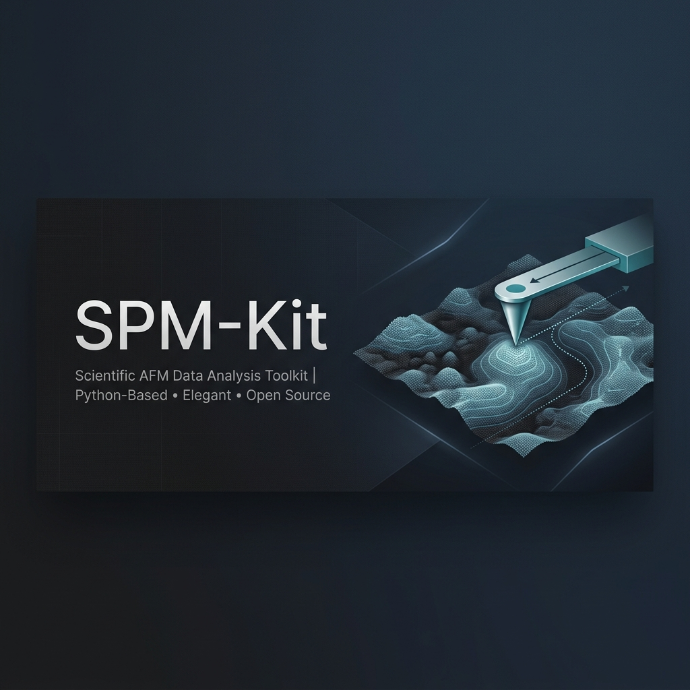

# SPM-Kit · Fathom

**Open numerical engine and interactive workspace for Scanning Probe Microscopy (SPM)**

*Nanomechanics, single-molecule force spectroscopy, image metrology, and resonance mass sensing — with physics validated by numerical recovery.*

[](https://github.com/kegouro/spmkit/actions/workflows/ci.yml)
[](https://github.com/kegouro/spmkit/actions/workflows/ci.yml)
[](https://pypi.org/project/spmkit/)
[](LICENSE)
[](https://github.com/astral-sh/ruff)
[](https://mypy-lang.org/)
[](https://zenodo.org/badge/latestdoi/1270254374)

[Español](README.md) · **English**

[Overview](#overview) · [Features](#features) · [Perspectives](#perspective-gallery) · [Install](#installation) · [Tutorials](#tutorials) · [Architecture](#architecture) · [Extend](#extensibility) · [Validation](#scientific-validation)

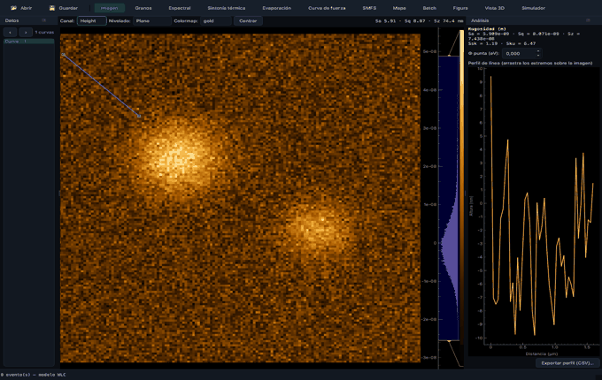

<sub>Fathom analyzes by <b>perspectives</b>: you switch tasks, not tabs. All data shown here is <b>synthetic and reproducible</b> (<a href="scripts/gen_docs_media.py"><code>scripts/gen_docs_media.py</code></a>).</sub>

</div>

---

<details>
<summary><b>Table of contents</b></summary>

- [Overview](#overview)
- [Features](#features)
- [Perspective gallery](#perspective-gallery)
- [Installation](#installation)
- [Quick start](#quick-start)
- [Tutorials](#tutorials)
- [Command-line reference](#command-line-reference)
- [Keyboard shortcuts](#keyboard-shortcuts)
- [Where each function lives](#where-each-function-lives)
- [Architecture](#architecture)
- [Supported formats](#supported-formats)
- [Extensibility](#extensibility)
- [Scientific validation](#scientific-validation)
- [Development and quality](#development-and-quality)
- [Reproduce the media](#reproduce-this-readmes-media)
- [Cite](#cite)

</details>

---

## Overview

**SPM-Kit** is a rigorous, open-source (MIT) toolkit to decode, analyze, and visualize scanning-probe-microscopy data —**AFM, KPFM, and force spectroscopy**— developed at the **SPM Lab** of Universidad Técnica Federico Santa María (UTFSM). It starts from a simple premise: scientific analysis must be **traceable, reproducible, and honest**, free of proprietary software and black boxes.

It is organized in two layers with a strict boundary between them:

| Layer | Role | Install |
|-------|------|---------|
| **`spmkit.core`** | The pure **numerical engine**, no GUI: format readers, validated analysis, export. Python + NumPy; heavy dependencies optional. | `pip install spmkit` |
| **Fathom** | The interactive **workspace** (PyQt6) built on that engine, meant to **replace** proprietary tools such as Nanosurf ANA and JPK Data Processing in day-to-day research. | `pip install "spmkit[gui]"` |

That separation is not cosmetic: **`core/` imports no GUI layer**, and an architecture test enforces it. All analysis is scriptable, runs headless on a server or cluster, and the GUI is a transparent control panel onto the same code.

```bash
spmkit workspace scan.nid     # open Fathom on a file
```

---

## Features

**Quantitative nanomechanics**
- Contact fitting: **spherical Hertz**, **paraboloid**, **conical Sneddon**, **DMT**, and **adhesive JKR**.
- Contact detection by **joint fitting** (variable projection), immune to the baseline-noise bias that plagues naive k·σ thresholds.
- **Monte Carlo uncertainty** propagated from calibration (InVOLS, spring constant).
- Cantilever calibration: InVOLS and **k by the thermal-noise method** (equipartition).
- JPK-style manual fit windows, with live region selection.

**Single-molecule force spectroscopy (SMFS)**
- Rupture-event detection by **prominence** with a k·σ height floor over the baseline (kills noise blips).
- Per-event polymer-chain fitting: **WLC** (Marko-Siggia / Bouchiat) and **FJC** (Langevin).
- Quality control (drops low-R² fits) and a **population contour-length histogram**.

**Force-volume maps**
- Maps local properties (modulus, adhesion, dissipation) to spatial coordinates.
- **Vectorized CPU/GPU** engine (NumPy / CuPy) mirroring exactly the closed form of the scalar fit.
- Interactive *linked brushing* between the map, the histogram, and the single curve.

**Resonance and mass sensing**
- **Thermal tuning**: simple-harmonic-oscillator (SHO) fit to the thermal-noise spectrum → **f₀, Q, k**.
- **Evaporation series**: tracks the resonance shift f(t) → added mass Δm(t), evaporation rate, and the **d² law** fit.

**Image metrology**
- **ISO 25178** roughness (Sa, Sq, Sz…), interactive line profiles, leveling (plane / polynomial / row-wise).
- **KPFM / CPD** with sample work function, grain detection, spectral analysis (radial PSD, fractal dimension, correlation length).

**Engineering and trust**
- **Nothing hardcoded**: every threshold, model, unit, and parameter is **editable in the interface**.
- **Scientific-fidelity export**: traceable CSV with metadata, a **physical unit per column**, and per-property statistics; never dumps `NaN`.
- **Entry-point extensibility**: new formats, analyses, and perspectives register **without touching the core**.
- **Visual customization**: preset themes (Graphite, Paper, NanoSurf gold, Nord, Dracula, Solarized, Gruvbox), accent, and typography, with live preview.

---

## Perspective gallery

Fathom exposes **twelve perspectives**. Each is a complete view —panels, controls, and canvases— focused on one task. You switch from the top bar or the command palette (`Ctrl+K`).

<table>
<tr>
<td width="50%">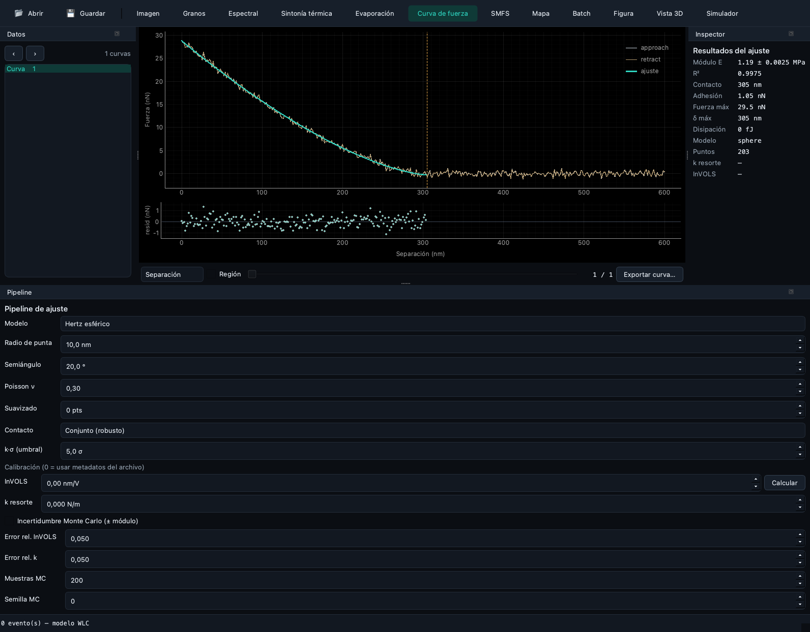</td>
<td width="50%">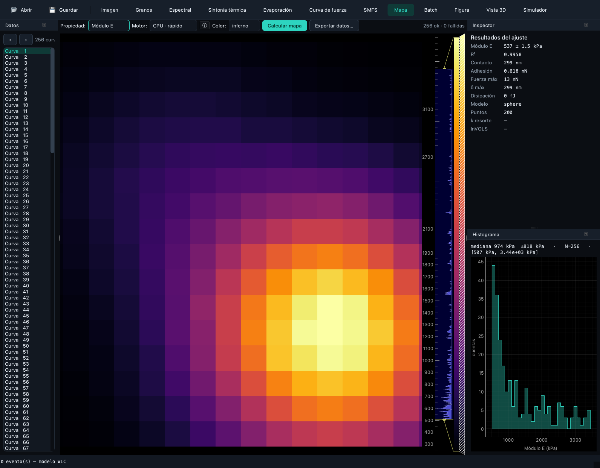</td>
</tr>
<tr>
<td align="center"><b>Force curve</b> — contact fit with modulus, uncertainty, residuals, and scientific export.</td>
<td align="center"><b>Map</b> — force-volume modulus map with a population histogram and a perceptual colormap.</td>
</tr>
<tr>
<td width="50%">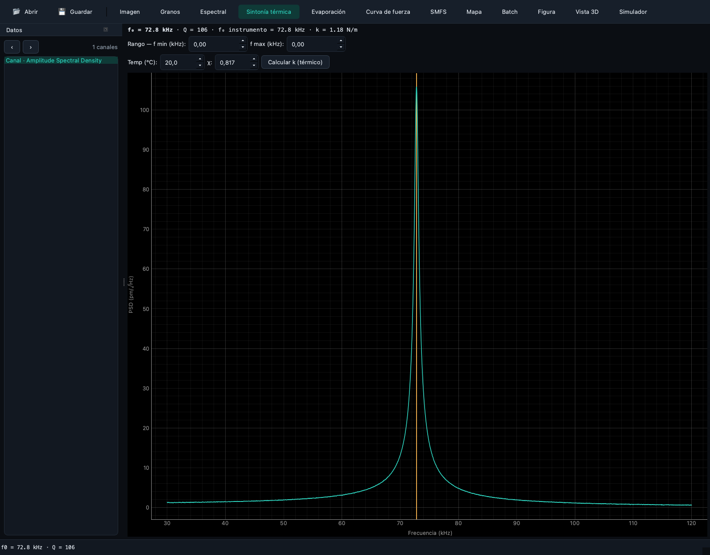</td>
<td width="50%">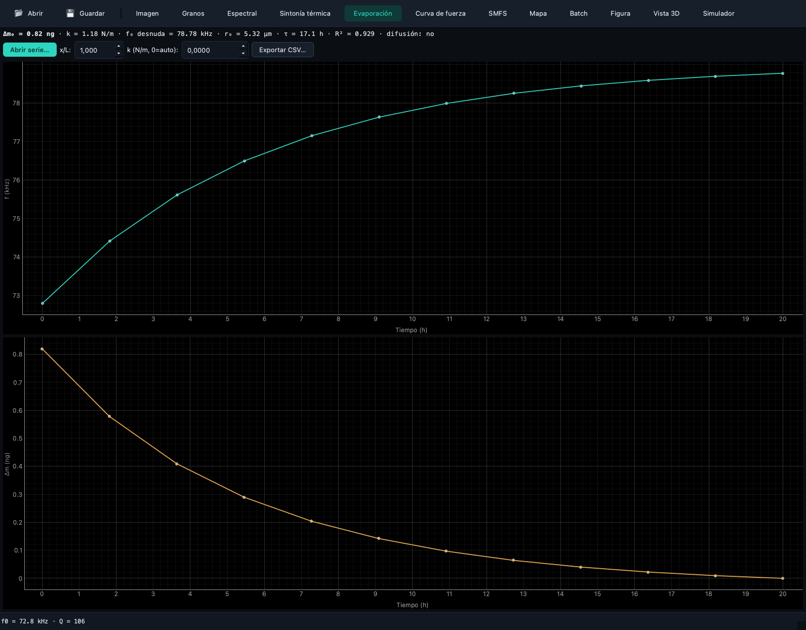</td>
</tr>
<tr>
<td align="center"><b>Thermal tuning</b> — SHO fit of the thermal noise → f₀, Q, and k.</td>
<td align="center"><b>Evaporation</b> — mass sensing by frequency shift: f(t), Δm(t), and the d² law.</td>
</tr>
<tr>
<td width="50%">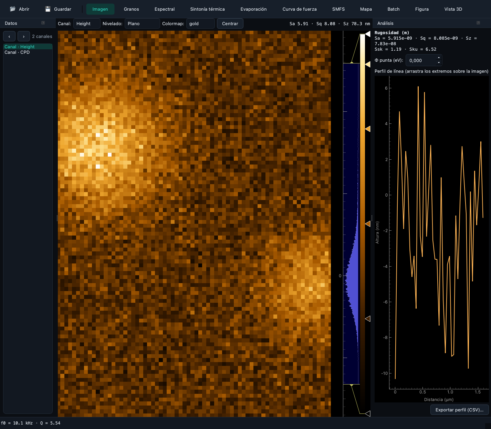</td>
<td width="50%">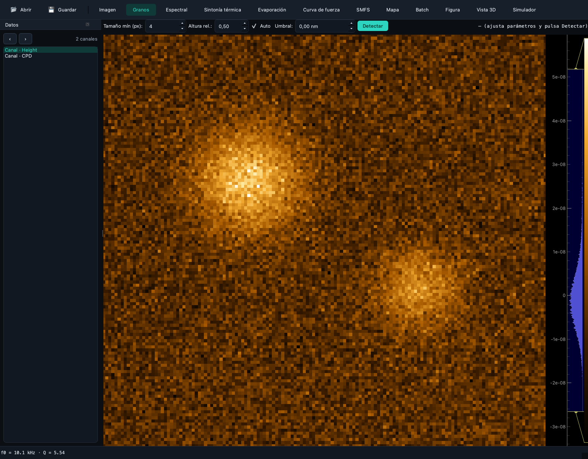</td>
</tr>
<tr>
<td align="center"><b>Image</b> — topography: leveling, line profile, ISO 25178 roughness, and KPFM.</td>
<td align="center"><b>Grains</b> — particle detection with statistics (count, diameter, coverage).</td>
</tr>
</table>

<details>
<summary><b>All twelve perspectives, in a table</b></summary>

| Perspective | What it does |
|-------------|--------------|
| **Image** | Topography: leveling (plane/polynomial/rows), colormap, line profile, ISO 25178 roughness, and KPFM. |
| **Grains** | Particle detection with statistics (count, diameter, coverage, density). |
| **Spectral** | Radial PSD, fractal dimension, and correlation length. |
| **Thermal tuning** | Thermal-noise resonance → f₀, Q, k by SHO fit and equipartition. |
| **Evaporation** | Mass-sensing time series: f(t) → Δm, evaporation rate, d² law. |
| **Force curve** | Contact fit (Hertz…JKR) with uncertainty, residuals, and export. |
| **SMFS** | Rupture events + per-event WLC/FJC chain fit, with QC and a histogram. |
| **Map** | Force-volume property maps + histogram + export. |
| **Batch** | Processes folders of force curves **and** maps → scientific summary table. |
| **Figure** | WYSIWYG publication-figure editor (annotations, scale bar, colorbar). |
| **3D view** | Surface with hillshade lighting and visual Z exaggeration. |
| **Simulator** | Educational digital twin of the cantilever (thermal-noise spectrum). |

</details>

---

## Installation

```bash
pip install spmkit              # numerical engine only (servers / HPC)
pip install "spmkit[gui]"       # + Fathom (workstations)
pip install "spmkit[all]"       # everything: GUI, HDF5, reports, grains, extra formats
```

Heavy dependencies are **optional extras**, keeping the base engine light:

| Extra | Enables |
|-------|---------|
| `gui` | Fathom (PyQt6, pyqtgraph, matplotlib). |
| `afm` | Long-tail readers via `afmformats` (JPK QI, `.ibw`, HDF5, NT-MDT…). |
| `jpk` | JPK force curves in TIFF format (`tifffile`). |
| `grains` | Grain detection and SHO fits (`scipy`). |
| `hdf5` | HDF5 read/write (`h5py`). |
| `gwy` | Gwyddion interoperability (`.gwy`). |
| `report` | HTML/PDF reports (`jinja2` + `viz`). |
| `viz` | Publication figures (`matplotlib`, `cmcrameri`, scalebars). |

---

## Quick start

**As a Python library**

```python
from spmkit import load
from spmkit.core.analysis import roughness, leveling

data = load("scan.nid")                   # → SPMData (channels in physical units)
ch = leveling.plane_fit(data["Z-Axis"])   # corrects tilt
print(roughness.statistics(ch))           # Sa, Sq, Sz… (ISO 25178)
```

```python
from spmkit.core.io import load_any
from spmkit.core.analysis import forcecurve

vol, _ = load_any("indent.jpk-force")     # → calibrated ForceVolume
seg = vol.curve(0).extend                  # approach segment
x = forcecurve.display_axis(seg.separation, seg.raw_height)
fit = forcecurve.fit_force_curve(x, seg.force, model="dmt")
print(fit.young_modulus, fit.r_squared)   # Young's modulus and goodness of fit
```

**As a desktop application**

```bash
spmkit workspace scan.nid     # opens Fathom on the given file
```

**From the command line**

```bash
spmkit info scan.nid                     # instrument metadata
spmkit nanomech indent.jpk-force         # contact fit of one curve
spmkit forcemap volume.jpk-qi -o map     # modulus map of a force-volume
spmkit evaporation ./thermal_series/     # mass sensing by evaporation
spmkit convert scan.nid scan.gwy         # transcribe to Gwyddion
```

---

## Tutorials

<details>
<summary><b>1. Analyze a force curve (Young's modulus)</b></summary>

1. `spmkit workspace indent.jpk-force` (or **Open…** in Fathom). The file routes to the **Force curve** perspective.
2. In the **Pipeline** panel (bottom) pick the contact **model** (spherical Hertz, DMT, JKR…), the **tip radius**, and the **contact** method (Joint or threshold).
3. The **Inspector** (right) shows Young's modulus, R², contact point, adhesion, and ± uncertainty (Monte Carlo).
4. To restrict the fit, enable **Region** and drag the window over the loading branch.
5. **Export curve…** produces a CSV with the fit, units, and the separation/force table.

Equivalent to: `spmkit nanomech indent.jpk-force --model dmt`.
</details>

<details>
<summary><b>2. Modulus map of a force-volume</b></summary>

1. Open a force-volume (`.jpk-qi`, spectroscopy `.nid`). Switch to the **Map** perspective.
2. Pick the **property** (Young's modulus, adhesion, dissipation…), the **engine** (fast CPU / pipeline), and the **colormap**.
3. **Compute map** fits the thousands of curves at once (vectorized). The **histogram** summarizes the population (median ± deviation).
4. Selecting a map pixel shows its single curve in the Inspector (*linked brushing*).
5. **Export data…** dumps the map per point with units and recipe metadata.

Equivalent to: `spmkit forcemap volume.jpk-qi -o map`.
</details>

<details>
<summary><b>3. Spring constant by thermal noise (Thermal tuning)</b></summary>

1. Open a thermal-tuning spectrum (`.nid`). Switch to **Thermal tuning**.
2. The **SHO** fit recovers **f₀** and **Q** from the thermal peak; the instrument usually ships its own values for comparison.
3. Bound the **frequency range** around the peak if neighboring modes are present.
4. **Compute k (thermal)** integrates ⟨x²⟩ = ∫ ASD² df over the range and applies equipartition with the editable mode-shape factor χ.

> Validated against a real instrument: f₀ recovered to 0.01 %, Q to 4 %, k to ~2 %.
</details>

<details>
<summary><b>4. Mass sensing by evaporation (time series)</b></summary>

1. Switch to the **Evaporation** perspective and click **Open series…**; choose a folder of thermal-tuning spectra (one per instant).
2. Fathom tracks the resonance f(t) and derives the **added mass** Δm(t) (top f, bottom Δm).
3. Adjust the **load position x/L** (from micrographs) and the **spring constant k**; everything recomputes live.
4. The readout reports Δm₀, k, bare f₀, r₀, τ, and the R² of the **d² law** (diffusion-limited evaporation).
5. **Export CSV…** for downstream analysis.

Equivalent to: `spmkit evaporation ./thermal_series/ -o evaporation.csv`.
</details>

---

## Command-line reference

```bash
spmkit --help
```

| Command | What it does |
|---------|--------------|
| `info` | File metadata and channel inventory. |
| `analyze` | Image analysis (roughness, KPFM…) of a channel. |
| `nanomech` | Contact fit of one force curve. |
| `forcecurve` | Loads and describes a calibrated force curve. |
| `forcemap` | Property map of a force-volume. |
| `forcereport` | HTML/PDF report of a force-volume. |
| `forceexport` | Exports force curves/maps with scientific fidelity. |
| `fbatch` | Batch of force curves in a folder → CSV. |
| `batch` | Batch of images in a folder → CSV. |
| `jkr` | Adhesive JKR fit (experimental, validated by recovery). |
| `evaporation` | Evaporation series: f(t) → mass and rate. |
| `figure` | Publication figure of a channel (PNG/SVG/PDF). |
| `convert` | Transcribes between formats (e.g. `.nid` → `.gwy`). |
| `verify` | Byte-level traceability check of a `.nid`. |
| `workspace` / `gui` | Opens Fathom. |

---

## Keyboard shortcuts

Every action is in the **command palette** (`Ctrl/⌘ + K`, fuzzy search). The most-used shortcuts:

| Action | Windows / Linux | macOS |
|--------|-----------------|-------|
| Command palette | `Ctrl + K` | `⌘ K` |
| Open curve or image | `Ctrl + O` | `⌘ O` |
| Save project | `Ctrl + S` | `⌘ S` |
| Compute property map | `Ctrl + M` | `⌘ M` |
| Export results (JSON) | `Ctrl + E` | `⌘ E` |
| Generate report (HTML/PDF) | `Ctrl + Shift + R` | `⌘ ⇧ R` |
| Copy results | `Ctrl + Shift + C` | `⌘ ⇧ C` |
| Pin current curve | `Ctrl + P` | `⌘ P` |
| Previous / next curve | `Ctrl + ←` / `Ctrl + →` | `⌘ ←` / `⌘ →` |
| First / last curve | `Ctrl + Home` / `Ctrl + End` | `⌘ Home` / `⌘ End` |
| Toggle light/dark theme | `Ctrl + Shift + L` | `⌘ ⇧ L` |
| Customize appearance | `Ctrl + Shift + A` | `⌘ ⇧ A` |

> On macOS, Qt maps `Ctrl` to `⌘` automatically; shortcuts are declared once in [`gui/app_workspace.py`](src/spmkit/gui/app_workspace.py) and [`gui/shell/workspace.py`](src/spmkit/gui/shell/workspace.py).

---

## Where each function lives

Every core analysis has a visible control in a perspective. This map connects the **function**, its **UI location**, and the **`core` module** where it lives (to find it in the repository):

| Function | Perspective · control | Core module |
|----------|-----------------------|-------------|
| Leveling (plane/polynomial/rows) | Image · *Leveling* dropdown | [`core/analysis/leveling.py`](src/spmkit/core/analysis/leveling.py) |
| ISO 25178 roughness | Image · *Analysis* panel | [`core/analysis/roughness.py`](src/spmkit/core/analysis/roughness.py) |
| Line profile | Image · ROI on the canvas | [`core/analysis/profiles.py`](src/spmkit/core/analysis/profiles.py) |
| KPFM / CPD | Image · V-unit channel + tip Φ | [`core/analysis/kpfm.py`](src/spmkit/core/analysis/kpfm.py) |
| Grain detection | Grains · threshold | [`core/analysis/grains.py`](src/spmkit/core/analysis/grains.py) |
| Radial PSD / fractal / correlation | Spectral · q range | [`core/analysis/spectral.py`](src/spmkit/core/analysis/spectral.py) |
| Contact fit (Hertz…JKR) | Force curve · *Pipeline* panel | [`core/analysis/forcecurve.py`](src/spmkit/core/analysis/forcecurve.py) |
| Adhesive JKR | Force curve · JKR model | [`core/analysis/experimental.py`](src/spmkit/core/analysis/experimental.py) |
| SMFS (WLC / FJC) | SMFS · model selector + thresholds | [`core/analysis/chain.py`](src/spmkit/core/analysis/chain.py) |
| Modulus map (CPU/GPU) | Map · *Compute map* | [`core/analysis/forcevolume_fast.py`](src/spmkit/core/analysis/forcevolume_fast.py) |
| Thermal tuning (f₀ / Q) | Thermal tuning · range + *Compute k* | [`core/analysis/resonance.py`](src/spmkit/core/analysis/resonance.py) |
| Calibration (InVOLS, thermal k) | Thermal tuning / Pipeline · *Compute* | [`core/analysis/calibration.py`](src/spmkit/core/analysis/calibration.py) |
| Evaporation series (Δm, d² law) | Evaporation · *Open series* | [`core/analysis/resonance.py`](src/spmkit/core/analysis/resonance.py) |
| Cantilever simulator | Simulator | [`core/analysis/simulation.py`](src/spmkit/core/analysis/simulation.py) |
| Publication figure | Figure · panel form | [`core/viz/figure.py`](src/spmkit/core/viz/figure.py) |
| Scientific export (CSV) | *Export…* in every perspective | [`core/export/writers.py`](src/spmkit/core/export/writers.py) |
| Folder batch (curves / maps) | Batch · *Open folder* | [`core/forcebatch.py`](src/spmkit/core/forcebatch.py) |

---

## Architecture

Three strictly separated layers. **`core/` is pure Python with no GUI imports**; `cli/` and `gui/` only orchestrate and present, importing the public `core` API. A test (`tests/test_architecture.py`) **enforces** this rule.

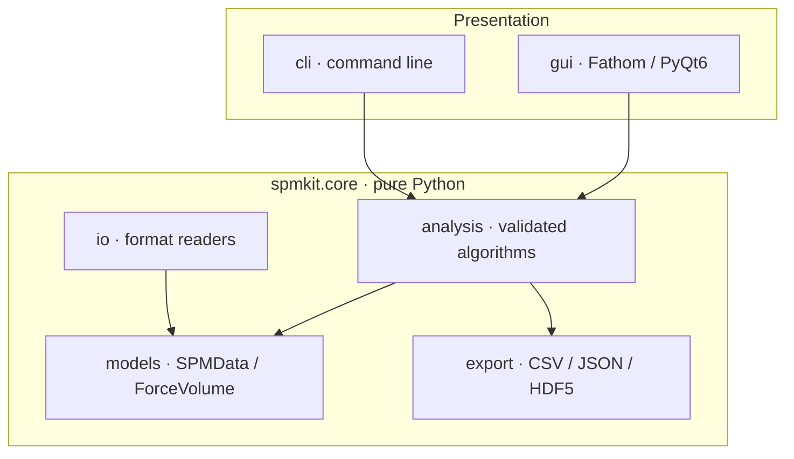

**Data flow** — from an instrument file to a traceable result:

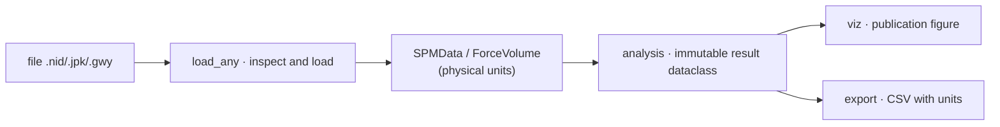

**Force-curve pipeline** — the closed form shared by the scalar fit and the vectorized map:

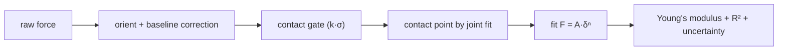

**Data model** ([`core/models`](src/spmkit/core/models)):

- **`SPMChannel`** — a 2D channel in physical units: `.data`, `.unit`, `.x_range`/`.y_range` (meters), `.direction`, `.metadata`.
- **`SPMData`** — a collection of channels; access by name `data["Height"]`.
- **`ForceVolume`** / **`ForceCurve`** / **`ForceSegment`** — the force-spectroscopy hierarchy, calibratable and picklable.

**GUI module registry** (MVVM) — a perspective is a `ModuleSpec` (observable ViewModel + Qt panel) discovered by entry points; see [Extensibility](#extensibility).

---

## Supported formats

| Extension | Origin | Support |
|-----------|--------|---------|
| `.nid` | Classic NanoSurf | Read validated to **machine precision** against Gwyddion; image and spectroscopy. |
| `.gwy` | Gwyddion | Native read and write. |
| `.nhf` | NanoSurf HDF5 | Read (experimental). |
| `.spm` / `.00N` | Bruker / Nanoscope | Image — **experimental**, unvalidated scaling; reimplemented citing [AFMReader](https://github.com/AFM-SPM/AFMReader) and [TopoStats](https://github.com/AFM-SPM/TopoStats). |
| `.jpk-force` / `.jpk-qi` | JPK Instruments | Force curves and maps (extra `afm`). |
| JPK-TIFF | JPK (TIFF export) | Force curves detected **by content** (extra `jpk`). |
| `.ibw`, HDF5, NT-MDT… | Various | Long tail via `afmformats` (extra `afm`). |

> Instrument data is never versioned: `reference/` is in `.gitignore`. Every figure in this documentation is generated from **synthetic data**.

---

## Extensibility

Fathom is designed so that **adding capabilities is a short errand**, without touching the core. Three extension points, each via entry points in your own package. Full guide: **[docs/extending.md](https://kegouro.github.io/spmkit/extending/)**.

### 1. A new file format

```python
# my_plugin/reader.py
from spmkit.core.models import SPMData, SPMChannel

class MyReader:
    extensions = (".myext",)
    def inspect(self, path): ...            # capabilities (image/force) — cheap
    def load(self, path, kind=None):        # → SPMData / ForceVolume
        return SPMData(channels=(SPMChannel(name="Z", data=z, unit="m",
                                            x_range=1e-6, y_range=1e-6),))
```

```toml
# your plugin's pyproject.toml
[project.entry-points."spmkit.plugins.v1"]
my_format = "my_plugin.reader:MyReader"
```

### 2. A new analysis

Goes in `core/analysis/` (pure Python, **no UI**) and returns an immutable dataclass. If it is a physical model, **it enters with its recovery test** (see [Validation](#scientific-validation)).

### 3. A new perspective

**Adding a perspective = adding a `ModuleSpec`:**

```python
from spmkit.gui.extensions import ModuleSpec, PanelSpec, PerspectiveSpec

MY_MODULE = ModuleSpec(
    name="my_module",
    panels=(PanelSpec("my_panel", "My analysis", _panel_factory),),
    perspectives=(PerspectiveSpec("mine", "My analysis", ("navigator", "my_panel")),),
)
```

```toml
[project.entry-points."spmkit.gui.modules"]
my_module = "my_plugin.gui:MY_MODULE"
```

When your plugin is installed, the perspective shows up in Fathom's bar **without modifying spmkit**. This is the mechanism that makes `spmkit` a multi-physics *host* and Fathom one of its extensions.

---

## Scientific validation

Rigor is the backbone of the project. Every physical model passes a **numerical recovery gate**: synthetic data is generated with known parameters and controlled noise, and the fit must recover them within tolerance **or it does not enter the repository** ([`tests/validation/test_recovery.py`](tests/validation/test_recovery.py)).

| Model / analysis | Recovers | Tolerance |
|------------------|----------|-----------|
| Contact (Hertz / DMT) | Young's modulus | < 2 % at 1 % noise |
| WLC / FJC | Contour length, persistence / Kuhn | < 1 % |
| Adhesive JKR | E\*, work of adhesion | < 2 % (E\*), Hertz limit w = 0 |
| SLS relaxation | Characteristic time τ | < 4 % |
| Thermal tuning (SHO) | f₀, Q | 0.01 % / 4 % vs a real instrument |

Beyond the format round-trip (**machine-precision** correlation against Gwyddion), the `.nid` reader includes **byte-level traceability** (`spmkit verify`). Continuous integration runs **over 460 tests** of core, validation, and GUI (the latter offscreen) on Python 3.11 and 3.12.

---

## Development and quality

```bash
make dev        # editable install with dev + gui + hdf5 extras and pre-commit hooks
make check      # lint + types + tests — exactly what CI runs
make gui        # launch Fathom
```

- **Types**: `mypy` strict on `core` (`disallow_untyped_defs`). **Style**: `black` and `ruff` at 100 columns.
- **Tests**: `tests/core/` (unit), `tests/validation/` (scientific traceability), `tests/gui/` (offscreen, need the `gui` + `test-gui` extras).
- **Convention**: all numerical analysis lives in `src/spmkit/core/`; `cli/` and `gui/` only invoke it. See [`CLAUDE.md`](CLAUDE.md) and [`CONTRIBUTING.md`](CONTRIBUTING.md).

### Reproduce this README's media

Every screenshot and the GIF are regenerated from synthetic data, with no instrument file:

```bash
QT_QPA_PLATFORM=offscreen python scripts/gen_docs_media.py
```

---

## Cite

If you use SPM-Kit or Fathom in a publication, cite it per [`CITATION.cff`](CITATION.cff).

<br>
<div align="center">

[](https://zenodo.org/badge/latestdoi/1270254374)

<sub>Structured under the <b><a href="https://kegouro.github.io">Pharos Project</a></b> — scientific infrastructure without computational barriers.</sub>
<br>
<sub>José Labarca Baeza · Prof. Tomás Corrales · SPM Lab, UTFSM · MIT License © 2026</sub>

</div>
