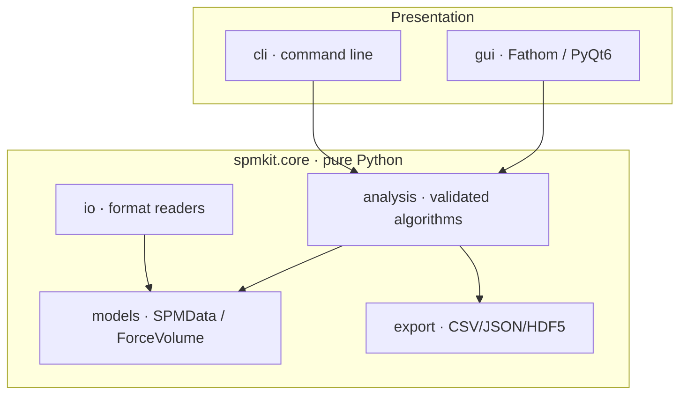

<div align="center">


# SPM-Kit · Fathom

### The open numerical engine and interactive workspace for Scanning Probe Microscopy

[](https://github.com/kegouro/spmkit/actions/workflows/ci.yml)
[](https://github.com/kegouro/spmkit/actions/workflows/ci.yml)
[](https://pypi.org/project/spmkit/)
[](LICENSE)
[](https://github.com/astral-sh/ruff)

[🇪🇸 Español](README.md) · **🇬🇧 English**

**[📖 Documentation](https://kegouro.github.io/spmkit/)** · [✨ Features](#-features) · [🚀 Install](#-installation) · [🧩 Build your own module](#-developing-in-fathom-extensibility) · [🏗️ Architecture](#️-architecture)

</div>

---

## 🔬 What it is

**SPM-Kit** is a rigorous, open-source (MIT) toolkit to decode, analyze and visualize scanning-probe-microscopy data —**AFM, KPFM and force spectroscopy**— developed at the **SPM Lab** of Universidad Técnica Federico Santa María (UTFSM).

It is organized in two layers:

| Layer | Role |
|-------|------|
| 🧮 **`spmkit.core`** | The pure **numerical engine** (no UI): format readers, validated analysis, export. Installable on its own — ideal for scripts, HPC and reproducible pipelines. |
| 🖥️ **Fathom** | The **interactive workspace** built on that engine, designed to **replace proprietary tools** (Nanosurf ANA, JPK Data Processing) in research. |

```bash
spmkit workspace [file]     # launch Fathom
```

<div align="center">

<sub>Fathom — analysis by <b>perspectives</b>: you switch task, not tab.</sub>
</div>

---

## ✨ Features

- 🧪 **Real-time nanomechanics** — contact fitting (Hertz, paraboloid, conical Sneddon, DMT and **adhesive JKR**) with Young's modulus, **Monte-Carlo uncertainty**, robust contact detection (joint fit), calibration (InVOLS and spring constant *k* from thermal noise) and manual fit windows.
- 🧬 **SMFS (single-molecule)** — rupture-event detection by **prominence** and per-event polymer-chain fitting: **WLC** (Marko-Siggia/Bouchiat) and **FJC** (Langevin), with quality control and a population contour-length histogram.
- 🗺️ **Force-volume maps** — local properties mapped to spatial coordinates, interactive *linked brushing* between spectra and topography, and a vectorized CPU/GPU engine.
- 📐 **Image metrology** — ISO 25178 roughness, interactive line profiles, KPFM/CPD (Kelvin probe), grain detection, spectral analysis (radial PSD, fractal dimension).
- 📤 **Scientific-grade export** — traceable CSV with metadata, **physical units on every column** and per-property statistics; no `NaN` dumps.
- 🎛️ **Nothing hardcoded** — every threshold, model and unit is **editable in the UI**.
- 🧩 **Open extensibility** — new formats, analyses and perspectives register via *entry-points* **without touching the core** (see [below](#-developing-in-fathom-extensibility)).
- 🎨 **Visual customization** — themes with presets (Graphite, Paper, NanoSurf gold, Nord, Dracula, Solarized, Gruvbox), accent and typography, with live preview.

---

## 🖼️ Perspectives

| Perspective | What it does |
|-------------|--------------|
| **Image** | Topography: leveling (plane/polynomial/rows), colormap, line profile, ISO 25178 roughness and KPFM. |
| **Grains** | Particle detection with statistics (count, diameter, coverage, density). |
| **Spectral** | Radial PSD, fractal dimension and correlation length. |
| **Force curve** | Contact fitting (Hertz…JKR) with uncertainty, residuals and scientific export. |
| **SMFS** | Rupture events + per-event WLC/FJC chain fitting, with QC and histogram. |
| **Thermal tuning** | Thermal-noise resonance → **f₀, Q, k** by equipartition. |
| **Map** | Force-volume property maps + histogram + export. |
| **Batch** | Processes folders of force curves **and maps** → scientific summary table. |
| **Figure** | WYSIWYG publication-figure editor (annotations, scale bar, colorbar). |
| **3D view** | Surface with *hillshade* lighting and visual Z exaggeration. |
| **Simulator** | Educational cantilever digital twin (thermal-noise spectrum). |

---

## 🚀 Installation

```bash
pip install spmkit              # numerical engine only (servers/HPC)
pip install "spmkit[gui]"       # + Fathom (workstations)
pip install "spmkit[all]"       # + HDF5, reports, grains (SciPy)
```

## ⚡ Quick start

**As a Python library:**

```python
from spmkit import load
from spmkit.core.analysis import roughness, leveling

data = load("scan.nid")                 # → SPMData (channels in physical units)
ch = leveling.plane_fit(data["Z-Axis"]) # remove tilt
print(roughness.statistics(ch))         # Sa, Sq, Sz… (ISO 25178)
```

**As a GUI:**

```bash
spmkit workspace scan.nid
```

**From the command line:**

```bash
spmkit info scan.nid                     # instrument metadata
spmkit roughness scan.nid -c Z-Axis      # ISO 25178 parameters
spmkit convert scan.nid scan.gwy         # transcribe to Gwyddion
spmkit fbatch /data -o results.csv       # batch of force curves
```

---

## 🧩 Developing in Fathom (extensibility)

Fathom is designed so that **adding capabilities is a short chore**, without touching the core. There are three extension points, each via *entry-points* declared in your own package. Full guide: **[docs/extending.md](https://kegouro.github.io/spmkit/extending/)**.

### 1. A new file format

Write a reader that returns an `SPMData` and register it:

```python
# my_plugin/reader.py
from spmkit.core.models import SPMData, SPMChannel

class MyReader:
    extensions = (".myext",)
    def inspect(self, path): ...          # capabilities (image/force) — cheap
    def load(self, path, kind=None):      # → SPMData / ForceVolume
        ...
        return SPMData(channels=(SPMChannel(name="Z", data=z, unit="m",
                                            x_range=1e-6, y_range=1e-6),))
```

```toml
# your plugin's pyproject.toml
[project.entry-points."spmkit.plugins.v1"]
my_format = "my_plugin.reader:MyReader"
```

### 2. A new analysis

Goes in `core/analysis/` (pure Python, **no UI**) and returns an immutable dataclass. If it's a physical model, it **enters with its recovery test** (see [Validation](#-scientific-validation)).

### 3. A new perspective (a full view in Fathom)

Declare a `ModuleSpec` — a ViewModel (observable state) + a panel (Qt) + its registration. **Adding a perspective = adding a `ModuleSpec`:**

```python
from spmkit.gui.extensions import ModuleSpec, PanelSpec, PerspectiveSpec

MY_MODULE = ModuleSpec(
    name="my_module",
    panels=(PanelSpec("my_panel", "My analysis", _panel_factory),),
    perspectives=(PerspectiveSpec("mine", "My analysis", ("navigator", "my_panel")),),
)
```

```toml
[project.entry-points."spmkit.gui.modules"]
my_module = "my_plugin.gui:MY_MODULE"
```

When your plugin is installed, the perspective appears in Fathom's bar **without modifying spmkit**. This is the mechanism that makes `spmkit` a multi-physics *host* and Fathom one of its extensions.

---

## 🏗️ Architecture

Three strictly separated layers: **`core/` is pure Python with no UI imports**; `cli/` and `gui/` only orchestrate/present and import `core`'s public API. This rule is **enforced by a test** (`tests/test_architecture.py`).



---

## 📂 Formats

| Extension | Source | Support |
|-----------|--------|---------|
| `.nid` | NanoSurf classic | Machine-precision read, validated vs Gwyddion |
| `.gwy` | Gwyddion | Native read and write |
| `.nhf` | NanoSurf HDF5 | Experimental |
| `.jpk-force` / `.jpk-qi` | JPK Instruments | Force curves and maps (extra `afm`) |

---

## 🔬 Scientific validation

Rigor is the project's cornerstone. Beyond format round-trip (**machine-precision** correlation against Gwyddion), **every physical model passes a numerical recovery gate**: synthetic data with known parameters and controlled noise is generated, and the fit must recover them within tolerance or **it does not enter the repository**.

- Young's modulus within **<2%** even with noise (thanks to joint contact fitting).
- **WLC/FJC** contour/persistence, **JKR** E\*/adhesion and **SLS** relaxation τ likewise validated.

CI runs **351 core/validation tests** + **168 GUI tests** (offscreen) on Python 3.11 and 3.12. See [`docs/VALIDATION.md`](./docs/VALIDATION.md) and [`tests/validation/`](./tests/validation).

---

## 🤝 Contributing

Numerical analysis lives exclusively in `src/spmkit/core/`. `mypy` (strict on `core`), `black` and `ruff` are required. `make check` is exactly what CI runs. See [`CONTRIBUTING.md`](./CONTRIBUTING.md).

## 📖 Citation

If you use SPM-Kit or Fathom in a publication, please cite it per [`CITATION.cff`](./CITATION.cff).

<br>
<div align="center">

[](https://zenodo.org/badge/latestdoi/1270254374)

<sub>Structured under the <b><a href="https://kegouro.github.io">Pharos Project</a></b> — scientific infrastructure without computational barriers.</sub>
<br>
<sub>José Labarca Baeza · Prof. Tomás Corrales · UTFSM | MIT License © 2026</sub>

</div>
