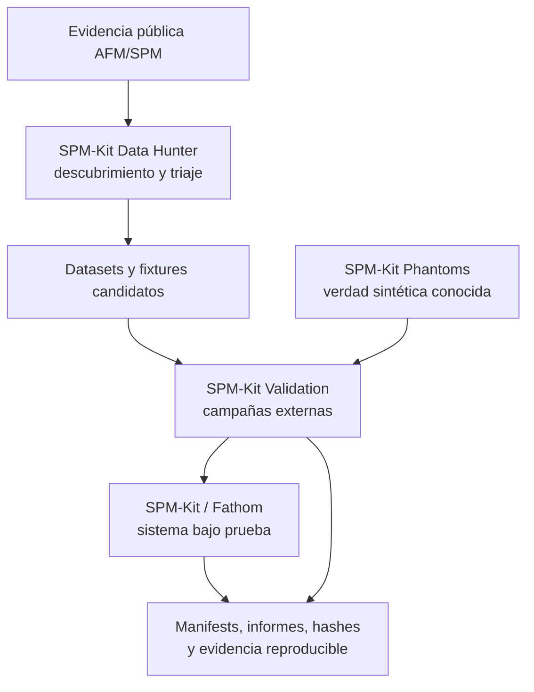

<div align="center">


# SPM-Kit · Fathom

**Motor numérico abierto y workspace interactivo para análisis AFM/SPM.**

**José Labarca Baeza es el creador, autor y desarrollador principal.** SPM-Kit fue
desarrollado independientemente durante sus estudios de pregrado en Física en la
Universidad Técnica Federico Santa María, en el contexto académico del SPM Lab.

[](https://github.com/kegouro/spmkit/actions/workflows/ci.yml)
[](https://kegouro.github.io/spmkit/)
[](https://pypi.org/project/spmkit/)
[](https://pypi.org/project/spmkit/)
[](LICENSE)
[](https://doi.org/10.5281/zenodo.21303280)

[English](README.md) · [Español](README.es.md) ·
[Documentación](https://kegouro.github.io/spmkit/) ·
[Estado científico](https://kegouro.github.io/spmkit/SCIENTIFIC_STATUS/) ·
[Citación](CITATION.cff)

```bash
pip install spmkit
pip install "spmkit[gui]"   # añade el workspace de escritorio Fathom
spmkit --help
```

**Software alfa.** Algunas capacidades cuentan con evidencia de software,
recuperación numérica o comparación externa; esto no es metrología certificada
ni soporte universal de instrumentos.

</div>

## Qué es

SPM-Kit es la fuente de verdad científica para carga de archivos, análisis
numérico y exportación. Expone una API de Python y una CLI para AFM, KPFM,
espectroscopía de fuerza, metrología de superficies y resonancia.

Fathom es el workspace PyQt6 construido sobre el mismo núcleo. No contiene una
segunda implementación numérica: la GUI orquesta las APIs públicas de
`spmkit.core`, y un test de arquitectura hace cumplir esa frontera.

| Superficie | Función | Instalación o inicio |
|---|---|---|
| `spmkit.core` | Lectores, modelos, análisis, verificación y exportación | `pip install spmkit` |
| API de Python | Análisis programable y headless | `from spmkit import load` |
| CLI | Flujos reproducibles en terminal | `spmkit --help` |
| Fathom | Workspace interactivo de análisis e informes | `spmkit workspace` |

## Inicio rápido

```python
from spmkit import load
from spmkit.core.analysis import leveling, roughness

scan = load("scan.nid")
height = leveling.plane_fit(scan["Z-Axis"])
print(roughness.statistics(height))
```

```bash
spmkit info scan.nid
spmkit analyze scan.nid --level plane --output results
spmkit workspace scan.nid
```

La superficie exacta de la CLI está en la [referencia de CLI](docs/cli.md). Usa
fixtures sintéticos o redistribuibles al compartir ejemplos.

## Capacidades

| Dominio | Alcance implementado | Frontera de evidencia |
|---|---|---|
| Metrología de superficie | Nivelación, perfiles, Sa, Sq, Sz, Ssk, Sku | Sa/Sq/Sz tienen comparaciones limitadas con Gwyddion 2.71; las demás métricas no heredan ese claim |
| Espectroscopía de fuerza | Hertz, DMT, contacto cónico, JKR adhesivo, WLC/FJC, SLS y mapas | Tests unitarios y de recuperación sintética; sin validación física general |
| KPFM | Estadística de CPD y función de trabajo de la muestra | Software testeado; la calibración experimental sigue bajo responsabilidad del usuario |
| Espectral y granos | PSD radial, longitud de correlación, estimaciones fractales y detección de granos | Tests de software y sintéticos; sin benchmark morfológico universal |
| Resonancia | Ajuste SHO, calibración térmica y utilidades de series temporales | Tests numéricos y ejercicio experimental limitado; no es calibración certificada |
| Reproducibilidad | Recetas, proyectos, exportaciones trazables e inspección byte a byte de `.nid` | El alcance depende del lector y flujo utilizado |

El registro autoritativo por capacidad es **[Estado científico](docs/SCIENTIFIC_STATUS.md)**.
Distingue entre implementado, testeado, verificado numéricamente, comparado
externamente, experimental, parcial y no soportado.

## Madurez de formatos

SPM-Kit combina lectores propios con adaptadores opcionales. Una dependencia
adaptadora no se presenta como soporte nativo.

| Formato | Datos | Ruta | Dependencia | Estado |
|---|---|---|---|---|
| NanoSurf `.nid` | Imágenes y volúmenes de fuerza | Nativa | Núcleo | Implementado; comparaciones seleccionadas de imagen/orientación y controles byte a byte |
| Gwyddion `.gwy` | Imágenes, lectura/escritura | Wrapper nativo | `spmkit[gwy]` | Implementado; sin equivalencia universal con Gwyddion |
| NanoSurf `.nhf` | Imágenes | Lector HDF5 nativo | `spmkit[hdf5]` | Experimental |
| Nanoscope III `.spm` | Imágenes | Lector nativo limitado | Núcleo | Parcial; seis archivos demostrados, sin claim general de la familia Bruker |
| JPK `.jpk-force` / `.jpk` | Curvas de fuerza | Nativa | Núcleo | Implementado; fixtures sintéticos cubren el parseo |
| Exportación JPK TIFF | Curvas de fuerza | Lector nativo detectado por contenido | `spmkit[jpk]` | Experimental |
| `.jpk-qi-data`, `.jpk-force-map`, `.jpk-qi-series`, `.ibw`, `.h5` | Según adaptador | Adaptador `afmformats` | `spmkit[afm]` | Cobertura experimental del adaptador |
| `.npz` | Intercambio SPM-Kit | Nativa | Núcleo | Implementado |

Consulta [Formatos](docs/FILE_FORMATS.md) para lectura/escritura, rutas de
implementación, evidencia y limitaciones.

## Evidencia científica

| Nivel | Significado en este ecosistema |
|---|---|
| `LEVEL 0 — CLAIMED` | Intención documentada sin evidencia ejecutada |
| `LEVEL 1 — SOFTWARE_VERIFIED` | Comportamiento ejecutable cubierto por tests |
| `LEVEL 2 — NUMERICALLY_VERIFIED` | Valores conocidos recuperados dentro de un alcance declarado |
| `LEVEL 3 — CROSS_VALIDATED` | Resultados comparados con otra ruta de software o referencia |
| `LEVEL 4 — PHYSICALLY_VALIDATED` | Evidencia física dentro de un alcance experimental declarado |
| `LEVEL 5 — REPRODUCIBILITY_VALIDATED` | Reproducción independiente bajo un protocolo declarado |

Un hito público es la comparación congelada de 48 casos para Sa, Sq y Sz con
Gwyddion 2.71: 144/144 comparaciones estuvieron dentro de tolerancia. Es
`LEVEL 3 — CROSS_VALIDATED` solo para esas tres métricas y esas matrices
canónicas. No es validación física, un holdout ciego ni equivalencia general con
Gwyddion. Véase el [resumen de campaña](https://github.com/kegouro/spmkit-validation/blob/main/evidence/campaigns/gwyddion_roughness_48_v0.1_summary.json).

## Ecosistema

> **Find the evidence → define the truth → test the system externally → preserve the result.**

[Explora el portal completo del ecosistema](https://kegouro.github.io/spmkit/ecosystem/)
para conocer los límites de cada componente, contratos de artefactos, instalación
y tutoriales de workflows reproducibles.



Alternativa textual: Data Hunter localiza evidencia pública candidata; Phantoms
aporta una fuente separada de verdad sintética conocida; Validation invoca
SPM-Kit por interfaces públicas y preserva entradas, salidas, tolerancias y
limitaciones. Fathom sigue siendo el workspace de usuario sobre el mismo núcleo.

| Repositorio | Úsalo cuando necesites | No afirma |
|---|---|---|
| **[spmkit](https://github.com/kegouro/spmkit)** | Análisis con el núcleo, CLI o Fathom | Corrección universal o metrología certificada |
| **[spmkit-validation](https://github.com/kegouro/spmkit-validation)** | Campañas aisladas por proceso y evidencia preservada | Que toda campaña sea independiente o validación física |
| **[spmkit-phantoms](https://github.com/kegouro/spmkit-phantoms)** | Verdad sintética y corrupciones controladas | Un gemelo digital completo del microscopio |
| **[spmkit-data-hunter](https://github.com/kegouro/spmkit-data-hunter)** | Descubrimiento y triaje de evidencia pública | Que descubrir establezca ground truth |

Ninguna afiliación, comparación o interés de interoperabilidad implica respaldo
de UTFSM, el SPM Lab, AFM-SPM, AFMReader, TopoStats o Gwyddion.

## Contribuir

Laboratorios externos pueden aportar código, fixtures redistribuibles, casos de
fallo, propuestas de campaña o comparaciones generadas independientemente. Antes
de compartir un dataset, confirma su estado de redistribución, elimina metadatos
privados, registra un checksum e indica si la identidad de la muestra puede
permanecer privada.

Empieza en [CONTRIBUTING.md](CONTRIBUTING.md) o en las plantillas de issues. No
subas datos de instrumento restringidos a un issue público.

## Citar

Usa [CITATION.cff](CITATION.cff) y el DOI de archivo específico de versión
[`10.5281/zenodo.21303280`](https://doi.org/10.5281/zenodo.21303280).
La autoría del software corresponde a José Labarca Baeza; los agradecimientos
siguientes no cambian la lista de autores del software.

## Agradecimientos

Tomás Corrales y el SPM Lab de la Universidad Técnica Federico Santa María proporcionaron datasets experimentales seleccionados y contexto de laboratorio durante el desarrollo y la evaluación de SPM-Kit.

María Saavedra Fredes y Benjamin Schleyer ayudaron a localizar y compartir datasets candidatos para las campañas de validación.

Los datasets candidatos pasaron por revisión científica, legal y técnica
separada. El agradecimiento no implica que todo dataset localizado fuese usado,
aceptado, redistribuible o científicamente adecuado.

## Limitaciones y estado de desarrollo

- El proyecto es software alfa y sus APIs pueden cambiar antes de 1.0.
- Ninguna capacidad tiene hoy un claim general `LEVEL 4` o `LEVEL 5`.
- Los lectores opcionales varían en madurez y comportamiento de dependencias.
- Los tests y la recuperación sintética no reemplazan la calibración específica
  del instrumento, la validación física ni la revisión experta.
- La evidencia más útil a continuación son datos independientes, redistribuibles,
  con preprocesamiento, unidades y salidas de referencia explícitas.

---

Licencia MIT © 2026 José Labarca Baeza
