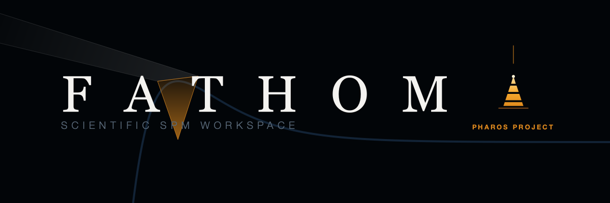
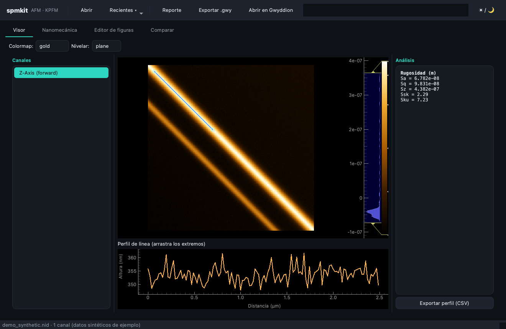
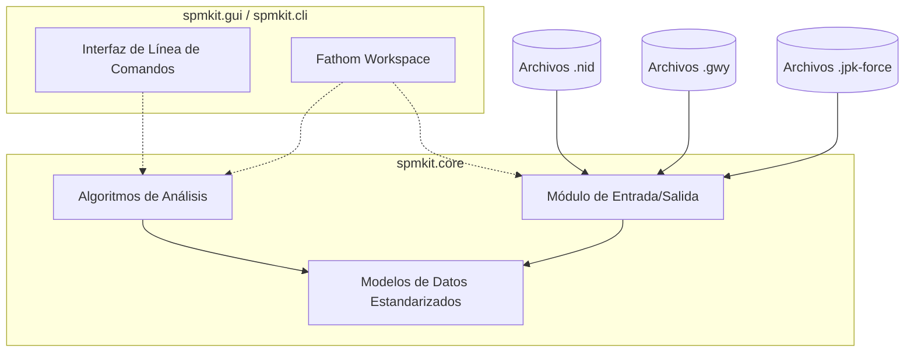

<div align="center">


# SPM-Kit: Core SDK para Microscopía de Sonda de Barrido

### Motor Numérico y Framework de Extensibilidad Abierta

[](https://github.com/kegouro/spmkit/actions/workflows/ci.yml)
[](https://github.com/kegouro/spmkit/actions/workflows/ci.yml)
[](#validación-científica-y-cobertura)
[](https://pypi.org/project/spmkit/)
[](https://pypi.org/project/spmkit/)
[](LICENSE)
[](https://github.com/astral-sh/ruff)

**[Documentación Oficial](https://kegouro.github.io/spmkit/)** · [Fathom Workspace](#fathom-entorno-de-análisis-avanzado) · [Arquitectura](#arquitectura-del-software) · [Validación](#validación-científica-y-cobertura)

<br>
</div>

**SPM-Kit** es un marco de trabajo (*toolkit*) riguroso y de código abierto desarrollado en el **SPM Lab** de la Universidad Técnica Federico Santa María (UTFSM). Proporciona la infraestructura algorítmica y matemática necesaria para la decodificación, análisis espectral, nivelación y extracción de propiedades nanomecánicas a partir de datos de microscopía de sonda de barrido (AFM, KPFM).

---

## Fathom: Entorno de Análisis Avanzado

<div align="center">

<br>
<picture>
  <source media="(prefers-color-scheme: dark)" srcset="docs/images/brand/fathom_logo_dark.png">
  <source media="(prefers-color-scheme: light)" srcset="docs/images/brand/fathom_logo_light.png">
  
</picture>
</div>

Mientras que `spmkit` actúa como la capa computacional subyacente, **Fathom** es el espacio de trabajo (*workspace*) interactivo insignia construido sobre su API. Fathom ha sido diseñado arquitectónicamente para sustituir herramientas propietarias de alto costo (como Nanosurf ANA y JPK Data Processing) en ecosistemas de investigación intensiva.

Para instanciar el entorno Fathom:

```bash
spmkit workspace [archivo_opcional]
```

### Capacidades Funcionales de Fathom

- **Pipeline de Ajuste Nanomecánico en Tiempo Real:** Ajuste algorítmico continuo para curvas de fuerza utilizando modelos de contacto clásicos (Hertz, Sneddon, DMT, JKR). Soporte para estimación de módulo de Young, radio de punta, corrección de Poisson y regiones de ajuste manual.
- **Topología de Mapeo de Volúmenes de Fuerza (*Force-Volume*):** Extracción de propiedades locales mapeadas a coordenadas espaciales, implementando *linked brushing* interactivo entre espectros y topografía.
- **Sistema Modular por Perspectivas:** Superando las interfaces monolíticas, Fathom emplea una estructura de vistas modulares (Perspectivas) que segrega lógicamente las áreas de trabajo: Visor Topográfico, Análisis de Rugosidad (ISO 25178), Mecánica Cuántica (KPFM), Detección Granular y Modelado de Resonancia.
- **Motor de Renderizado Dinámico:** Renderizado tridimensional interactivo con aplicación de modelos de iluminación (*hillshade*).

<div align="center">

<sub>Interfaz del Workspace Fathom (Renderizado con perfiles bilineales).</sub>
</div>

---

## Arquitectura del Software

El ecosistema adopta un paradigma estricto de separación de capas (Arquitectura Hexagonal/Clean Architecture), asegurando que el análisis matemático permanezca agnóstico respecto a la interfaz de usuario.



- **Directorio Core:** El motor numérico se encuentra aislado en `[src/spmkit/core](./src/spmkit/core)`. Ninguna dependencia gráfica interactúa con esta capa, lo que permite su despliegue en clústeres de computación de alto rendimiento (*HPC*).
- **Directorio de Presentación:** La lógica de interacción, gestión de estado (*ViewModels*) y vistas de PyQt6 residen en `[src/spmkit/gui](./src/spmkit/gui)`.

---

## Ecosistema y Formatos de Archivo

El módulo de entrada y salida garantiza interoperabilidad de ciclo completo (*round-trip*) con las plataformas estandarizadas de la industria.

| Extensión | Formato Origen | Estado de Soporte |
|-----------|----------------|-------------------|
| `.nid` | NanoSurf Clásico | Validación Categórica (Lectura) |
| `.gwy` | Gwyddion | Lectura y Escritura Nativa |
| `.nhf` | NanoSurf HDF5 | Soporte Experimental |
| `.jpk-force` | JPK Instruments | Integración en Fathom |

---

## Validación Científica y Cobertura

La rigurosidad es el pilar de SPM-Kit. El decodificador de matrices binarias para archivos `.nid` ha sido sujeto a validaciones algorítmicas de control cruzado contra *Gwyddion*.

La matriz de pruebas demuestra una **correlación de precisión de máquina (1.000000)** en la conversión a unidades métricas físicas. Los informes de prueba y auditoría numérica pueden consultarse íntegramente en `[docs/VALIDATION.md](./docs/VALIDATION.md)` y en el subdirectorio de pruebas `[tests/validation/](./tests/validation)`.

Actualmente, el repositorio ejecuta una suite integral automatizada por GitHub Actions que valida más de **350 iteraciones de prueba** en entornos estandarizados de Python 3.11 y 3.12.

---

## Guía de Despliegue e Instalación

El empaquetado de SPM-Kit es modular. Los investigadores pueden optar por instalar únicamente el motor de cálculo, o el ecosistema gráfico completo.

```bash
# Instalación del motor matemático (Recomendado para servidores/HPC)
pip install spmkit

# Instalación integral incluyendo Fathom Workspace (Recomendado para workstations)
pip install "spmkit[gui]"

# Instalación completa con todas las dependencias cruzadas (HDF5, Reportes, SciPy Grains)
pip install "spmkit[all]"
```

### Operaciones por Línea de Comandos

La interfaz de comandos proporciona tuberías (*pipelines*) de análisis directo sin sobrecarga gráfica:

```bash
spmkit info scan.nid                     # Extracción de metadatos instrumentales
spmkit roughness scan.nid -c Z-Axis      # Determinación de parámetros ISO 25178
spmkit convert scan.nid scan.gwy         # Transcripción a ecosistema Gwyddion
spmkit fbatch /datos -o resultados.csv   # Procesamiento distribuido de múltiples curvas
```

---

## Contribución Académica

Las aportaciones al código fuente son bienvenidas y sujetas a estrictas políticas de revisión. El análisis numérico reside exclusivamente en `src/spmkit/core/`. Se exige el cumplimiento integral de métricas estáticas mediante `mypy`, formateo determinista con `black` y cumplimiento de linters mediante `ruff`.

Referirse a `[CONTRIBUTING.md](./CONTRIBUTING.md)` para las pautas formales.

### Referencia Citacional

En el caso de utilizar SPM-Kit o Fathom para la obtención de resultados en publicaciones académicas, solicitamos citar el proyecto de acuerdo a los estándares definidos en `[CITATION.cff](./CITATION.cff)`.

<br>

<div align="center">

[](https://zenodo.org/badge/latestdoi/1270254374)

<sub>Proyecto auspiciado y estructurado bajo el <b><a href="https://kegouro.github.io">Pharos Project</a></b> — Desarrollando infraestructura científica sin barreras computacionales.</sub>
<br>
<sub>José Labarca Baeza · Prof. Tomás Corrales | Licencia MIT © 2026</sub>

</div>
