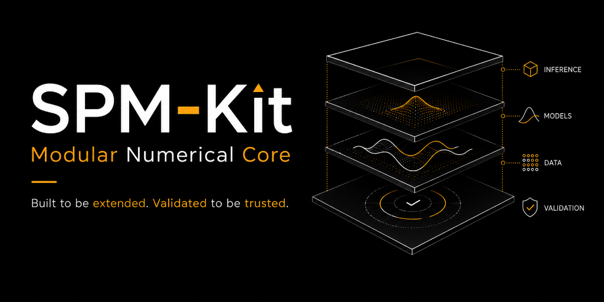
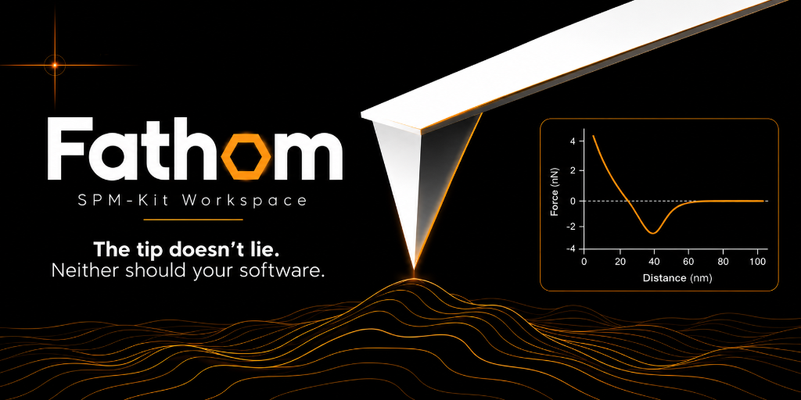
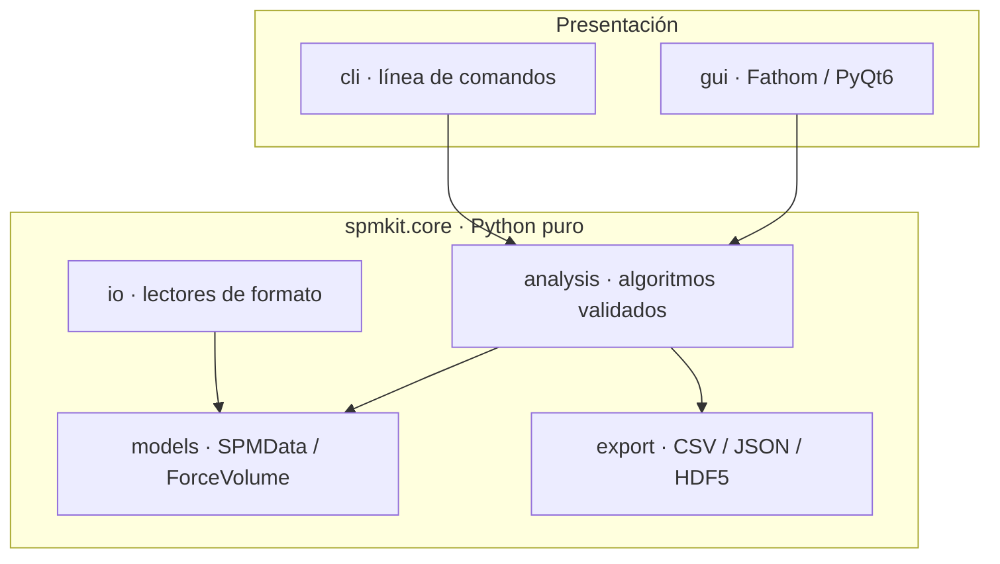
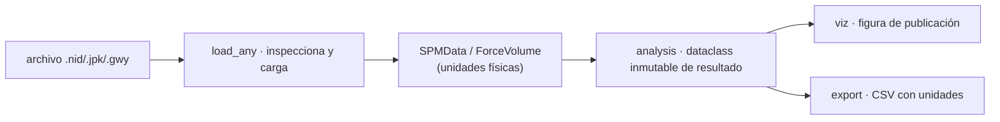
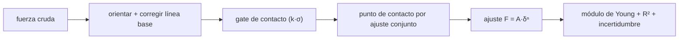

<div align="center">



# SPM-Kit · Fathom

**Motor numérico abierto y *workspace* interactivo para Microscopía de Sonda de Barrido (SPM)**

*Nanomecánica, espectroscopía de fuerza de molécula única, metrología de imagen y sensado de masa por resonancia — con física validada por recuperación numérica.*

[](https://github.com/kegouro/spmkit/actions/workflows/ci.yml)
[](https://github.com/kegouro/spmkit/actions/workflows/ci.yml)
[](https://pypi.org/project/spmkit/)
[](LICENSE)
[](https://github.com/astral-sh/ruff)
[](https://mypy-lang.org/)
[](https://zenodo.org/badge/latestdoi/1270254374)

**Español** · [English](README.en.md)

[Sinopsis](#sinopsis) · [Características](#características) · [Perspectivas](#galería-de-perspectivas) · [Instalación](#instalación) · [Tutoriales](#tutoriales) · [Arquitectura](#arquitectura) · [Extender](#extensibilidad) · [Validación](#validación-científica)


<br><br>


<sub>Fathom analiza por <b>perspectivas</b>: se cambia de tarea, no de pestaña. Todos los datos mostrados aquí son <b>sintéticos y reproducibles</b> (<a href="scripts/gen_docs_media.py"><code>scripts/gen_docs_media.py</code></a>).</sub>

</div>

---

<details>
<summary><b>Índice</b></summary>

- [Sinopsis](#sinopsis)
- [Características](#características)
- [Galería de perspectivas](#galería-de-perspectivas)
- [Instalación](#instalación)
- [Inicio rápido](#inicio-rápido)
- [Tutoriales](#tutoriales)
- [Referencia de la línea de comandos](#referencia-de-la-línea-de-comandos)
- [Atajos de teclado](#atajos-de-teclado)
- [Dónde está cada función](#dónde-está-cada-función)
- [Arquitectura](#arquitectura)
- [Formatos soportados](#formatos-soportados)
- [Extensibilidad](#extensibilidad)
- [Validación científica](#validación-científica)
- [Desarrollo y calidad](#desarrollo-y-calidad)
- [Agradecimientos](#agradecimientos)
- [Reproducir los medios](#reproducir-los-medios-de-este-readme)
- [Citar](#citar)

</details>

---

## Sinopsis

**SPM-Kit** es un *toolkit* riguroso y de código abierto (MIT) para decodificar, analizar y visualizar datos de microscopía de sonda de barrido —**AFM, KPFM y espectroscopía de fuerza**— desarrollado en el **SPM Lab** de la Universidad Técnica Federico Santa María (UTFSM). Nace de una premisa simple: el análisis científico debe ser **trazable, reproducible y honesto**, sin depender de software propietario ni de cajas negras.

Se organiza en dos capas con una frontera estricta entre ellas:

| Capa | Rol | Instalación |
|------|-----|-------------|
| **`spmkit.core`** | El **motor numérico** puro, sin interfaz gráfica: lectores de formato, análisis validado y exportación. Python + NumPy; dependencias pesadas opcionales. | `pip install spmkit` |
| **Fathom** | El **workspace interactivo** (PyQt6) construido sobre ese motor, pensado para **sustituir** herramientas propietarias como Nanosurf ANA y JPK Data Processing en investigación diaria. | `pip install "spmkit[gui]"` |

Esa separación no es cosmética: **`core/` no importa ninguna capa de interfaz**, y una prueba de arquitectura lo hace cumplir. Todo el análisis es scriptable, corre *headless* en un servidor o clúster, y la GUI es un panel de control transparente hacia el mismo código.

```bash
spmkit workspace scan.nid     # abre Fathom sobre un archivo
```

---

## Características

**Nanomecánica cuantitativa**
- Ajuste de contacto: **Hertz esférico**, **paraboloide**, **Sneddon cónico**, **DMT** y **JKR adhesivo**.
- Detección de contacto por **ajuste conjunto** (variable projection), inmune al sesgo del ruido de línea base que afecta a los umbrales k·σ ingenuos.
- **Incertidumbre por Monte Carlo** propagada desde la calibración (InVOLS, constante de resorte).
- Calibración de la palanca: InVOLS y **k por el método de ruido térmico** (equipartición).
- Ventanas de ajuste manual estilo JPK, con selección de región en vivo.

**Espectroscopía de fuerza de molécula única (SMFS)**
- Detección de eventos de ruptura por **prominencia** con piso de altura k·σ sobre la línea base (mata los *blips* de ruido).
- Ajuste de cadena polimérica por evento: **WLC** (Marko-Siggia / Bouchiat) y **FJC** (Langevin).
- Control de calidad (descarta ajustes de R² bajo) e **histograma de longitudes de contorno** de población.

**Mapas de force-volume**
- Mapea propiedades locales (módulo, adhesión, disipación) a coordenadas espaciales.
- Motor **vectorizado CPU/GPU** (NumPy / CuPy) que replica exactamente la forma cerrada del ajuste escalar.
- *Linked brushing* interactivo entre el mapa, el histograma y la curva individual.

**Resonancia y sensado de masa**
- **Sintonía térmica**: ajuste del oscilador armónico (SHO) al espectro de ruido térmico → **f₀, Q, k**.
- **Serie de evaporación**: sigue el desplazamiento de resonancia f(t) → masa añadida Δm(t), tasa de evaporación y ajuste de la **ley d²**.

**Metrología de imagen**
- Rugosidad **ISO 25178** (Sa, Sq, Sz…), perfiles de línea interactivos, nivelado (plano / polinómico / por filas).
- **KPFM / CPD** con función de trabajo de la muestra, detección de granos, análisis espectral (PSD radial, dimensión fractal, longitud de correlación).

**Ingeniería y confianza**
- **Nada hardcodeado**: cada umbral, modelo, unidad y parámetro es **editable en la interfaz**.
- **Exportación con fidelidad científica**: CSV trazable con metadatos, **unidad física en cada columna** y estadística por propiedad; nunca vuelca `NaN`.
- **Extensibilidad por *entry-points***: formatos, análisis y perspectivas nuevos se registran **sin tocar el núcleo**.
- **Personalización visual**: temas con presets (Grafito, Papel, NanoSurf oro, Nord, Dracula, Solarized, Gruvbox), acento y tipografía, con vista previa en vivo.

---

## Galería de perspectivas

Fathom expone **doce perspectivas**. Cada una es una vista completa —paneles, controles y lienzos— enfocada en una tarea. Se cambia de perspectiva desde la barra superior o con la paleta de comandos (`Ctrl+K`).

<table>
<tr>
<td width="50%"></td>
<td width="50%"></td>
</tr>
<tr>
<td align="center"><b>Curva de fuerza</b> — ajuste de contacto con módulo, incertidumbre, residuos y exportación científica.</td>
<td align="center"><b>Mapa</b> — mapa de módulo de un force-volume con histograma de población y colormap perceptual.</td>
</tr>
<tr>
<td width="50%"></td>
<td width="50%"></td>
</tr>
<tr>
<td align="center"><b>Sintonía térmica</b> — ajuste SHO del ruido térmico → f₀, Q y k.</td>
<td align="center"><b>Evaporación</b> — sensado de masa por desplazamiento de frecuencia: f(t), Δm(t) y ley d².</td>
</tr>
<tr>
<td width="50%"></td>
<td width="50%"></td>
</tr>
<tr>
<td align="center"><b>Imagen</b> — topografía: nivelado, perfil de línea, rugosidad ISO 25178 y KPFM.</td>
<td align="center"><b>Granos</b> — detección de partículas con estadística (conteo, diámetro, cobertura).</td>
</tr>
</table>

<details>
<summary><b>Las doce perspectivas, en una tabla</b></summary>

| Perspectiva | Para qué sirve |
|-------------|----------------|
| **Imagen** | Topografía: nivelado (plano/polinomio/filas), colormap, perfil de línea, rugosidad ISO 25178 y KPFM. |
| **Granos** | Detección de partículas con estadística (conteo, diámetro, cobertura, densidad). |
| **Espectral** | PSD radial, dimensión fractal y longitud de correlación. |
| **Sintonía térmica** | Resonancia por ruido térmico → f₀, Q, k por ajuste SHO y equipartición. |
| **Evaporación** | Serie temporal de sensado de masa: f(t) → Δm, tasa de evaporación, ley d². |
| **Curva de fuerza** | Ajuste de contacto (Hertz…JKR) con incertidumbre, residuos y exportación. |
| **SMFS** | Eventos de ruptura + ajuste de cadena WLC/FJC por evento, con QC e histograma. |
| **Mapa** | Mapas de propiedades de un force-volume + histograma + exportación. |
| **Batch** | Procesa carpetas de curvas **y** mapas de fuerza → tabla resumen científica. |
| **Figura** | Editor WYSIWYG de figuras de publicación (anotaciones, barra de escala, colorbar). |
| **Vista 3D** | Superficie con iluminación (*hillshade*) y exageración Z visual. |
| **Simulador** | Gemelo digital educativo del cantiléver (espectro de ruido térmico). |

</details>

---

## Instalación

```bash
pip install spmkit              # solo el motor numérico (servidores / HPC)
pip install "spmkit[gui]"       # + Fathom (estaciones de trabajo)
pip install "spmkit[all]"       # todo: GUI, HDF5, reportes, granos, formatos extra
```

Las dependencias pesadas son **extras opcionales**, de modo que el motor base queda liviano:

| Extra | Habilita |
|-------|----------|
| `gui` | Fathom (PyQt6, pyqtgraph, matplotlib). |
| `afm` | Lectores de la cola larga vía `afmformats` (JPK QI, `.ibw`, HDF5, NT-MDT…). |
| `jpk` | Curvas de fuerza JPK en formato TIFF (`tifffile`). |
| `grains` | Detección de granos y ajustes SHO (`scipy`). |
| `hdf5` | Lectura/escritura HDF5 (`h5py`). |
| `gwy` | Interoperabilidad con Gwyddion (`.gwy`). |
| `report` | Reportes HTML/PDF (`jinja2` + `viz`). |
| `viz` | Figuras de publicación (`matplotlib`, `cmcrameri`, *scalebars*). |

[Guía de usuario](docs/user-guide.md) · [PDF imprimible](docs/user-guide.pdf)

---

## Inicio rápido

**Como biblioteca de Python**

```python
from spmkit import load
from spmkit.core.analysis import roughness, leveling

data = load("scan.nid")                   # → SPMData (canales en unidades físicas)
ch = leveling.plane_fit(data["Z-Axis"])   # corrige la inclinación
print(roughness.statistics(ch))           # Sa, Sq, Sz… (ISO 25178)
```

```python
from spmkit.core.io import load_any
from spmkit.core.analysis import forcecurve

vol, _ = load_any("indent.jpk-force")     # → ForceVolume calibrado
seg = vol.curve(0).extend                  # segmento de aproximación
x = forcecurve.display_axis(seg.separation, seg.raw_height)
fit = forcecurve.fit_force_curve(x, seg.force, model="dmt")
print(fit.young_modulus, fit.r_squared)   # módulo de Young y bondad de ajuste
```

**Como aplicación de escritorio**

```bash
spmkit workspace scan.nid     # abre Fathom en el archivo indicado
```

**Desde la línea de comandos**

```bash
spmkit info scan.nid                     # metadatos del instrumento
spmkit nanomech indent.jpk-force         # ajuste de contacto de una curva
spmkit forcemap volume.jpk-qi -o mapa    # mapa de módulo de un force-volume
spmkit evaporation ./serie_termica/      # sensado de masa por evaporación
spmkit convert scan.nid scan.gwy         # transcribe a Gwyddion
```

---

## Tutoriales

<details>
<summary><b>1. Analizar una curva de fuerza (módulo de Young)</b></summary>

1. `spmkit workspace indent.jpk-force` (o **Abrir…** en Fathom). El archivo se rutea a la perspectiva **Curva de fuerza**.
2. En el panel **Pipeline** (abajo) elige el **modelo** de contacto (Hertz esférico, DMT, JKR…), el **radio de punta** y el método de **contacto** (Conjunto o umbral).
3. El **Inspector** (derecha) muestra el módulo de Young, R², punto de contacto, adhesión e incertidumbre ± (Monte Carlo).
4. Para restringir el ajuste, activa **Región** y arrastra la ventana sobre la rama de carga.
5. **Exportar curva…** genera un CSV con el ajuste, unidades y la tabla separación/fuerza.

Equivale a: `spmkit nanomech indent.jpk-force --model dmt`.
</details>

<details>
<summary><b>2. Mapa de módulo de un force-volume</b></summary>

1. Abre un force-volume (`.jpk-qi`, `.nid` de espectroscopía). Cambia a la perspectiva **Mapa**.
2. Elige la **Propiedad** (Módulo E, adhesión, disipación…), el **motor** (CPU rápido / pipeline) y el **colormap**.
3. **Calcular mapa** ajusta las miles de curvas de una sola vez (vectorizado). El **histograma** resume la población (mediana ± desviación).
4. Seleccionar un píxel del mapa muestra su curva individual en el Inspector (*linked brushing*).
5. **Exportar datos…** vuelca el mapa por punto con unidades y metadatos de la receta.

Equivale a: `spmkit forcemap volume.jpk-qi -o mapa`.
</details>

<details>
<summary><b>3. Constante de resorte por ruido térmico (Sintonía térmica)</b></summary>

1. Abre un espectro de sintonía térmica (`.nid`). Cambia a **Sintonía térmica**.
2. El ajuste **SHO** recupera **f₀** y **Q** del pico térmico; el instrumento suele traer sus propios valores para contraste.
3. Acota el **rango de frecuencia** alrededor del pico si hay modos vecinos.
4. **Calcular k (térmico)** integra ⟨x²⟩ = ∫ ASD² df sobre el rango y aplica equipartición con el factor de forma de modo χ editable.

> Validado contra un instrumento real: f₀ recuperada al 0.01 %, Q al 4 %, k al ~2 %.
</details>

<details>
<summary><b>4. Sensado de masa por evaporación (serie temporal)</b></summary>

1. Cambia a la perspectiva **Evaporación** y pulsa **Abrir serie…**; elige una carpeta de espectros de sintonía térmica (uno por instante).
2. Fathom sigue la resonancia f(t) y deriva la **masa añadida** Δm(t) (arriba f, abajo Δm).
3. Ajusta la **posición de carga x/L** (de micrografías) y la **constante de resorte k**; todo recalcula en vivo.
4. El readout reporta Δm₀, k, f₀ desnuda, r₀, τ y el R² de la **ley d²** (evaporación limitada por difusión).
5. **Exportar CSV…** para el análisis posterior.

Equivale a: `spmkit evaporation ./serie_termica/ -o evaporacion.csv`.
</details>

---

## Referencia de la línea de comandos

```bash
spmkit --help
```

| Comando | Qué hace |
|---------|----------|
| `info` | Metadatos e inventario de canales de un archivo. |
| `analyze` | Análisis de imagen (rugosidad, KPFM…) de un canal. |
| `nanomech` | Ajuste de contacto de una curva de fuerza. |
| `forcecurve` | Carga y describe una curva de fuerza calibrada. |
| `forcemap` | Mapa de propiedades de un force-volume. |
| `forcereport` | Reporte HTML/PDF de un force-volume. |
| `forceexport` | Exporta curvas/mapas de fuerza con fidelidad científica. |
| `fbatch` | Lote de curvas de fuerza de una carpeta → CSV. |
| `batch` | Lote de imágenes de una carpeta → CSV. |
| `jkr` | Ajuste JKR adhesivo (experimental, validado por recuperación). |
| `evaporation` | Serie de evaporación: f(t) → masa y tasa. |
| `figure` | Figura de publicación de un canal (PNG/SVG/PDF). |
| `convert` | Transcribe entre formatos (p. ej. `.nid` → `.gwy`). |
| `verify` | Verificación de trazabilidad byte a byte de un `.nid`. |
| `workspace` / `gui` | Abre Fathom. |

---

## Atajos de teclado

Toda acción está en la **paleta de comandos** (`Ctrl/⌘ + K`, búsqueda difusa). Los atajos más usados:

| Acción | Windows / Linux | macOS |
|--------|-----------------|-------|
| Paleta de comandos | `Ctrl + K` | `⌘ K` |
| Abrir curva o imagen | `Ctrl + O` | `⌘ O` |
| Guardar proyecto | `Ctrl + S` | `⌘ S` |
| Calcular mapa de propiedades | `Ctrl + M` | `⌘ M` |
| Exportar resultados (JSON) | `Ctrl + E` | `⌘ E` |
| Generar informe (HTML/PDF) | `Ctrl + Shift + R` | `⌘ ⇧ R` |
| Copiar resultados | `Ctrl + Shift + C` | `⌘ ⇧ C` |
| Fijar curva actual | `Ctrl + P` | `⌘ P` |
| Curva anterior / siguiente | `Ctrl + ←` / `Ctrl + →` | `⌘ ←` / `⌘ →` |
| Primera / última curva | `Ctrl + Home` / `Ctrl + End` | `⌘ Home` / `⌘ End` |
| Alternar tema claro/oscuro | `Ctrl + Shift + L` | `⌘ ⇧ L` |
| Personalizar apariencia | `Ctrl + Shift + A` | `⌘ ⇧ A` |

> En macOS, Qt mapea `Ctrl` a `⌘` automáticamente; los atajos se declaran una sola vez en [`gui/app_workspace.py`](src/spmkit/gui/app_workspace.py) y [`gui/shell/workspace.py`](src/spmkit/gui/shell/workspace.py).

---

## Dónde está cada función

Cada análisis del núcleo tiene un control visible en una perspectiva. Este mapa conecta la **función**, su **ubicación en la UI** y el **módulo del `core`** donde vive (para buscarlo en el repositorio):

| Función | Perspectiva · control | Módulo del núcleo |
|---------|-----------------------|-------------------|
| Nivelado (plano/polinomio/filas) | Imagen · dropdown *Nivelado* | [`core/analysis/leveling.py`](src/spmkit/core/analysis/leveling.py) |
| Rugosidad ISO 25178 | Imagen · panel *Análisis* | [`core/analysis/roughness.py`](src/spmkit/core/analysis/roughness.py) |
| Perfil de línea | Imagen · ROI en el lienzo | [`core/analysis/profiles.py`](src/spmkit/core/analysis/profiles.py) |
| KPFM / CPD | Imagen · canal en V + Φ de la punta | [`core/analysis/kpfm.py`](src/spmkit/core/analysis/kpfm.py) |
| Detección de granos | Granos · umbral | [`core/analysis/grains.py`](src/spmkit/core/analysis/grains.py) |
| PSD radial / fractal / correlación | Espectral · rango q | [`core/analysis/spectral.py`](src/spmkit/core/analysis/spectral.py) |
| Ajuste de contacto (Hertz…JKR) | Curva de fuerza · panel *Pipeline* | [`core/analysis/forcecurve.py`](src/spmkit/core/analysis/forcecurve.py) |
| JKR adhesivo | Curva de fuerza · modelo JKR | [`core/analysis/experimental.py`](src/spmkit/core/analysis/experimental.py) |
| SMFS (WLC / FJC) | SMFS · selector de modelo + umbrales | [`core/analysis/chain.py`](src/spmkit/core/analysis/chain.py) |
| Mapa de módulo (CPU/GPU) | Mapa · *Calcular mapa* | [`core/analysis/forcevolume_fast.py`](src/spmkit/core/analysis/forcevolume_fast.py) |
| Sintonía térmica (f₀ / Q) | Sintonía térmica · rango + *Calcular k* | [`core/analysis/resonance.py`](src/spmkit/core/analysis/resonance.py) |
| Calibración (InVOLS, k térmico) | Sintonía térmica / Pipeline · *Calcular* | [`core/analysis/calibration.py`](src/spmkit/core/analysis/calibration.py) |
| Serie de evaporación (Δm, ley d²) | Evaporación · *Abrir serie* | [`core/analysis/resonance.py`](src/spmkit/core/analysis/resonance.py) |
| Simulador del cantiléver | Simulador | [`core/analysis/simulation.py`](src/spmkit/core/analysis/simulation.py) |
| Figura de publicación | Figura · formulario del panel | [`core/viz/figure.py`](src/spmkit/core/viz/figure.py) |
| Exportación científica (CSV) | *Exportar…* en cada perspectiva | [`core/export/writers.py`](src/spmkit/core/export/writers.py) |
| Lote de carpetas (curvas / mapas) | Batch · *Abrir carpeta* | [`core/forcebatch.py`](src/spmkit/core/forcebatch.py) |

---

## Arquitectura

Tres capas estrictamente separadas. **`core/` es Python puro sin imports de interfaz**; `cli/` y `gui/` solo orquestan y presentan, e importan la API pública de `core`. Una prueba (`tests/test_architecture.py`) **hace cumplir** esta regla.



**Flujo de datos** — de un archivo de instrumento a un resultado trazable:



**Pipeline de una curva de fuerza** — la forma cerrada que comparten el ajuste escalar y el mapa vectorizado:



**Modelo de datos** ([`core/models`](src/spmkit/core/models)):

- **`SPMChannel`** — un canal 2D en unidades físicas: `.data`, `.unit`, `.x_range`/`.y_range` (metros), `.direction`, `.metadata`.
- **`SPMData`** — colección de canales; acceso por nombre `data["Height"]`.
- **`ForceVolume`** / **`ForceCurve`** / **`ForceSegment`** — la jerarquía de espectroscopía de fuerza, calibrable y picklable.

**Registro de módulos de la GUI** (MVVM) — una perspectiva es un `ModuleSpec` (ViewModel observable + panel Qt) descubierto por *entry-points*; ver [Extensibilidad](#extensibilidad).

---

## Formatos soportados

| Extensión | Origen | Soporte |
|-----------|--------|---------|
| `.nid` | NanoSurf clásico | Lectura validada a **precisión de máquina** contra Gwyddion; imagen y espectroscopía. |
| `.gwy` | Gwyddion | Lectura y escritura nativa. |
| `.nhf` | NanoSurf HDF5 | Lectura (experimental). |
| `.spm` / `.00N` | Bruker / Nanoscope | Imagen Nanoscope III `.spm` — soporte **parcial**; seis archivos demostrados contra Gwyddion 2.71 a precisión de matriz. `.00N` no fue evaluado en este hito. |
| `.jpk-force` / `.jpk-qi` | JPK Instruments | Curvas y mapas de fuerza (extra `afm`). |
| JPK-TIFF | JPK (exportación TIFF) | Curvas de fuerza detectadas **por contenido** (extra `jpk`). |
| `.ibw`, HDF5, NT-MDT… | Varios | Cola larga vía `afmformats` (extra `afm`). |

> Los datos de instrumento nunca se versionan: `reference/` está en `.gitignore`. Todas las figuras de esta documentación se generan con **datos sintéticos**.

---

## Extensibilidad

Fathom está diseñado para que **añadir capacidades sea un trámite corto**, sin tocar el núcleo. Tres puntos de extensión, cada uno por *entry-points* en tu propio paquete. Guía completa: **[docs/extending.md](https://kegouro.github.io/spmkit/extending/)**.

### 1. Un formato de archivo nuevo

```python
# mi_plugin/lector.py
from spmkit.core.models import SPMData, SPMChannel

class MiLector:
    extensions = (".miext",)
    def inspect(self, path): ...            # capacidades (imagen/fuerza) — barato
    def load(self, path, kind=None):        # → SPMData / ForceVolume
        return SPMData(channels=(SPMChannel(name="Z", data=z, unit="m",
                                            x_range=1e-6, y_range=1e-6),))
```

```toml
# pyproject.toml de tu plugin
[project.entry-points."spmkit.plugins.v1"]
mi_formato = "mi_plugin.lector:MiLector"
```

### 2. Un análisis nuevo

Va en `core/analysis/` (Python puro, **sin UI**) y devuelve un dataclass inmutable. Si es un modelo físico, **entra con su prueba de recuperación** (ver [Validación](#validación-científica)).

### 3. Una perspectiva nueva

**Añadir una perspectiva = añadir un `ModuleSpec`:**

```python
from spmkit.gui.extensions import ModuleSpec, PanelSpec, PerspectiveSpec

MI_MODULO = ModuleSpec(
    name="mi_modulo",
    panels=(PanelSpec("mi_panel", "Mi análisis", _fabrica_del_panel),),
    perspectives=(PerspectiveSpec("mi", "Mi análisis", ("navigator", "mi_panel")),),
)
```

```toml
[project.entry-points."spmkit.gui.modules"]
mi_modulo = "mi_plugin.gui:MI_MODULO"
```

Al instalar tu plugin, la perspectiva aparece en la barra de Fathom **sin modificar spmkit**. Este es el mecanismo que convierte a `spmkit` en un *host* multi-física y a Fathom en una de sus extensiones.

---

## Validación científica

La rigurosidad es el pilar del proyecto. Cada modelo físico pasa un ***gate* de recuperación numérica**: se generan datos sintéticos con parámetros conocidos y ruido controlado, y el ajuste debe recuperarlos dentro de tolerancia **o no entra al repositorio** ([`tests/validation/test_recovery.py`](tests/validation/test_recovery.py)).

| Modelo / análisis | Se recupera | Tolerancia |
|-------------------|-------------|-----------|
| Contacto (Hertz / DMT) | Módulo de Young | < 2 % con 1 % de ruido |
| WLC / FJC | Longitud de contorno, persistencia / Kuhn | < 1 % |
| JKR adhesivo | E\*, trabajo de adhesión | < 2 % (E\*), límite Hertz w = 0 |
| Relajación SLS | Tiempo característico τ | < 4 % |
| Sintonía térmica (SHO) | f₀, Q | 0.01 % / 4 % vs instrumento real |

Además del *round-trip* de formatos (correlación de **precisión de máquina** contra Gwyddion), el lector `.nid` incluye **trazabilidad byte a byte** (`spmkit verify`). La integración continua ejecuta **más de 460 pruebas** de núcleo, validación y GUI (esta última *offscreen*) en Python 3.11 y 3.12.

### Hito Nanoscope SPM v0.1

El lector nativo limitado para Nanoscope III `.spm` reprodujo contra Gwyddion 2.71
las matrices de seis archivos experimentales demostrados (cuatro `DEVELOPMENT` y
dos `EXTERNAL_CONFIRMATION`) con delta máximo y RMS de píxel de `0.0 nm`. Las
comparaciones Sa/Sq/Sz fueron 12/12 y 6/6 dentro de la tolerancia congelada. Es
evidencia `LEVEL 2 NUMERICALLY_VERIFIED` para este alcance limitado, no soporte
universal del formato ni validación física. La confirmación Lancaster fue
prerregistrada pero no ciega porque el *preflight* expuso métricas antes de la
implementación; no hay un blind holdout. Véase la [auditoría final](https://github.com/kegouro/spmkit-validation/blob/1fdc21b45841434758d256ea3b4be77910b74073/docs/campaigns/nanoscope_spm_parser_pilot_v0.1_audit.md).

---

## Desarrollo y calidad

```bash
make dev        # instalación editable con extras dev + gui + hdf5 y hooks de pre-commit
make check      # lint + tipos + pruebas — exactamente lo que corre CI
make gui        # lanza Fathom
```

- **Tipos**: `mypy` estricto sobre `core` (`disallow_untyped_defs`). **Estilo**: `black` y `ruff` a 100 columnas.
- **Pruebas**: `tests/core/` (unitarias), `tests/validation/` (trazabilidad científica), `tests/gui/` (offscreen, requieren los extras `gui` + `test-gui`).
- **Convención**: todo análisis numérico vive en `src/spmkit/core/`; `cli/` y `gui/` solo lo invocan. Ver [`CLAUDE.md`](CLAUDE.md) y [`CONTRIBUTING.md`](CONTRIBUTING.md).

## Agradecimientos

María Saavedra Fredes y Benjamin Schleyer ayudaron a localizar y compartir
datasets candidatos para la campaña de validación.

### Reproducir los medios de este README

Todas las capturas y el GIF se regeneran de datos sintéticos, sin ningún archivo de instrumento:

```bash
QT_QPA_PLATFORM=offscreen python scripts/gen_docs_media.py
```

---

## Citar

Si usas SPM-Kit o Fathom en una publicación, cítalo según [`CITATION.cff`](CITATION.cff).

<br>
<div align="center">

[](https://zenodo.org/badge/latestdoi/1270254374)

<sub>Estructurado bajo el <b><a href="https://kegouro.github.io">Pharos Project</a></b> — infraestructura científica sin barreras computacionales.</sub>
<br>
<sub>José Labarca Baeza · Prof. Tomás Corrales · SPM Lab, UTFSM · Licencia MIT © 2026</sub>

</div>
