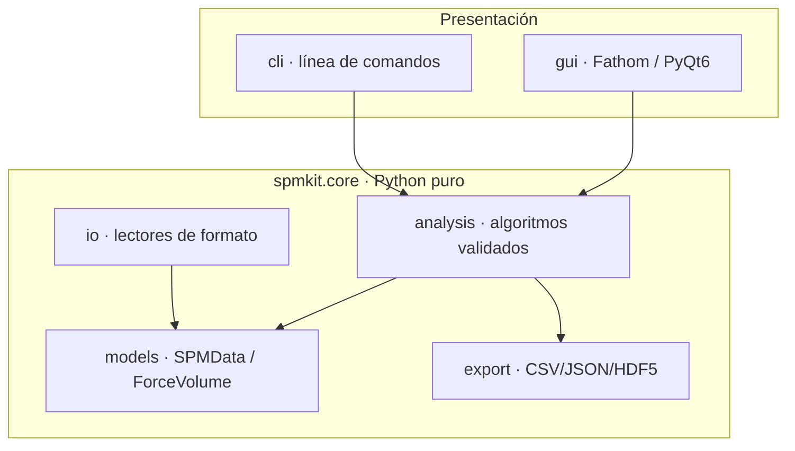

<div align="center">


# SPM-Kit · Fathom

### El motor numérico abierto y el *workspace* interactivo para Microscopía de Sonda de Barrido

[](https://github.com/kegouro/spmkit/actions/workflows/ci.yml)
[](https://github.com/kegouro/spmkit/actions/workflows/ci.yml)
[](https://pypi.org/project/spmkit/)
[](LICENSE)
[](https://github.com/astral-sh/ruff)

**🇪🇸 Español** · [🇬🇧 English](README.en.md)

**[📖 Documentación](https://kegouro.github.io/spmkit/)** · [✨ Características](#-características) · [🚀 Instalación](#-instalación) · [🧩 Desarrollar tu propio módulo](#-desarrollar-en-fathom-extensibilidad) · [🏗️ Arquitectura](#️-arquitectura)

</div>

---

## 🔬 Qué es

**SPM-Kit** es un *toolkit* riguroso y de código abierto (MIT) para decodificar, analizar y visualizar datos de microscopía de sonda de barrido —**AFM, KPFM y espectroscopía de fuerza**— desarrollado en el **SPM Lab** de la Universidad Técnica Federico Santa María (UTFSM).

Se organiza en dos capas:

| Capa | Rol |
|------|-----|
| 🧮 **`spmkit.core`** | El **motor numérico** puro (sin interfaz): lectores de formato, análisis validado, exportación. Instalable solo, ideal para *scripts*, HPC y *pipelines* reproducibles. |
| 🖥️ **Fathom** | El **workspace interactivo** construido sobre ese motor, diseñado para **sustituir herramientas propietarias** (Nanosurf ANA, JPK Data Processing) en investigación. |

```bash
spmkit workspace [archivo]     # abre Fathom
```

<div align="center">

<sub>Fathom — análisis por <b>perspectivas</b>: cambias de tarea, no de pestaña.</sub>
</div>

---

## ✨ Características

- 🧪 **Nanomecánica en tiempo real** — ajuste de contacto (Hertz, paraboloide, Sneddon cónico, DMT y **JKR adhesivo**) con módulo de Young, **incertidumbre por Monte Carlo**, detección de contacto robusta (ajuste conjunto), calibración (InVOLS y *k* por ruido térmico) y ventanas de ajuste manual.
- 🧬 **SMFS (molécula única)** — detección de eventos de ruptura por **prominencia** y ajuste de cadena polimérica por evento: **WLC** (Marko-Siggia/Bouchiat) y **FJC** (Langevin), con control de calidad e histograma de contorno de población.
- 🗺️ **Mapas de force-volume** — propiedades locales mapeadas a coordenadas espaciales, con *linked brushing* interactivo entre espectros y topografía, y motor vectorizado CPU/GPU.
- 📐 **Metrología de imagen** — rugosidad ISO 25178, perfiles de línea interactivos, KPFM/CPD por sonda Kelvin, detección de granos, análisis espectral (PSD radial, dimensión fractal).
- 📤 **Exportación con fidelidad científica** — CSV trazable con metadatos, **unidades físicas en cada columna** y estadística por propiedad; sin volcados de `NaN`.
- 🎛️ **Nada hardcodeado** — cada umbral, modelo y unidad es **editable en la interfaz**.
- 🧩 **Extensibilidad abierta** — formatos, análisis y perspectivas nuevos se registran por *entry-points* **sin tocar el núcleo** (ver [abajo](#-desarrollar-en-fathom-extensibilidad)).
- 🎨 **Personalización visual** — temas con presets (Grafito, Papel, NanoSurf oro, Nord, Dracula, Solarized, Gruvbox), acento y tipografía, con vista previa en vivo.

---

## 🖼️ Perspectivas

| Perspectiva | Para qué sirve |
|-------------|----------------|
| **Imagen** | Topografía: nivelado (plano/polinomio/filas), colormap, perfil de línea, rugosidad ISO 25178 y KPFM. |
| **Granos** | Detección de partículas con estadística (conteo, diámetro, cobertura, densidad). |
| **Espectral** | PSD radial, dimensión fractal y longitud de correlación. |
| **Curva de fuerza** | Ajuste de contacto (Hertz…JKR) con incertidumbre, residuos y exportación científica. |
| **SMFS** | Eventos de ruptura + ajuste de cadena WLC/FJC por evento, con QC e histograma. |
| **Sintonía térmica** | Resonancia por ruido térmico → **f₀, Q, k** por equipartición. |
| **Mapa** | Mapas de propiedades de un force-volume + histograma + exportación. |
| **Batch** | Procesa carpetas de curvas **y mapas** de fuerza → tabla resumen científica. |
| **Figura** | Editor WYSIWYG de figuras de publicación (anotaciones, barra de escala, colorbar). |
| **Vista 3D** | Superficie con iluminación (*hillshade*) y exageración Z visual. |
| **Simulador** | Gemelo digital educativo del cantiléver (espectro de ruido térmico). |

---

## 🚀 Instalación

```bash
pip install spmkit              # solo el motor numérico (servidores/HPC)
pip install "spmkit[gui]"       # + Fathom (workstations)
pip install "spmkit[all]"       # + HDF5, reportes, granos (SciPy)
```

## ⚡ Inicio rápido

**Como biblioteca de Python:**

```python
from spmkit import load
from spmkit.core.analysis import roughness, leveling

data = load("scan.nid")                 # → SPMData (canales en unidades físicas)
ch = leveling.plane_fit(data["Z-Axis"]) # corrige inclinación
print(roughness.statistics(ch))         # Sa, Sq, Sz… (ISO 25178)
```

**Como GUI:**

```bash
spmkit workspace scan.nid
```

**Desde la línea de comandos:**

```bash
spmkit info scan.nid                     # metadatos del instrumento
spmkit roughness scan.nid -c Z-Axis      # parámetros ISO 25178
spmkit convert scan.nid scan.gwy         # transcribe a Gwyddion
spmkit fbatch /datos -o resultados.csv   # lote de curvas de fuerza
```

---

## 🧩 Desarrollar en Fathom (extensibilidad)

Fathom está diseñado para que **añadir capacidades sea un trámite corto**, sin tocar el núcleo. Hay tres puntos de extensión, cada uno por *entry-points* declarados en tu propio paquete. Guía completa: **[docs/extending.md](https://kegouro.github.io/spmkit/extending/)**.

### 1. Un formato de archivo nuevo

Crea un lector que devuelva un `SPMData` y regístralo:

```python
# mi_plugin/lector.py
from spmkit.core.models import SPMData, SPMChannel

class MiLector:
    extensions = (".miext",)
    def inspect(self, path): ...          # capacidades (imagen/fuerza) — barato
    def load(self, path, kind=None):      # → SPMData / ForceVolume
        ...
        return SPMData(channels=(SPMChannel(name="Z", data=z, unit="m",
                                            x_range=1e-6, y_range=1e-6),))
```

```toml
# pyproject.toml de tu plugin
[project.entry-points."spmkit.plugins.v1"]
mi_formato = "mi_plugin.lector:MiLector"
```

### 2. Un análisis nuevo

Va en `core/analysis/` (Python puro, **sin UI**) y devuelve un dataclass inmutable. Si es un modelo físico, **entra con su test de recuperación** (ver [Validación](#-validación-científica)).

### 3. Una perspectiva nueva (una vista completa en Fathom)

Declara un `ModuleSpec` — un ViewModel (estado observable) + un panel (Qt) + su registro. **Añadir una perspectiva = añadir un `ModuleSpec`:**

```python
from spmkit.gui.extensions import ModuleSpec, PanelSpec, PerspectiveSpec

MI_MODULO = ModuleSpec(
    name="mi_modulo",
    panels=(PanelSpec("mi_panel", "Mi análisis", _fabrica_del_panel),),
    perspectives=(PerspectiveSpec("mi", "Mi análisis", ("navigator", "mi_panel")),),
)
```

```toml
[project.entry-points."spmkit.gui.modules"]
mi_modulo = "mi_plugin.gui:MI_MODULO"
```

Al instalar tu plugin, la perspectiva aparece en la barra de Fathom **sin modificar spmkit**. Este es el mecanismo que convierte a `spmkit` en un *host* multi-física y a Fathom en una de sus extensiones.

---

## 🏗️ Arquitectura

Tres capas estrictamente separadas: **`core/` es Python puro sin imports de UI**; `cli/` y `gui/` solo orquestan/presentan e importan la API pública de `core`. Esta regla la **hace cumplir un test** (`tests/test_architecture.py`).



---

## 📂 Formatos

| Extensión | Origen | Soporte |
|-----------|--------|---------|
| `.nid` | NanoSurf clásico | Lectura validada a precisión de máquina vs Gwyddion |
| `.gwy` | Gwyddion | Lectura y escritura nativa |
| `.nhf` | NanoSurf HDF5 | Experimental |
| `.jpk-force` / `.jpk-qi` | JPK Instruments | Curvas y mapas de fuerza (extra `afm`) |

---

## 🔬 Validación científica

La rigurosidad es el pilar del proyecto. Además del *round-trip* de formatos (correlación de **precisión de máquina** contra Gwyddion), **cada modelo físico pasa un *gate* de recuperación numérica**: se generan datos sintéticos con parámetros conocidos y ruido controlado, y el ajuste debe recuperarlos dentro de tolerancia o **no entra al repositorio**.

- Módulo de Young a **<2 %** incluso con ruido (gracias al ajuste conjunto del contacto).
- Contorno/persistencia de **WLC/FJC**, E\*/adhesión de **JKR** y τ de la relajación **SLS** igualmente validados.

CI ejecuta **351 pruebas de núcleo/validación** + **168 de GUI** (offscreen) en Python 3.11 y 3.12. Ver [`docs/VALIDATION.md`](./docs/VALIDATION.md) y [`tests/validation/`](./tests/validation).

---

## 🤝 Contribuir

El análisis numérico reside exclusivamente en `src/spmkit/core/`. Se exige `mypy` (estricto en `core`), `black` y `ruff`. `make check` es exactamente lo que corre CI. Ver [`CONTRIBUTING.md`](./CONTRIBUTING.md).

## 📖 Citar

Si usas SPM-Kit o Fathom en una publicación, cítalo según [`CITATION.cff`](./CITATION.cff).

<br>
<div align="center">

[](https://zenodo.org/badge/latestdoi/1270254374)

<sub>Estructurado bajo el <b><a href="https://kegouro.github.io">Pharos Project</a></b> — infraestructura científica sin barreras computacionales.</sub>
<br>
<sub>José Labarca Baeza · Prof. Tomás Corrales · UTFSM | Licencia MIT © 2026</sub>

</div>
