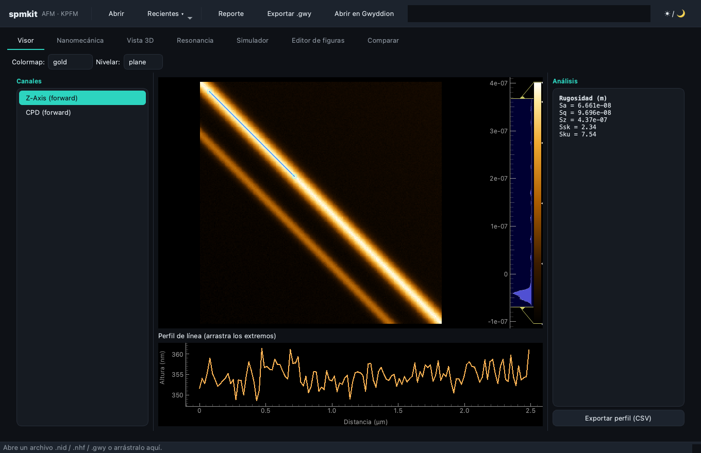
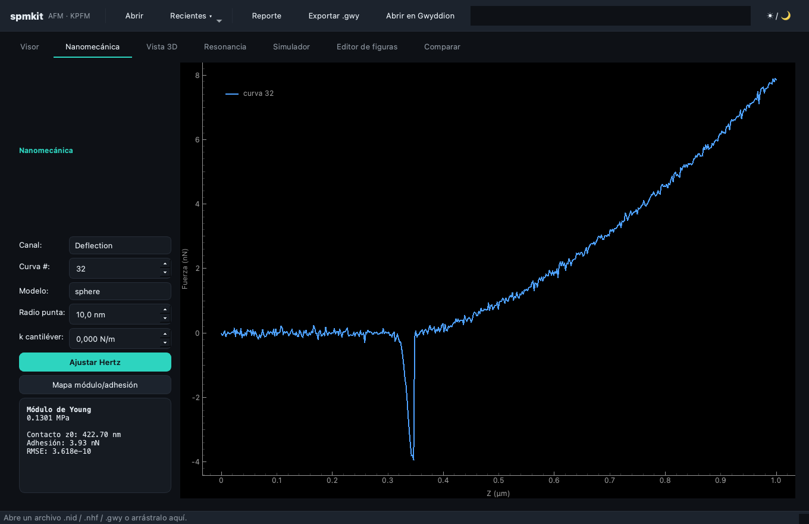
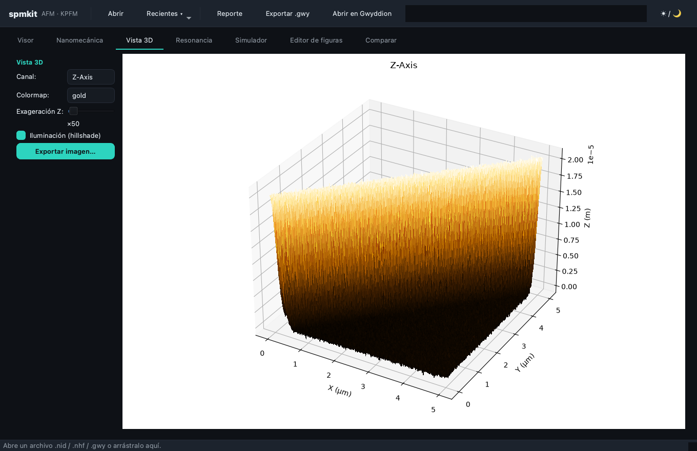
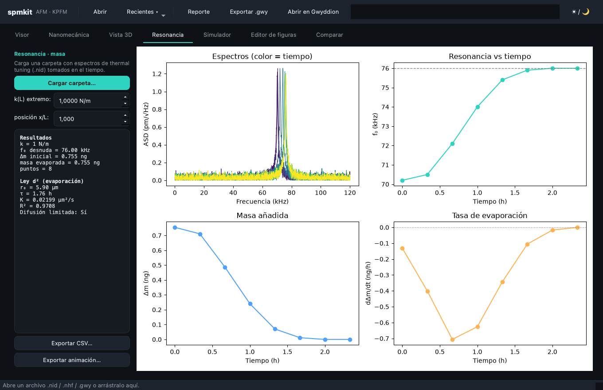
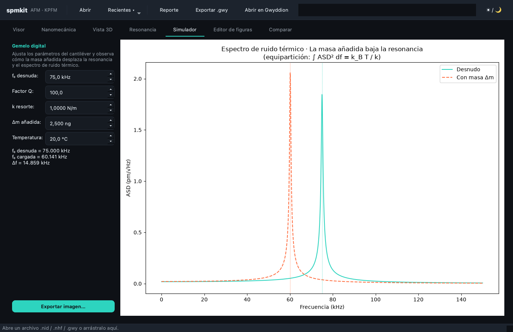
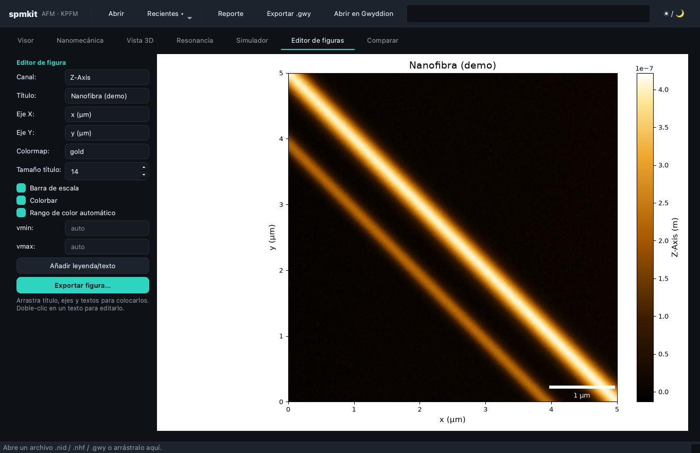
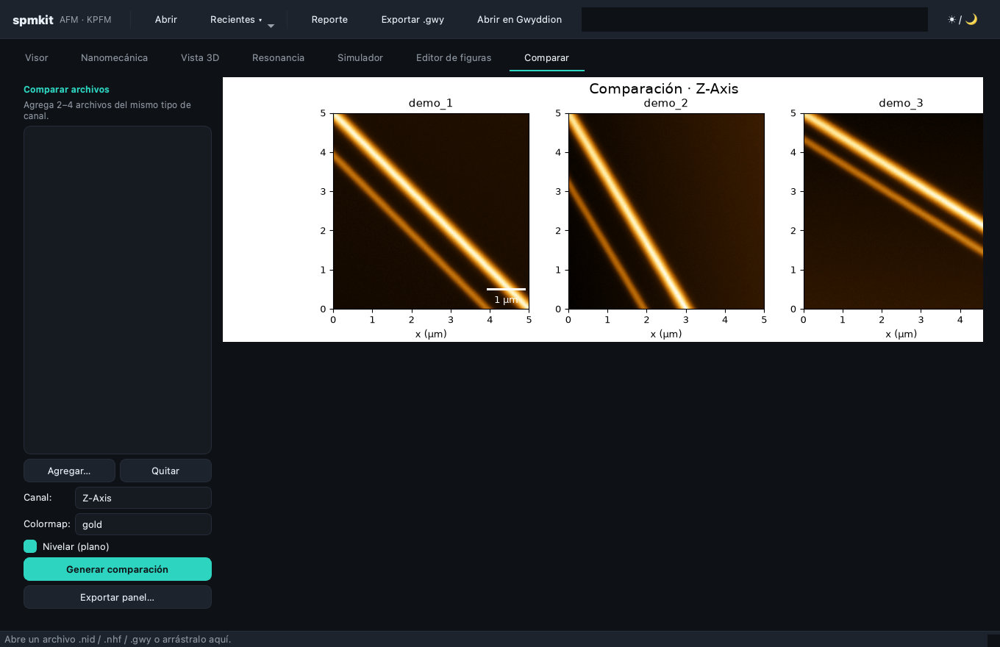
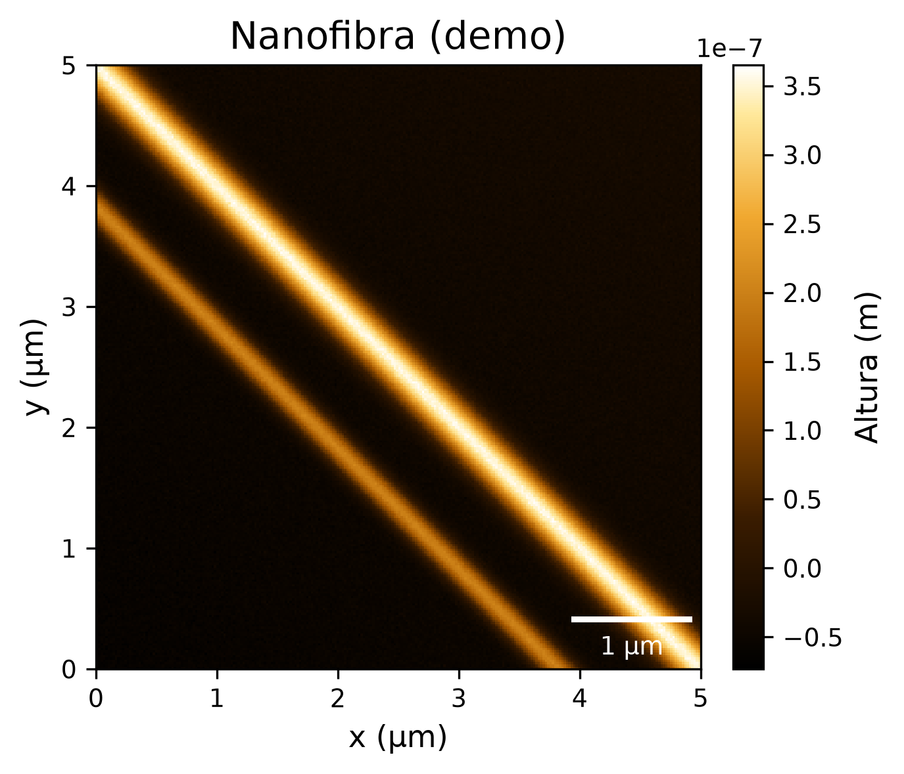

<div align="center">

# 🔬 SPM-Kit

### Analizador open-source de datos **AFM / KPFM** para microscopía de sonda de barrido

*Desarrollado en el **SPM Lab** de la Universidad Técnica Federico Santa María (UTFSM)*

[](https://github.com/kegouro/spmkit/actions/workflows/ci.yml)
[](https://github.com/kegouro/spmkit/actions/workflows/ci.yml)
[](#-tests-y-calidad)
[](https://pypi.org/project/spmkit/)
[](https://pypi.org/project/spmkit/)
[](LICENSE)
[](https://github.com/astral-sh/ruff)
[](https://mypy-lang.org/)
[](https://kegouro.github.io/spmkit/)

**[📖 Documentación](https://kegouro.github.io/spmkit/)** · [Instalación](#-instalación) · [Uso rápido](#-uso-rápido) · [Características](#-características) · [Validación](#-validación-científica) · [Arquitectura](#-arquitectura) · [Contribuir](CONTRIBUTING.md)


<sub>Interfaz de spmkit · <i>captura con datos sintéticos de ejemplo</i></sub>

> 📖 **Guía de estudio**: teoría de AFM con diagramas en [docs/theory/index.html](docs/theory/index.html) (ábrela en el navegador).

</div>

---

Lee formatos **NanoSurf** (`.nid`, `.nhf`) y **Gwyddion** (`.gwy`), y entrega
análisis listo para publicar: rugosidad, perfiles, KPFM y nanomecánica, con una
CLI y una GUI científica. Su lectura del `.nid` está **validada a precisión de
máquina** contra Gwyddion.

## ✨ Características

| | |
|---|---|
| 🗂️ **Formatos** | Lee `.nid`, `.nhf`, `.gwy`; escribe `.gwy` (round-trip con Gwyddion) |
| 📊 **Rugosidad** | ISO 25178 (Sa, Sq, Sz, Ssk, Sku) + nivelación (plano/polinomio/filas) |
| 📈 **Perfiles** | Perfiles de línea interactivos con interpolación bilineal |
| ⚡ **KPFM** | Potencial de contacto (CPD) y función de trabajo |
| 🔩 **Nanomecánica** | Hertz/Sneddon → módulo de Young, adhesión, **mapas** de módulo |
| 〰️ **Resonancia** | Thermal tuning → sensado de masa por Δf: f(t), Δm(t), tasa de evaporación, ley d² |
| 🧊 **Vista 3D** | Superficie 3D interactiva con dorado e iluminación hillshade |
| 📐 **Espectral** | PSD radial, exponente de Hurst, dimensión fractal, longitud de correlación |
| 🧮 **Simulador** | Gemelo digital del cantiléver: ruido térmico y corrimiento por masa |
| 🧫 **Granos** | Detección de partículas y estadística de tamaños |
| 🎨 **Figuras** | Editor WYSIWYG, colormaps científicos, barra de escala → PNG/SVG/PDF |
| 🧩 **Comparar** | Fusiona 2–4 archivos con colorbar y escala compartidas |
| 📝 **Reportes** | Informe HTML completo (imprimible a PDF) + procesamiento por lotes |
| 🖥️ **GUI** | 7 pestañas, tema claro/oscuro, atajos de teclado, drag & drop |

## 🖼️ La app en acción

Cada sección procesando datos *(ejemplos con datos sintéticos)*:

| Visor — imagen, perfil y rugosidad/KPFM | Nanomecánica — curva F-d y ajuste Hertz |
|:---:|:---:|
|  |  |
| **Vista 3D** — superficie con iluminación | **Resonancia** — sensado de masa |
|  |  |
| **Simulador** — gemelo digital del cantiléver | **Editor de figuras** — publicación |
|  |  |
| **Comparar** — panel con escala/color compartidos | |
|  | |

## 📦 Instalación

Requiere **Python ≥ 3.11**.

```bash
# Desde el repositorio (disponible ya):
pip install "git+https://github.com/kegouro/spmkit#egg=spmkit[gui]"

# Desde PyPI (una vez publicado):
pip install spmkit              # núcleo + CLI
pip install "spmkit[gui]"       # + interfaz gráfica
pip install "spmkit[all]"       # todo (gui, gwy, hdf5, granos, figuras, reportes)
```

Verifica la instalación:

```bash
spmkit --version
spmkit gui          # abre la interfaz gráfica
```

<details>
<summary>Extras disponibles</summary>

| Extra | Añade |
|-------|-------|
| `gui` | Interfaz gráfica (PyQt6 + pyqtgraph) |
| `viz` | Figuras de publicación (matplotlib, colormaps, scale bar) |
| `gwy` | Interop Gwyddion `.gwy` |
| `hdf5` | Lectura/exportación HDF5 |
| `grains` | Detección de granos (scipy) |
| `report` | Reportes HTML/PDF |
| `nanosurf` | Lector `.nhf` validado (NSFopen) |

</details>

> Funciona con `pip` o [`uv`](https://github.com/astral-sh/uv). Build backend: `hatchling`.

## 🚀 Uso rápido

**CLI**

```bash
spmkit info     scan.nid                     # metadatos y canales
spmkit roughness scan.nid -c Z-Axis          # rugosidad (ISO 25178)
spmkit nanomech spec.nid --tip-radius 10e-9  # ajuste Hertz → módulo de Young
spmkit grains   scan.nid                     # detección de granos
spmkit figure   scan.nid -o fig.svg          # figura de publicación
spmkit convert  scan.nid scan.gwy            # → Gwyddion
spmkit gui                                   # interfaz gráfica
```

**Como librería**

```python
from spmkit import load
from spmkit.core.analysis import leveling, roughness, kpfm

data  = load("scan.nid")
flat  = leveling.plane_fit(data["Z-Axis"])   # corrige inclinación
stats = roughness.statistics(flat)            # Sa, Sq, Sz, Ssk, Sku
cpd   = kpfm.statistics(data["CPD"], tip_work_function=5.0)
```

## 🔬 Validación científica

La lectura del `.nid` se verificó contra el `.gwy` exportado por Gwyddion para
la **misma medida**: conversión a unidades físicas **exacta a precisión de
máquina** (correlación 1.000000) y orientación de imagen consistente con
Gwyddion/NanoSurf. Detalles en **[docs/VALIDATION.md](docs/VALIDATION.md)**.

## 🖼️ Figuras de publicación

<div align="center">

</div>

Colormaps perceptualmente uniformes (incluido el **dorado estilo NanoSurf**),
barra de escala física, textos arrastrables y rango de color editable.

## 🏗️ Arquitectura

Separación estricta en tres capas. CLI y GUI **solo** usan la API pública del
`core`; nunca tocan parsers ni implementan análisis.

```
┌───────────────┐   ┌───────────────┐
│     cli/      │   │     gui/      │   ← presentación (typer / PyQt6)
└───────┬───────┘   └───────┬───────┘
        └───────────┬───────┘   importan funciones del core
                    ▼
        ┌───────────────────────┐
        │         core/         │   ← puro Python, sin UI
        │ io · analysis · viz   │
        └───────────────────────┘
                    ▲
   .nid / .nhf / .gwy ┘
```

Más en [docs/ARCHITECTURE.md](docs/ARCHITECTURE.md).

## 🧰 Formatos soportados

| Formato | Extensión | Estado |
|---------|-----------|--------|
| NanoSurf clásico | `.nid` | ✅ Lectura validada |
| NanoSurf HDF5 | `.nhf` | 🧪 Experimental |
| Gwyddion | `.gwy` | ✅ Lectura y escritura |
| Exportación | `.csv` `.json` `.h5` `.png` `.svg` `.pdf` | ✅ |

## 🧪 Tests y calidad

- **106 tests** con `pytest` (cobertura ~73%), incluyendo una **suite de
  validación científica** (`tests/validation/`) que compara la lectura del
  `.nid` contra exports reales de Gwyddion.
- Tipado estático con **mypy**, lint con **ruff**, formato con **black**.
- **CI** en GitHub Actions corre lint + tests en **Python 3.11 y 3.12** en cada push.

```bash
pytest                    # tests + cobertura
ruff check src tests      # lint
black --check src tests   # formato
mypy src                  # tipos
```

## 🤝 Contribuir

¡Bienvenidas las contribuciones! Lee [CONTRIBUTING.md](CONTRIBUTING.md). El
análisis vive en `core/`; la CLI/GUI solo orquestan. Todo pasa por `ruff`,
`black`, `mypy` y `pytest`.

## 📖 Citación

Si usas spmkit en tu investigación, cítalo según [`CITATION.cff`](CITATION.cff).

## 📄 Licencia

[MIT](LICENSE) © 2026 SPM Lab UTFSM — Prof. Tomás Corrales, José Labarca.
