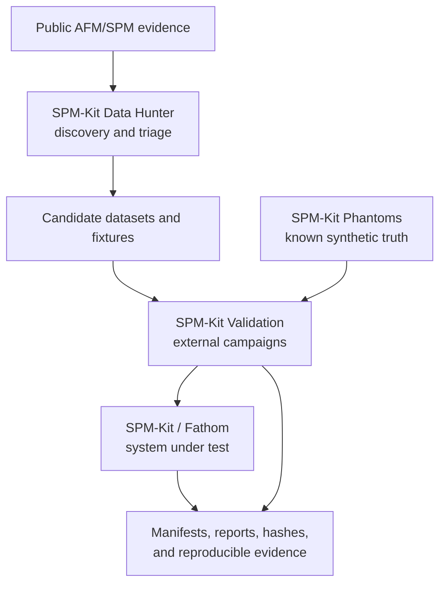

<div align="center">


# SPM-Kit · Fathom

**An open numerical engine and interactive workspace for AFM/SPM analysis.**

**José Labarca Baeza is the creator, author, and lead developer.** SPM-Kit was
developed independently during his undergraduate physics studies at Universidad
Técnica Federico Santa María, in the academic context of the SPM Lab.

[](https://github.com/kegouro/spmkit/actions/workflows/ci.yml)
[](https://kegouro.github.io/spmkit/)
[](https://pypi.org/project/spmkit/)
[](https://pypi.org/project/spmkit/)
[](LICENSE)
[](https://doi.org/10.5281/zenodo.21303280)

[English](README.md) · [Español](README.es.md) ·
[Documentation](https://kegouro.github.io/spmkit/) ·
[Scientific status](https://kegouro.github.io/spmkit/SCIENTIFIC_STATUS/) ·
[Citation](CITATION.cff)

```bash
pip install spmkit
pip install "spmkit[gui]"   # add the Fathom desktop workspace
spmkit --help
```

**Alpha software.** Selected capabilities have software, numerical, or external
comparison evidence; this is not certified metrology or universal instrument support.

</div>

## What it is

SPM-Kit is the scientific source of truth for file loading, numerical analysis,
and export. It exposes a Python API and command-line interface for AFM, KPFM,
force spectroscopy, surface metrology, and resonance workflows.

Fathom is the PyQt6 workspace built on that same core. It does not contain a
second numerical implementation: the GUI orchestrates public `spmkit.core` APIs.
An architecture test enforces this boundary.

| Surface | Role | Install or launch |
|---|---|---|
| `spmkit.core` | Readers, models, analysis, verification, export | `pip install spmkit` |
| Python API | Scriptable and headless analysis | `from spmkit import load` |
| CLI | Reproducible terminal workflows | `spmkit --help` |
| Fathom | Interactive analysis and reporting workspace | `spmkit workspace` |

## Quick start

```python
from spmkit import load
from spmkit.core.analysis import leveling, roughness

scan = load("scan.nid")
height = leveling.plane_fit(scan["Z-Axis"])
print(roughness.statistics(height))
```

```bash
spmkit info scan.nid
spmkit analyze scan.nid --level plane --output results
spmkit workspace scan.nid
```

The exact CLI surface is documented in the [CLI reference](docs/cli.md). Use
synthetic or redistributable fixtures when sharing examples.

## Capabilities

| Domain | Implemented scope | Evidence boundary |
|---|---|---|
| Surface metrology | Leveling, profiles, Sa, Sq, Sz, Ssk, Sku | Sa/Sq/Sz have limited Gwyddion 2.71 cross-comparisons; other metrics do not inherit that claim |
| Force spectroscopy | Hertz, DMT, conical contact, adhesive JKR, WLC/FJC, SLS, force-volume maps | Unit and synthetic-recovery tests; no general physical validation |
| KPFM | CPD statistics and sample work-function calculation | Software tested; experimental calibration remains user responsibility |
| Spectral and grains | Radial PSD, correlation length, fractal estimates, grain detection | Software and synthetic tests; no universal morphology benchmark |
| Resonance | SHO fitting, thermal calibration, time-series mass-sensing utilities | Numerical tests and limited experimental exercise; not certified calibration |
| Reproducibility | Recipes, project files, traceable exports, byte-level `.nid` inspection | Scope depends on the reader and workflow used |

The authoritative, capability-by-capability record is the
**[Scientific status](docs/SCIENTIFIC_STATUS.md)** page. It distinguishes
implemented, unit tested, numerically verified, externally compared,
experimental, partial, and unsupported behavior.

## File-format maturity

SPM-Kit has two reader paths: built-in readers and optional adapters. An adapter
dependency is not presented as native support.

| Format | Data | Path | Dependency | Status |
|---|---|---|---|---|
| NanoSurf `.nid` | Images and force volumes | Native | Core | Implemented; selected image/orientation comparisons and byte-level checks |
| Gwyddion `.gwy` | Images, read/write | Native wrapper | `spmkit[gwy]` | Implemented; not universal Gwyddion equivalence |
| NanoSurf `.nhf` | Images | Native HDF5 reader | `spmkit[hdf5]` | Experimental |
| Nanoscope III `.spm` | Images | Limited native reader | Core | Partial; six demonstrated files, no general Bruker-family claim |
| JPK `.jpk-force` / `.jpk` | Force curves | Native | Core | Implemented; synthetic fixtures cover parsing |
| JPK TIFF export | Force curves | Content-detected native reader | `spmkit[jpk]` | Experimental |
| `.jpk-qi-data`, `.jpk-force-map`, `.jpk-qi-series`, `.ibw`, `.h5` | Adapter-dependent | `afmformats` adapter | `spmkit[afm]` | Experimental adapter coverage |
| `.npz` | SPM-Kit interchange | Native | Core | Implemented |

See [File formats](docs/FILE_FORMATS.md) for read/write behavior, implementation
paths, evidence, and limitations.

## Scientific evidence

SPM-Kit uses the following maturity vocabulary:

| Level | Meaning in this ecosystem |
|---|---|
| `LEVEL 0 — CLAIMED` | Documented intent without executed software evidence |
| `LEVEL 1 — SOFTWARE_VERIFIED` | Executable behavior covered by software tests |
| `LEVEL 2 — NUMERICALLY_VERIFIED` | Known numerical values recovered within a declared scope |
| `LEVEL 3 — CROSS_VALIDATED` | Results compared with an external software/reference route |
| `LEVEL 4 — PHYSICALLY_VALIDATED` | Physical reference evidence within a stated experimental scope |
| `LEVEL 5 — REPRODUCIBILITY_VALIDATED` | Independent reproduction under a declared protocol |

Current public highlights include a frozen 48-case comparison of Sa, Sq, and Sz
against Gwyddion 2.71: 144/144 comparisons were within the declared tolerance.
That is `LEVEL 3 — CROSS_VALIDATED` for those three metrics on those canonical
matrices only. It is not physical validation, a blind holdout, or general
equivalence with Gwyddion. See the
[campaign summary](https://github.com/kegouro/spmkit-validation/blob/main/evidence/campaigns/gwyddion_roughness_48_v0.1_summary.json).

## Ecosystem

> **Find the evidence → define the truth → test the system externally → preserve the result.**

[Explore the complete ecosystem portal](https://kegouro.github.io/spmkit/ecosystem/)
for component boundaries, artifact contracts, installation paths, and reproducible
workflow tutorials.


```mermaid
flowchart TD
    Public["Public AFM/SPM evidence"] --> Hunter["SPM-Kit Data Hunter<br/>discovery and triage"]
    Hunter --> Candidates["Candidate datasets and fixtures"]
    Candidates --> Validation["SPM-Kit Validation<br/>external campaigns"]
    Phantoms["SPM-Kit Phantoms<br/>known synthetic truth"] --> Validation
    Validation --> SUT["SPM-Kit / Fathom<br/>system under test"]
    SUT --> Records["Manifests, reports, hashes,<br/>and reproducible evidence"]
    Validation --> Records
```

Text alternative: Data Hunter locates candidate public evidence; Phantoms
provides a separate source of known synthetic truth; Validation invokes SPM-Kit
through public interfaces and preserves the inputs, outputs, tolerances, and
limitations. Fathom remains the user-facing workspace over the same SPM-Kit core.

| Repository | Use it when you need | It does not claim |
|---|---|---|
| **[spmkit](https://github.com/kegouro/spmkit)** | Analysis through the core, CLI, or Fathom | Universal correctness or certified metrology |
| **[spmkit-validation](https://github.com/kegouro/spmkit-validation)** | Process-isolated campaigns and retained evidence | That every campaign is independent or physical validation |
| **[spmkit-phantoms](https://github.com/kegouro/spmkit-phantoms)** | Controlled synthetic truth and corruptions | A complete microscope digital twin |
| **[spmkit-data-hunter](https://github.com/kegouro/spmkit-data-hunter)** | Public evidence discovery and triage | That discovery establishes ground truth |

No affiliation, interoperability interest, or comparison in this project implies
endorsement by UTFSM, the SPM Lab, AFM-SPM, AFMReader, TopoStats, or Gwyddion.

## Contributing

External laboratories can contribute code, redistributable fixtures, failure
cases, campaign proposals, or independently generated comparisons. Before
sharing a dataset, confirm its redistribution status, remove private metadata,
record a checksum, and state whether sample identity may remain private.

Start with [CONTRIBUTING.md](CONTRIBUTING.md) or the tailored issue templates.
Do not upload restricted instrument data to a public issue.

## Citation

Use [CITATION.cff](CITATION.cff) and the version-specific archive DOI
[`10.5281/zenodo.21303280`](https://doi.org/10.5281/zenodo.21303280).
Software authorship belongs to José Labarca Baeza; acknowledgements below do not
change the software author list.

## Acknowledgements

Tomás Corrales and the SPM Lab at Universidad Técnica Federico Santa María provided selected experimental datasets and laboratory context during the development and evaluation of SPM-Kit.

María Saavedra Fredes and Benjamin Schleyer helped locate and share candidate datasets for the validation campaigns.

Candidate datasets were subject to separate scientific, legal, and technical
review. Acknowledgement does not imply that every located dataset was used,
accepted, redistributable, or scientifically suitable.

## Limitations and development status

- The project is alpha software and APIs may change before 1.0.
- No capability currently carries a general `LEVEL 4` or `LEVEL 5` claim.
- Optional readers vary in maturity and dependency behavior.
- Tests and synthetic recovery do not replace instrument-specific calibration,
  physical validation, or expert review.
- The most useful next evidence is independently produced, redistributable data
  with explicit preprocessing, units, and reference outputs.

---

MIT License © 2026 José Labarca Baeza
