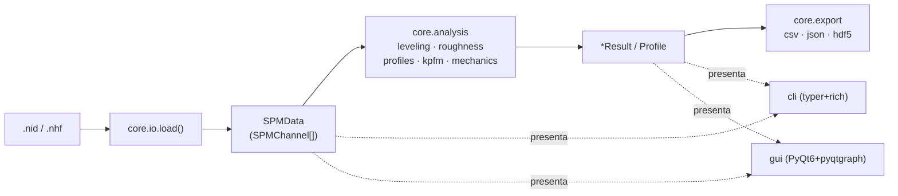

# Arquitectura de spmkit

spmkit separa estrictamente el **backend** (núcleo de análisis) de las capas
de **presentación** (CLI y GUI). El objetivo es que el análisis sea reutilizable,
testeable y que la lógica científica viva en un solo lugar.

## Regla de dependencias

```
cli/  ─┐
       ├─► core/  ◄── archivos .nid / .nhf
gui/  ─┘
```

* `core/` **no** importa nada de `cli/` ni `gui/`.
* `cli/` y `gui/` importan **solo** la API pública de `core/`.
* `cli/` y `gui/` **nunca** importan parsers ni implementan análisis: orquestan.

## Flujo de datos



## Sub-capas del core

| Módulo | Responsabilidad | Entrada → Salida |
|--------|-----------------|------------------|
| `core.io` | Leer formatos del instrumento | ruta → `SPMData` |
| `core.models` | Modelos de dominio (inmutables) | — |
| `core.analysis` | Cálculo numérico | `SPMChannel` → `*Result` |
| `core.export` | Serializar a formatos abiertos | resultado → archivo |

### Modelos (`core.models`)

* **`SPMChannel`** — un canal 2D en unidades físicas: `data` (ndarray),
  `unit`, `x_range`/`y_range` (m), `direction`, `group`, `metadata`.
* **`SPMData`** — colección de canales + metadatos del barrido. Acceso por
  nombre: `data["Z-Axis"]`, con selección de dirección (`forward`/`backward`).

### Contrato público

```python
from spmkit import load                      # core.io.load
from spmkit.core.analysis import (
    leveling, roughness, profiles, kpfm, mechanics
)
from spmkit.core.export import to_csv, to_hdf5, to_json
```

## Formato NanoSurf .nid (notas de implementación)

* Header de texto **UTF-8** tipo INI (con respaldo latin-1).
* Marcador binario `#!` (2 bytes) separa header de datos.
* Bloques binarios por canal, en el orden de `[DataSet] GrN-ChM`.
* Cada muestra: `SaveBits`/`SaveSign`/`SaveOrder` → típicamente int32 LE.
* Conversión a físico: `phys = Dim2Min + (raw + 2^(b-1)) / 2^b * Dim2Range`.

## Decisiones de diseño

* **uv + hatchling**: gestor moderno + build backend estándar (no setuptools legacy).
* **PyQt6 + pyqtgraph** para la GUI: render acelerado de imágenes y perfiles
  interactivos, superior a soluciones web para visualización científica densa.
* **Dataclasses inmutables** en el dominio: resultados reproducibles y fáciles
  de serializar.
* **Extras opcionales** (`hdf5`, `gui`): el núcleo se instala ligero; las
  dependencias pesadas son opt-in.
