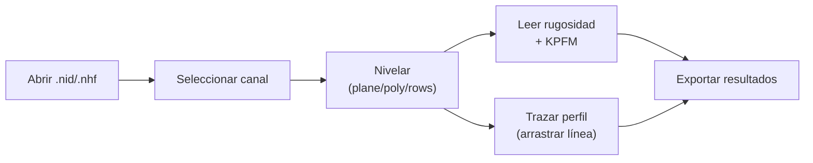

# Diseño de UI — spmkit GUI

## Librería elegida: PyQt6 + pyqtgraph

| Criterio | PyQt6 + pyqtgraph | pywebview + Plotly | FastAPI + React |
|----------|-------------------|--------------------|-----------------|
| Visualización científica densa | ✅ excelente (GPU) | ⚠️ lenta en imágenes grandes | ⚠️ depende |
| Perfiles interactivos en vivo | ✅ nativo | ⚠️ torpe | ⚠️ complejo |
| Facilidad de desarrollo | 🙂 media | ✅ alta | ❌ baja |
| Distribución (1 ejecutable) | ✅ | ✅ | ❌ servidor |
| Mantenibilidad | ✅ | 🙂 | ⚠️ dos stacks |

**pyqtgraph** es la base de herramientas tipo Gwyddion: maneja heatmaps de
gran tamaño y cursores/ROIs interactivos con fluidez, justo lo que NanoSurf
ofrece y lo que el lab necesita para análisis de topografía.

## Pantalla principal (wireframe)

```
┌─ spmkit · Analizador AFM/KPFM ──────────────────────────────────────┐
│ [Abrir] | Colormap:[viridis▾] | Nivelar:[plane▾]                     │
├──────────────┬──────────────────────────────────────┬───────────────┤
│ Canales      │            IMAGEN (heatmap)           │  Análisis     │
│              │   ┌────────────────────────────┐  ▓   │ Rugosidad (m) │
│ Amplitude    │   │                            │  ▓   │  Sa = 2.4e-8  │
│ ▶ Z-Axis     │   │      [imagen AFM color]     │  ▓   │  Sq = 3.9e-8  │
│ Phase        │   │     ── línea de perfil ──   │  ▓   │  Sz = 2.2e-7  │
│ Z-Axis Sensor│   │                            │  ▒   │  Ssk = 2.44   │
│   (fwd/bwd)  │   └────────────────────────────┘ cbar │  Sku = 8.26   │
│              ├──────────────────────────────────────┤               │
│              │   PERFIL DE LÍNEA (arrastra extremos) │ KPFM (si V)   │
│              │   ╱╲    ╱╲___                          │  media, Δφ    │
│              │  ╱  ╲__╱      ╲___                     │               │
│              │  0      distancia (m)        →        │ [Exportar CSV]│
└──────────────┴──────────────────────────────────────┴───────────────┘
```

## Flujo de usuario



1. **Abrir** un archivo del instrumento (`.nid`/`.nhf`).
2. La lista de **canales** se puebla (con dirección fwd/bwd).
3. Al seleccionar un canal se muestra el **heatmap** y se aplica la
   **nivelación** elegida en la barra.
4. El panel de **análisis** muestra rugosidad (y KPFM si el canal es en V).
5. El usuario arrastra la **línea de perfil** sobre la imagen; el gráfico
   inferior se actualiza en vivo.
6. **Exportar** perfil/resultados a CSV.

## Mapeo a componentes (PyQt6)

| Zona | Widget |
|------|--------|
| Barra superior | `QToolBar` + `QComboBox` (colormap, nivelación) |
| Panel izquierdo | `QListWidget` (canales) |
| Imagen | `pyqtgraph.ImageView` + `LineSegmentROI` |
| Perfil | `pyqtgraph.PlotWidget` |
| Panel derecho | `QTextEdit` (resultados) + `QPushButton` (exportar) |

> Toda acción del usuario delega el cálculo en `spmkit.core`. La GUI no
> contiene fórmulas ni parsers.
