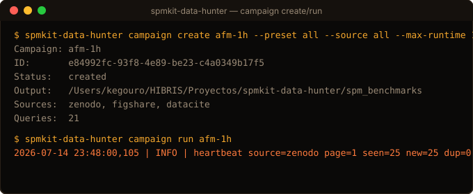
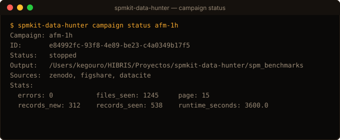
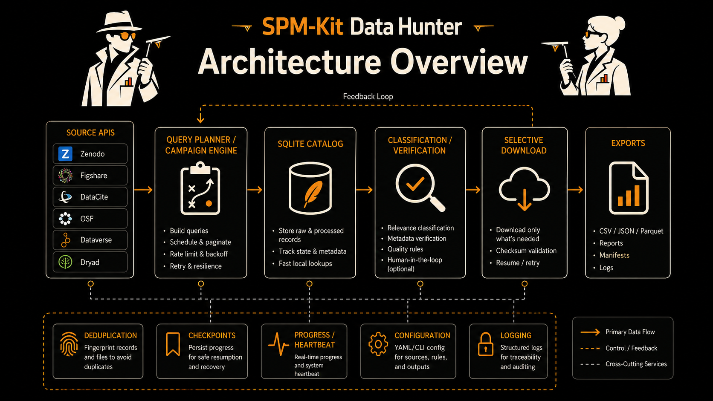

<section class="spm-component" data-component="hunter">
  <picture><source type="image/webp" srcset="../../assets/ecosystem/data-hunter/banner-640.webp 640w, ../../assets/ecosystem/data-hunter/banner-1280.webp 1280w" sizes="(max-width: 1280px) 100vw, 1280px"></picture>
  <div class="spm-component__body">
    <div><p class="spm-component__role">SPM-Kit Data Hunter · Evidence discovery</p><h1>Find candidate evidence without calling it truth</h1><p>Data Hunter queries supported public repository APIs, inventories files, normalizes metadata, deduplicates records and classifies possible scientific utility.</p></div>
    <div><span class="spm-status spm-status--experimental">Alpha · source 2.2.0</span><div class="spm-io"><span><b>Input</b>queries, APIs, campaign policy</span><span aria-hidden="true">→</span><span><b>Output</b>candidate catalog and provenance</span></div></div>
  </div>
</section>

## Role in one sentence

**Data Hunter finds and classifies possible evidence. It does not validate
SPM-Kit and does not certify datasets.**

## Problem it solves

Public records vary from well-described raw/processed/code packages to a DOI
with no files. Searching by keyword alone cannot tell a parser fixture from a
possible cross-check or a calibrated reference. Data Hunter makes that triage
explicit and resumable while leaving the final scientific decision to a human.

## What it does

- queries Zenodo and Figshare file-capable APIs and DataCite metadata;
- normalizes source records and file inventories into a persistent catalog;
- deduplicates records and applies an AFM/SPM relevance gate;
- classifies file types and evidence utility with token-aware rules;
- runs named campaigns with page/cursor checkpoints and duration/record budgets;
- probes remote files without executing content;
- plans and performs selected downloads with explicit size/safety limits;
- preserves source, query, identifiers, license metadata, checksums and events;
- exports JSON, JSONL, CSV and Markdown views from SQLite.

## What it deliberately does not do

- scrape arbitrary websites or bypass repository APIs;
- execute downloaded code or trust archives;
- make a DOI, score or Gold label into ground truth;
- infer redistribution rights from public visibility alone;
- compare SPM-Kit numerical results;
- automatically feed every discovery into Validation.

## Installation

The package is not on PyPI. Install the separate repository:

```bash
git clone https://github.com/kegouro/spmkit-data-hunter.git
cd spmkit-data-hunter
python -m venv .venv
source .venv/bin/activate
python -m pip install -e ".[dev]"
spmkit-data-hunter doctor
spmkit-data-hunter sources list
```

`doctor` reports configured capabilities without printing token values. Live
campaigns use network APIs and should be run only with the intended time,
record and download budgets.

## First successful offline command

```bash
spmkit-data-hunter --self-test
```

This exercises deterministic internal behavior without querying public
services or downloading data.

## Verified campaign command sequence

```bash
spmkit-data-hunter campaign create afm-1h \
  --preset all \
  --source all \
  --max-runtime 1h \
  --max-records 0 \
  --output spm_benchmarks

spmkit-data-hunter campaign run afm-1h --output spm_benchmarks
spmkit-data-hunter campaign status afm-1h --output spm_benchmarks
spmkit-data-hunter campaign export afm-1h --output spm_benchmarks
```

`Ctrl+C` requests a safe pause at the last committed page checkpoint. Resume
with `campaign resume`. A completed search says the configured sources/budgets
were traversed; it says nothing about scientific truth.

<div class="spm-capability-grid">
  <figure class="spm-media-frame"><figcaption class="spm-media-caption">Campaign creation/run example maintained by the Data Hunter repository.</figcaption></figure>
  <figure class="spm-media-frame"><figcaption class="spm-media-caption">Campaign status exposes progress and checkpoint state.</figcaption></figure>
</div>

## Detailed workflow

```text
define campaign
    ↓
query public repository APIs
    ↓
normalize records and file inventories
    ↓
deduplicate + AFM/SPM relevance gate
    ↓
classify evidence utility
    ↓
human review of files, methods, license and role
    ↓
download only selected records
    ↓
transfer an accepted case to fixture or validation design
```

The transfer after human review is manual and documented. A rejected or
incomplete candidate remains useful provenance; it should not disappear merely
because it failed to become a benchmark.

## Outputs

```text
spm_benchmarks/
├── catalog.sqlite3       normalized records and file inventories
├── campaigns.sqlite3     configurations, page checkpoints, events and stats
├── catalog.json          replaceable export view
├── catalog.jsonl         one normalized record per line
├── catalog.csv           compact tabular review view
├── REPORT.md             human-readable campaign/catalog summary
└── datasets/             only files explicitly selected for download
```

`catalog.sqlite3` is the record/file source of truth. `campaigns.sqlite3`
stores progress and control state. JSON/JSONL/CSV/Markdown are regenerated
views. Stop the process before copying SQLite databases and include `-wal` and
`-shm` files when they exist.

## Supported public sources

| Source | Current role | File inventory | Checkpoint |
|---|---|---:|---|
| Zenodo | direct repository | yes | page |
| Figshare | direct repository | yes | page |
| DataCite | metadata index | usually no | cursor |

DataCite records are metadata evidence and are not represented as fully
hydrated dataset packages. OSF, Dataverse, Dryad and other adapters are planned,
not current support.

## Evidence categories

| Utility class | Plain-language meaning | Possible next use |
|---|---|---|
| `benchmark_ready` | raw plus distinct processed/reference material and method/code signals | strong candidate for human-designed analysis comparison |
| `crosscheck_candidate` | raw and processed assets exist but method/code is incomplete | preliminary comparison and follow-up |
| `reader_fixture` | native raw material without a matched numerical reference | parser, channel and robustness testing |
| `processed_reference_only` | processed output exists without recoverable raw input | context, examples or literature tracing |
| `documentation_only` | method/code/docs without a usable data pair | implementation or protocol context |
| `incomplete` | relevance or evidence chain is insufficient | retain provenance; do not promote |

A score or utility class prioritizes review. It does not establish calibration,
method equivalence or scientific truth.

## What makes a dataset useful?

| Package contents | What it can support | What remains missing |
|---|---|---|
| raw file only | reader and metadata fixture | expected scientific output |
| raw + processed output | candidate numerical cross-check | matched method, units and parameters may be absent |
| raw + code | reproducible implementation candidate | external independence and calibration still need review |
| raw + methods | interpretable campaign design | executable reference may be absent |
| linked publication | provenance and experimental context | paper values may not map to downloadable arrays |
| calibrated reference | possible physical-validation proposal | traceability, uncertainty and lawful access require audit |
| possible blind holdout | future confirmation design | must remain unexposed and preregistered before use |

More metadata can make a record easier to assess. It cannot make a weak physical
reference strong by itself.

## Safe download path

```bash
spmkit-data-hunter download plan afm-1h \
  --output spm_benchmarks \
  --level gold silver \
  --category raw processed

spmkit-data-hunter download run afm-1h \
  --output spm_benchmarks \
  --level gold silver \
  --category raw processed \
  --max-file-gb 2 \
  --max-record-gb 20 \
  --inspect-archives
```

Planning downloads writes no files. `--accept-unbounded-downloads` acknowledges
a transfer risk only; it is not a scientific filter.

## Architecture and integration

<figure class="spm-media-frame">
  
  <figcaption class="spm-media-caption">Repository-maintained architecture asset. The portal text above is the authoritative accessible description.</figcaption>
</figure>

- **Data Hunter → human review:** implemented output and required decision gate.
- **Human review → Core fixture:** documented manual handoff; requires lawful
  redistribution or a private test arrangement.
- **Human review → Validation design:** documented manual handoff; mensurand,
  reference, independence and tolerance must be frozen separately.
- **Automatic Data Hunter → Validation pipeline:** not implemented and not implied.

## Scientific status and limitations

Data Hunter's offline classification/campaign machinery is software-tested.
Live source completeness depends on public APIs, query wording, metadata and
campaign bounds. Discovery does not grant `LEVEL 2`, `LEVEL 3` or higher evidence
to a dataset or SPM-Kit capability.

- External input is untrusted; URL, payload, archive and metadata safety matter.
- Repository licenses and record rights can be incomplete or ambiguous.
- A raw native file can validate a parser route only within its demonstrated scope.
- Public records may change or disappear; preserve identifiers and checksums.
- Human scientific review remains mandatory.

## Contribute

Useful contributions include official-API adapters, offline fixtures for source
schemas, file-category rules that avoid false positives, evidence-taxonomy
clarifications and human-reviewed dataset proposals with explicit rights.

[Repository](https://github.com/kegouro/spmkit-data-hunter) ·
[Workflow: find a format fixture](workflows/index.md#workflow-c-find-a-public-format-fixture) ·
[Next: Phantoms](phantoms.md)
