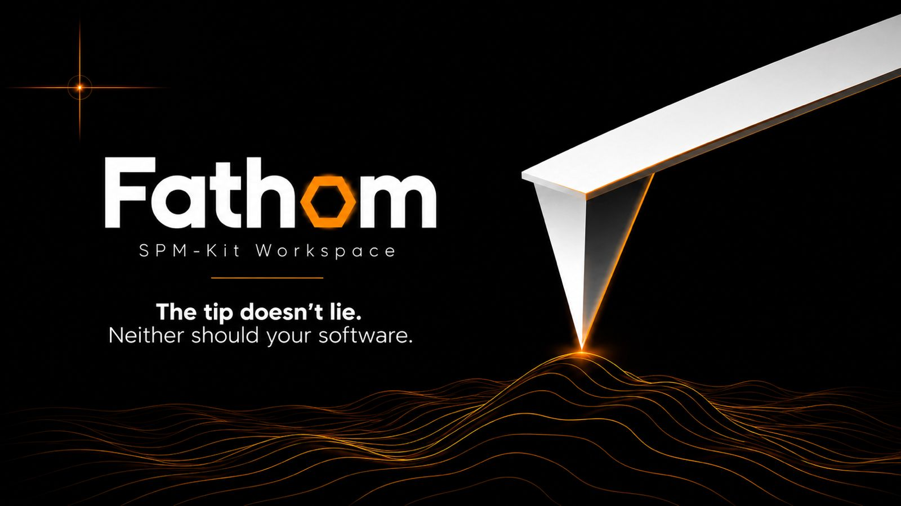
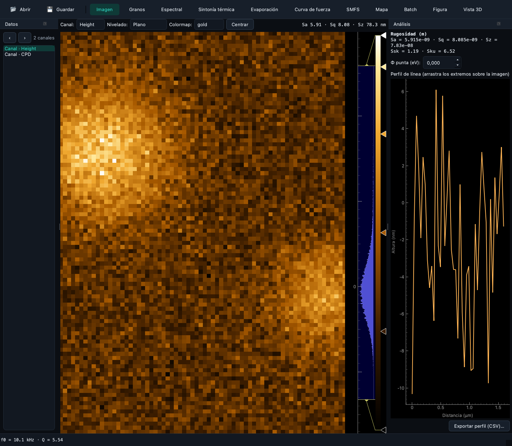
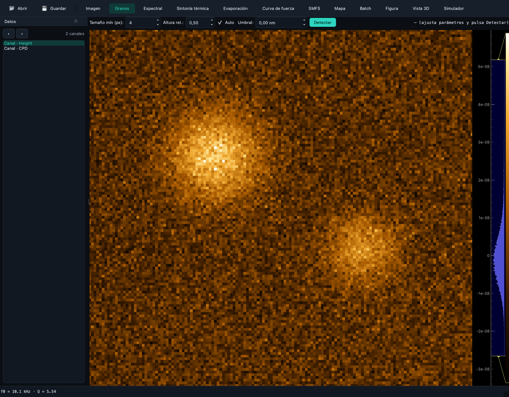
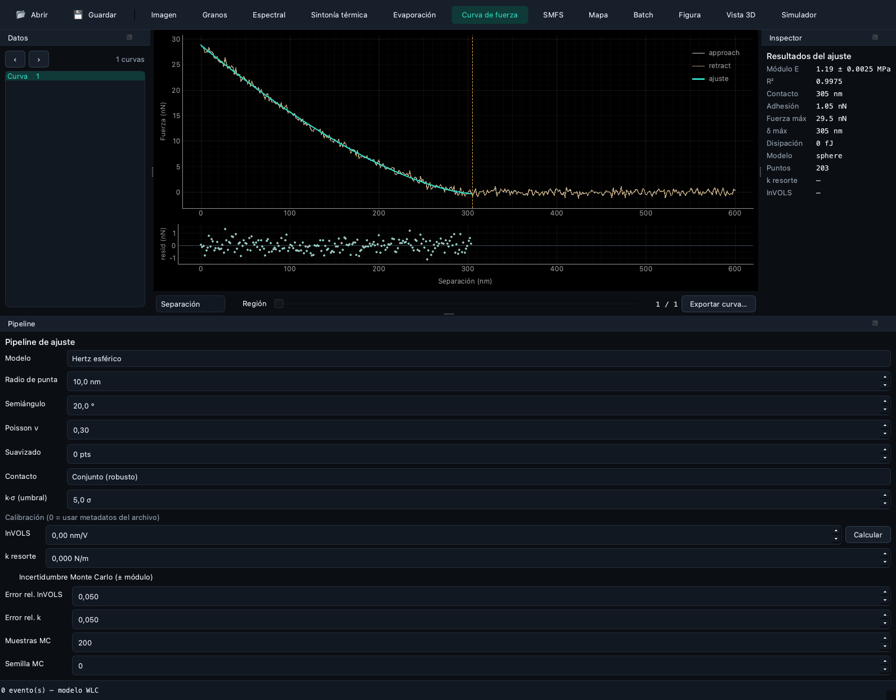
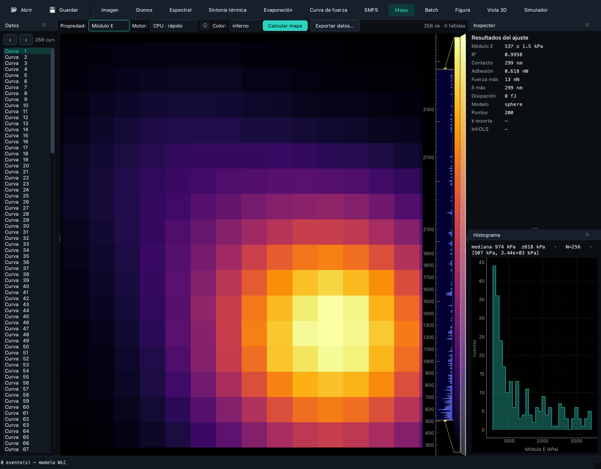
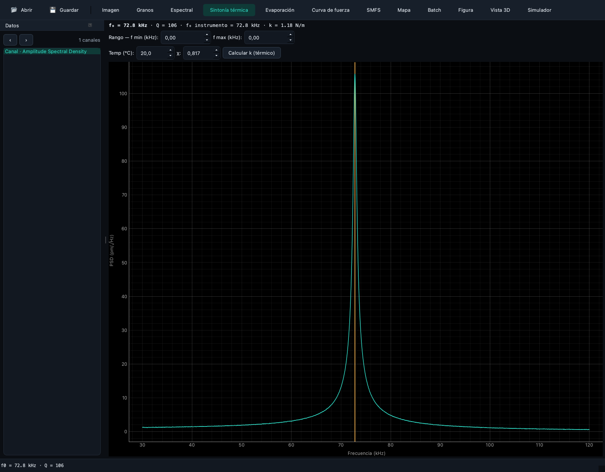
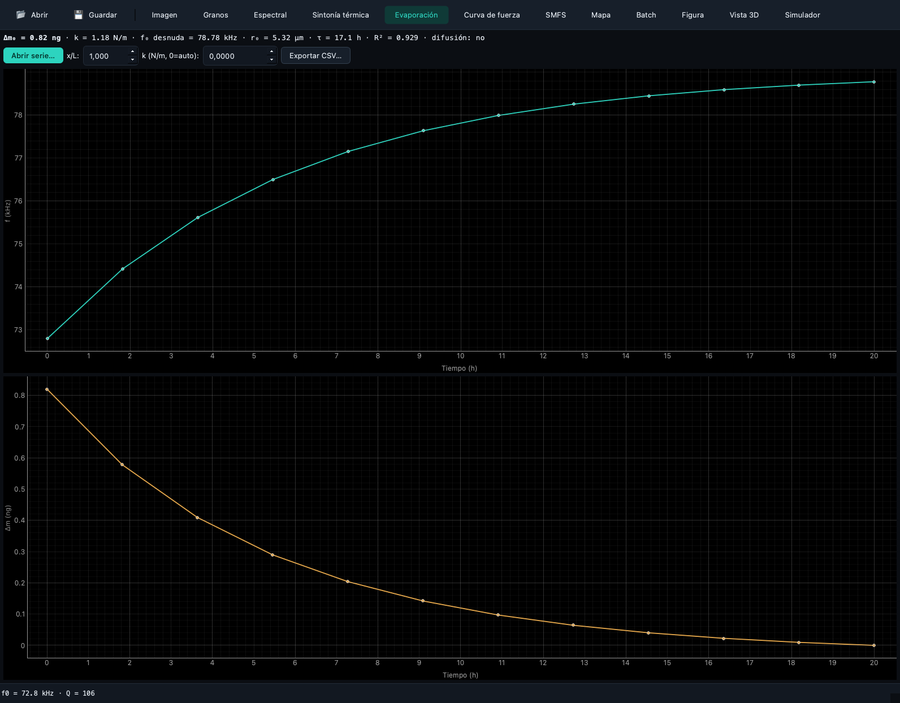

<section class="spm-component" data-component="fathom">
  <picture><source type="image/webp" srcset="../../assets/ecosystem/fathom/banner-640.webp 640w, ../../assets/ecosystem/fathom/banner-1280.webp 1280w" sizes="(max-width: 1280px) 100vw, 1280px"></picture>
  <div class="spm-component__body">
    <div><p class="spm-component__role">Fathom · Interactive scientific workspace</p><h1>Operate the computation without losing sight of it</h1><p>Fathom provides perspective-based exploration, parameter configuration, fitting, maps, figures and reports over SPM-Kit Core.</p></div>
    <div><span class="spm-status">Bundled with SPM-Kit · Alpha</span><div class="spm-io"><span><b>Input</b>files, parameters, projects</span><span aria-hidden="true">→</span><span><b>Output</b>Core results, figures, reports</span></div></div>
  </div>
</section>

## Role in one sentence

**SPM-Kit computes. Fathom lets the researcher inspect, configure and operate
those computations interactively.**

Fathom is not a separate analyzer and is not distributed as a separate package.
It is the `spmkit.gui` workspace installed through the `gui` extra.

## Problem it solves

Some scientific choices are easier to make with linked views: picking a
channel, checking a contact point, moving through force curves, comparing a fit
with its residuals, or arranging a figure. Fathom exposes those operations while
keeping the numerical code in Core.

## What it does

- inspects a dropped/opened file before routing it as image or force data;
- organizes work into perspectives rather than a single crowded window;
- shares navigator, inspector, pipeline, log and histogram panels where useful;
- edits analysis parameters and invokes the associated Core path;
- supports project files, a command palette and keyboard navigation;
- renders images, curves, maps, spectra, fit quality and publication figures;
- exports JSON, CSV, figures and reports through the paths implemented for the active data.

## What it deliberately does not do

- reimplement numerical equations separately from Core;
- hide errors by inventing a result or a default channel;
- turn a synthetic screenshot into experimental evidence;
- make an automatic scientific decision about model validity;
- guarantee that every perspective has equal evidence maturity;
- replace reproducible batch/API use when a script is the better instrument.

## Installation and launch

```bash
python -m pip install "spmkit[gui] @ git+https://github.com/kegouro/spmkit@main"
spmkit gui
spmkit gui scan.nid
```

Verification without opening a window:

```bash
python -c "from spmkit.gui.app_workspace import build_workspace; print('Fathom import OK')"
```

## First session

1. Install the `gui` extra and launch `spmkit gui`.
2. Open a file with **Ctrl+O**, the toolbar action or drag-and-drop.
3. Inspect the file route. Mixed image/force containers prompt for the intended kind.
4. Choose a perspective from the top bar or press **Ctrl+K**.
5. Confirm channel, units, physical field of view and direction.
6. Configure leveling, model, tip geometry, thresholds or other visible parameters.
7. Run the operation and inspect the result plus available QC indicators.
8. Move through curves/maps rather than trusting one representative example.
9. Export the appropriate result, figure or report.
10. Save the `.spmproj` project with **Ctrl+S** and preserve the source/version context.

## Workspace model

| Surface | Responsibility |
|---|---|
| Perspective bar | chooses the scientific task and visible panels |
| Navigator | shows loaded data and routes selectable channels/curves |
| Main canvas | displays the active image, curve, map, spectrum or figure |
| Inspector | exposes selected-object/result information |
| Pipeline | holds force-analysis configuration and processing state |
| Histogram | inspects property-map distributions |
| Log | preserves task and batch messages visible to the user |
| Command palette | searches registered actions and all current perspectives |

A project stores the open file reference, current analysis parameters and active
perspective. It is not a copy of the instrument file; keep the original at a
stable lawful location.

## Which Fathom perspective should I use?

The labels below are taken from the current built-in module declarations. The
English intent is followed by the current display label and internal key.

<div class="spm-perspective-grid">
  <article class="spm-panel spm-panel--perspective"><h3>Topography and roughness</h3><p><strong>Imagen</strong> · `image`</p><p>Image canvas, navigator and image-analysis panel for channel inspection, leveling, roughness and KPFM.</p></article>
  <article class="spm-panel spm-panel--perspective"><h3>Particle segmentation</h3><p><strong>Granos</strong> · `grains`</p><p>Thresholded particles and grain statistics over the current image route.</p></article>
  <article class="spm-panel spm-panel--perspective"><h3>PSD and self-affinity</h3><p><strong>Espectral</strong> · `spectral`</p><p>Radial PSD, Hurst/fractal fit and correlation-length inspection.</p></article>
  <article class="spm-panel spm-panel--perspective"><h3>Cantilever spectrum</h3><p><strong>Sintonía térmica</strong> · `resonance`</p><p>Thermal spectrum extraction and resonance analysis.</p></article>
  <article class="spm-panel spm-panel--perspective"><h3>Time-dependent resonance</h3><p><strong>Evaporación</strong> · `evaporation`</p><p>Frequency, derived mass and declared evaporation-law analysis.</p></article>
  <article class="spm-panel spm-panel--perspective"><h3>One force curve</h3><p><strong>Curva de fuerza</strong> · `force`</p><p>Contact mechanics, visible pipeline parameters, fit and quality indicators.</p></article>
  <article class="spm-panel spm-panel--perspective"><h3>Molecule pulling</h3><p><strong>SMFS</strong> · `smfs`</p><p>Retract events and WLC/FJC-oriented single-molecule analysis.</p></article>
  <article class="spm-panel spm-panel--perspective"><h3>Force-volume properties</h3><p><strong>Mapa</strong> · `map`</p><p>Computed property maps with inspector and histogram.</p></article>
  <article class="spm-panel spm-panel--perspective"><h3>Multiple files</h3><p><strong>Batch</strong> · `batch`</p><p>Batch table and log for repeated processing.</p></article>
  <article class="spm-panel spm-panel--perspective"><h3>Publication output</h3><p><strong>Figura</strong> · `figure`</p><p>Figure composition and scientific image export.</p></article>
  <article class="spm-panel spm-panel--perspective"><h3>Surface rendering</h3><p><strong>Vista 3D</strong> · `view3d`</p><p>Three-dimensional presentation of the active image surface.</p></article>
  <article class="spm-panel spm-panel--perspective"><h3>Educational modeling</h3><p><strong>Simulador</strong> · `simulator`</p><p>Cantilever simulation. Treat as educational/numerical, not a validated measurement.</p></article>
</div>

## Current interface gallery

All images below are generated from deterministic synthetic data by
`scripts/gen_docs_media.py`. They demonstrate the interface and routing only.

<div class="spm-capability-grid">
  <figure class="spm-media-frame"><figcaption class="spm-media-caption">Image: synthetic topography and analysis controls.</figcaption></figure>
  <figure class="spm-media-frame"><figcaption class="spm-media-caption">Grains: segmentation on synthetic morphology.</figcaption></figure>
  <figure class="spm-media-frame"><figcaption class="spm-media-caption">Force Curve: deterministic synthetic Hertz-like data and fit.</figcaption></figure>
  <figure class="spm-media-frame"><figcaption class="spm-media-caption">Map: synthetic soft/hard domains in a force volume.</figcaption></figure>
  <figure class="spm-media-frame"><figcaption class="spm-media-caption">Thermal Tune: generated resonance spectrum.</figcaption></figure>
  <figure class="spm-media-frame"><figcaption class="spm-media-caption">Evaporation: generated frequency/mass series.</figcaption></figure>
</div>

## Shortcuts and command palette

| Action | Shortcut |
|---|---|
| Open file | `Ctrl+O` |
| Save project | `Ctrl+S` |
| Command palette | `Ctrl+K` |
| Calculate map | `Ctrl+M` |
| Export current results | `Ctrl+E` |
| Generate report | `Ctrl+Shift+R` |
| Toggle light/dark theme | `Ctrl+Shift+L` |
| Appearance dialog | `Ctrl+Shift+A` |
| Copy results | `Ctrl+Shift+C` |
| Pin current curve | `Ctrl+P` |
| Previous/next curve | `Ctrl+Left` / `Ctrl+Right` |
| First/last curve | `Ctrl+Home` / `Ctrl+End` |

The command palette also registers “Go to …” actions for every assembled
perspective, including plugin-provided modules.

## Detailed workflow

For a force-volume file:

1. Open the file and choose the force route when prompted.
2. Start in **Curva de fuerza** and inspect an individual curve.
3. Set model and tip geometry in the Pipeline panel.
4. Check contact placement, R², RMSE and residual behavior on more than one curve.
5. Move to **Mapa** and compute through the selected backend.
6. Inspect the modulus distribution and invalid/missing regions.
7. Export the map CSV/figure or a full report.
8. Save the project and preserve input hash, package version and calibration assumptions.

The allowed claim is that the configured SPM-Kit path produced the inspected
result. A good-looking map alone does not establish that the contact model or
instrument calibration is valid for the sample.

## Architecture and integrations

```text
file → Core reader/inspection → domain object
                              ↓
Fathom session → ViewModel → public Core analysis
                              ↓
panel/canvas ← structured result → export/report
```

- **Core:** implemented in-process dependency and sole numerical implementation.
- **Projects/recipes:** Fathom preserves the supported application state for
  repeat work; the Core CLI remains preferable for large reproducible batches.
- **Validation:** campaigns normally invoke the public package/CLI, not Fathom;
  GUI screenshots are not campaign evidence.
- **Plugins:** modules can contribute panels and perspectives through the
  registered extension architecture after numerical behavior is stable.

## Scientific status

Fathom's controls exercise capabilities with different evidence levels. The UI
itself has GUI/software tests; a displayed physical-model result inherits the
evidence and limitations of that Core path. See the
[implementation map](../theory/spmkit-workflows.md) and
[scientific status](../SCIENTIFIC_STATUS.md).

## Limitations

- The current display labels are Spanish-first even though this portal is English.
- Fathom requires a desktop display and is not the batch/HPC interface.
- Some export/report actions are data-route dependent.
- Quality indicators describe fit behavior, not universal model validity.
- Plugin stability follows the versioned public contracts; pre-1.0 APIs may evolve.
- Interface screenshots are synthetic demonstrations, not experimental evidence.

## Contribute

Useful contributions include accessible keyboard workflows, deterministic GUI
tests, result/QC presentation, and a Fathom panel only after its numerical Core
capability and validation path are defined. See [Extending](../extending.md).

[Repository](https://github.com/kegouro/spmkit) ·
[Full user manual](../user-guide.md) ·
[Quick start](../getting-started/fathom-quick-start.md) ·
[Next: Data Hunter](data-hunter.md)
