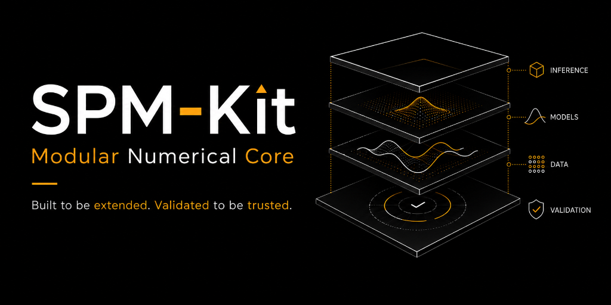
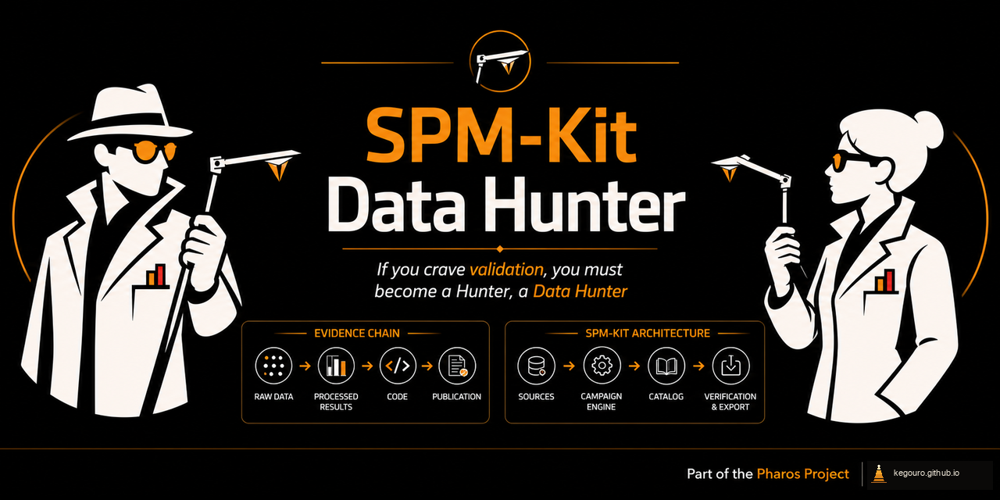
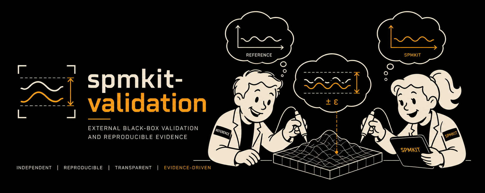

<section class="spm-hero">
  
Pharos Project · SPM-Kit ecosystem · Five responsibilities

  <h1>An open AFM/SPM analysis ecosystem built around evidence.</h1>
  
SPM-Kit combines a numerical engine, an interactive workspace, synthetic ground truth, external validation and public-data discovery so that scientific results can be inspected from raw evidence to final output.

  

    <strong>CREATOR</strong> José Labarca Baeza
    <strong>CHAIN</strong> discover → define → test → compute → inspect
    <strong>BOUNDARY</strong> alpha · no universal validation claim
  

  

    <a href="#workflow">Explore the workflow</a>
    <a href="choose/">Choose a component</a>
    <a href="workflows/">Run an example</a>
    <a href="validation/">Inspect the evidence</a>
    <a href="#repositories">View repositories</a>
  

</section>

## The 60-second model

**Find the evidence → define the truth → test the system externally → preserve
the result.** Five identities divide that work without pretending the boundaries
are automatic:

  <article class="spm-evidence-step">LEADS<h3>Data Hunter</h3>
Finds candidate datasets, fixtures and references. Human review decides whether a candidate advances.
</article>
  <article class="spm-evidence-step">KNOWN TRUTH<h3>Phantoms</h3>
Creates deterministic numerical surfaces and declared corruptions independently from the analyzer.
</article>
  <article class="spm-evidence-step">EXTERNAL TEST<h3>Validation</h3>
Freezes contracts and invokes an installed SPM-Kit package through public interfaces.
</article>
  <article class="spm-evidence-step">COMPUTATION<h3>SPM-Kit Core</h3>
Reads calibrated data and performs the numerical analysis being evaluated.
</article>
  <article class="spm-evidence-step">OPERATION<h3>Fathom</h3>
Lets a researcher inspect, configure and operate the same Core interactively.
</article>

The line above is explanatory. The real architecture is a network.

## The technically accurate network

  
<strong>Data Hunter</strong><small>Produces candidate inventories. A human may transfer an accepted fixture or dataset into campaign design.</small>

  
<strong>Phantoms</strong><small>Produces independent clean/observed numerical cases and manifests. It does not call the analyzer.</small>

  
<strong>Validation</strong><small>Consumes frozen cases and invokes the public installed SPM-Kit package as the system under test.</small>

  
<strong>SPM-Kit Core</strong><small>Computational source of truth for readers, models, analysis, exports and provenance.</small>

  
<strong>Fathom</strong><small>Invokes Core through the application layer. It is not a separate analyzer.</small>

  
<strong>External reference</strong><small>Gwyddion or another reference appears only inside a declared campaign with an explicit independence class.</small>

  <strong>Directed relationships:</strong> Fathom → Core; Validation → public
  SPM-Kit package; Phantoms → Validation case design; Data Hunter → human review
  → fixture/campaign design; declared external reference → Validation comparison.
  Every handoff preserves or adds provenance. There is no arrow from SPM-Kit
  back into Phantoms and no automatic Data Hunter feed into Validation.

## Components

  <section class="spm-component" data-component="core">
    <picture><source type="image/webp" srcset="../assets/ecosystem/core/banner-640.webp 640w, ../assets/ecosystem/core/banner-1024.webp 1024w" sizes="(max-width: 1024px) 100vw, 1024px"></picture>
    

      

SPM-Kit Core · Numerical engine
<h2><a href="spmkit/">The computational source of truth</a></h2>
Readers, calibrated domain models, image metrology, force spectroscopy, KPFM, resonance, export, provenance and plugins through Python and the `spmkit` CLI.

<strong>For:</strong> scientists writing scripts, notebook users, HPC/batch operators, integrators and reader/plugin developers.

<a href="spmkit/">Core guide</a><a href="https://github.com/kegouro/spmkit">Repository</a>

      
Alpha · source 0.1.5.dev0
<b>Input</b>instrument files, arrays, declared parameters→<b>Output</b>typed results, exports, provenance

<strong>Install:</strong> `spmkit` package. PyPI lags the current GitHub source; see the installation matrix.

    

  </section>

  <section class="spm-component" data-component="fathom">
    <picture><source type="image/webp" srcset="../assets/ecosystem/fathom/banner-640.webp 640w, ../assets/ecosystem/fathom/banner-1280.webp 1280w" sizes="(max-width: 1280px) 100vw, 1280px"></picture>
    

      

Fathom · Interactive workspace
<h2><a href="fathom/">Operate the Core without hiding it</a></h2>
Perspective-based exploration, parameter editing, curve fitting, maps, linked panels, figures, projects and reports over the same numerical implementation.

<strong>For:</strong> researchers who need visual inspection, interactive fitting and publication-oriented output.

<a href="fathom/">Fathom tour</a><a href="../getting-started/fathom-quick-start/">First session</a>

      
Bundled with SPM-Kit
<b>Input</b>files, parameters, projects→<b>Output</b>Core results, figures, reports

<strong>Install:</strong> `spmkit[gui]`; launch with `spmkit gui`.

    

  </section>

  <section class="spm-component" data-component="hunter">
    <picture><source type="image/webp" srcset="../assets/ecosystem/data-hunter/banner-640.webp 640w, ../assets/ecosystem/data-hunter/banner-1280.webp 1280w" sizes="(max-width: 1280px) 100vw, 1280px"></picture>
    

      

SPM-Kit Data Hunter · Evidence discovery
<h2><a href="data-hunter/">Find leads, then review them</a></h2>
Queries supported public repositories, normalizes metadata, deduplicates records, inventories files and classifies possible scientific utility.

<strong>For:</strong> dataset scouts, reader-fixture curators and validation designers.

<a href="data-hunter/">Discovery guide</a><a href="https://github.com/kegouro/spmkit-data-hunter">Repository</a>

      
Alpha · 2.2.0 source
<b>Input</b>queries, source APIs, campaign rules→<b>Output</b>candidate catalog and provenance

<strong>Install:</strong> separate Git repository; not on PyPI.

    

  </section>

  <section class="spm-component" data-component="phantoms">
    <picture><source type="image/webp" srcset="../assets/ecosystem/phantoms/banner-640.webp 640w, ../assets/ecosystem/phantoms/banner-1280.webp 1280w" sizes="(max-width: 1280px) 100vw, 1280px"></picture>
    

      

SPM-Kit Phantoms · Synthetic truth
<h2><a href="phantoms/">Define truth before analysis</a></h2>
Creates analytical surfaces with known parameters, deterministic random cases, declared corruption sequences, clean/observed separation and export manifests.

<strong>For:</strong> algorithm developers, reviewers and campaign authors who need a known numerical answer.

<a href="phantoms/">Phantom catalog</a><a href="https://github.com/kegouro/spmkit-phantoms">Repository</a>

      
Alpha · 0.1.0 source
<b>Input</b>model parameters, field of view, seed→<b>Output</b>arrays, masks, manifests, hashes

<strong>Install:</strong> separate Git repository; not on PyPI.

    

  </section>

  <section class="spm-component" data-component="validation">
    <picture><source type="image/webp" srcset="../assets/ecosystem/validation/banner-640.webp 640w, ../assets/ecosystem/validation/banner-1280.webp 1280w" sizes="(max-width: 1280px) 100vw, 1280px"></picture>
    

      

SPM-Kit Validation · External evidence
<h2><a href="validation/">Test what the package actually does</a></h2>
Freezes campaigns, invokes public executables in a separate process, captures outputs, compares references and preserves passes, failures, blockers and limitations.

<strong>For:</strong> reviewers, release maintainers and researchers reproducing a narrow scientific claim.

<a href="validation/">Campaign browser</a><a href="https://github.com/kegouro/spmkit-validation">Repository</a>

      
Alpha · 0.1.0 source
<b>Input</b>frozen contract, SUT, reference→<b>Output</b>reports, manifests, audit trail

<strong>Install:</strong> separate Git repository; not on PyPI.

    

  </section>

## Why multiple repositories?

The separation protects scientific responsibilities:

| Boundary | What separation protects |
|---|---|
| Core vs Fathom | one numerical implementation across headless and interactive use |
| Core vs Phantoms | the expected synthetic answer is not produced by the analyzer under test |
| Core vs Validation | campaigns exercise installed public behavior instead of importing internals |
| Data Hunter vs Validation | search scores and metadata do not silently become scientific truth |
| Companion repositories | narrower dependencies, independent release histories and auditable evidence changes |

This is deliberate architecture, not accidental fragmentation. An external
validation repository can pin an older SPM-Kit, preserve a failed campaign and
remain inspectable even while Core continues to evolve.

## End-to-end workflow {#workflow}

| Stage | Component | Action | Example interface | Artifact | Claim enabled | Limitation |
|---|---|---|---|---|---|---|
| Discover | Data Hunter | Query public APIs and classify records | `spmkit-data-hunter --source zenodo --preset topography --limit 20 --output hunt` | JSON/CSV candidate catalog, checkpoints, provenance | A record may be useful for a declared role | No truth, redistribution right or suitability is established |
| Define | Phantoms | Generate a known surface and optional corruption | `spmkit-phantoms --outdir cases` | `clean.npz`, optional observed/masks, manifest, hashes | The numerical input and expected property are known | It is not a physical microscope |
| Freeze | Validation | Declare SUT, command, inputs, reference and tolerance | `spmkit-validation campaign campaigns/smoke_v0.1.yaml --output run` | frozen cases, captured streams, `cases.csv` | The external test contract is inspectable | Process isolation alone does not prove reference independence |
| Compute | SPM-Kit Core | Run the installed public command | `spmkit analyze scan.nid --output results` | typed results, CSV/JSON and logs | The package performed the named calculation | The result inherits calibration and preprocessing limits |
| Inspect | Fathom | Review parameters, fit quality, maps and output | `spmkit gui scan.nid` | project, figure, report or export | A human can audit the same Core result interactively | Visual plausibility is not validation |
| Preserve | All | Retain versions, hashes, parameters, results and limits | campaign/report-specific | reproducible evidence record | A narrow claim can be re-examined | Preservation does not upgrade the evidence level |

## Choose your entry point

| I need to… | Start with | Why |
|---|---|---|
| Analyze an AFM image interactively | [Fathom](fathom.md) | Visual scientific workspace |
| Analyze files in Python or on a cluster | [SPM-Kit Core](spmkit.md) | Headless API and CLI |
| Test an algorithm against known surfaces | [Phantoms](phantoms.md) | Known synthetic truth |
| Reproduce a frozen comparison campaign | [Validation](validation.md) | External contracts and evidence |
| Find public AFM/SPM files | [Data Hunter](data-hunter.md) | Discovery and evidence triage |
| Add a new reader | [SPM-Kit Core plugin system](spmkit.md#plugins) | Public reader contract |
| Contribute a validation dataset | [Data Hunter + Validation](workflows/index.md#workflow-c-find-a-public-format-fixture) | Human classification before campaign design |
| Inspect evidence behind a claim | [Validation](validation.md) | Manifests, logs, reports and limitations |

[Open the full accessible decision guide](choose.md)

## Evidence ladder

| Level | Meaning | Ecosystem contribution | Not automatic |
|---|---|---|---|
| `LEVEL 0 — CLAIMED` | behavior is described | all components document intent | a README statement is not a test |
| `LEVEL 1 — SOFTWARE_VERIFIED` | automated software behavior is checked | Core, Fathom and companions test contracts | passing tests do not prove the physical model |
| `LEVEL 2 — NUMERICALLY_VERIFIED` | a known numerical case is recovered | Phantoms supplies truth; Core/Validation execute recovery | a synthetic surface is not a calibrated specimen |
| `LEVEL 3 — CROSS_VALIDATED` | a declared external reference agrees within frozen tolerance | Validation records reference, independence and comparison | external software is not necessarily independent truth |
| `LEVEL 4 — PHYSICALLY_VALIDATED` | calibrated physical reference supports the claim | future campaign proposals may use reviewed datasets | no current general claim exists |
| `LEVEL 5 — REPRODUCIBILITY_VALIDATED` | independent laboratories reproduce the result | future interlaboratory protocol | no current claim exists |

Using a component never grants a level by itself. The retained evidence record,
scope and limitations determine the level.

## Integration patterns

- **Phantoms → Validation → SPM-Kit:** export a declared synthetic case, freeze
  expected metrics and tolerance, then invoke the installed SPM-Kit CLI.
- **Data Hunter → human review → Validation:** inspect license, rawness,
  calibration and scientific role before a selected record enters campaign design.
- **SPM-Kit Core → Fathom:** Fathom calls the same public numerical packages and
  displays their typed results; it does not reimplement equations.
- **External reference → Validation → evidence report:** a campaign pins the
  reference version and method, records its independence class and preserves
  both differences and agreements.

The exact status of each artifact handoff is recorded in the
[artifact and data contracts](contracts.md).

## Limitations

!!! warning "Read before treating the ecosystem as evidence"

    - The components are alpha-stage where their package metadata says so.
    - Synthetic evidence is not physical evidence.
    - Public datasets are not automatically references or redistributable fixtures.
    - Black-box execution does not guarantee that a reference is scientifically independent.
    - Not every SPM-Kit feature or parser has the same maturity.
    - Physical and interlaboratory validation remain incomplete.
    - Manual handoffs exist between repositories; the portal labels them rather than inventing automation.

## Next

[Choose a component](choose.md) ·
[Install the ecosystem](install.md) ·
[Run an end-to-end workflow](workflows/index.md) ·
[Review brand governance](brand.md)
