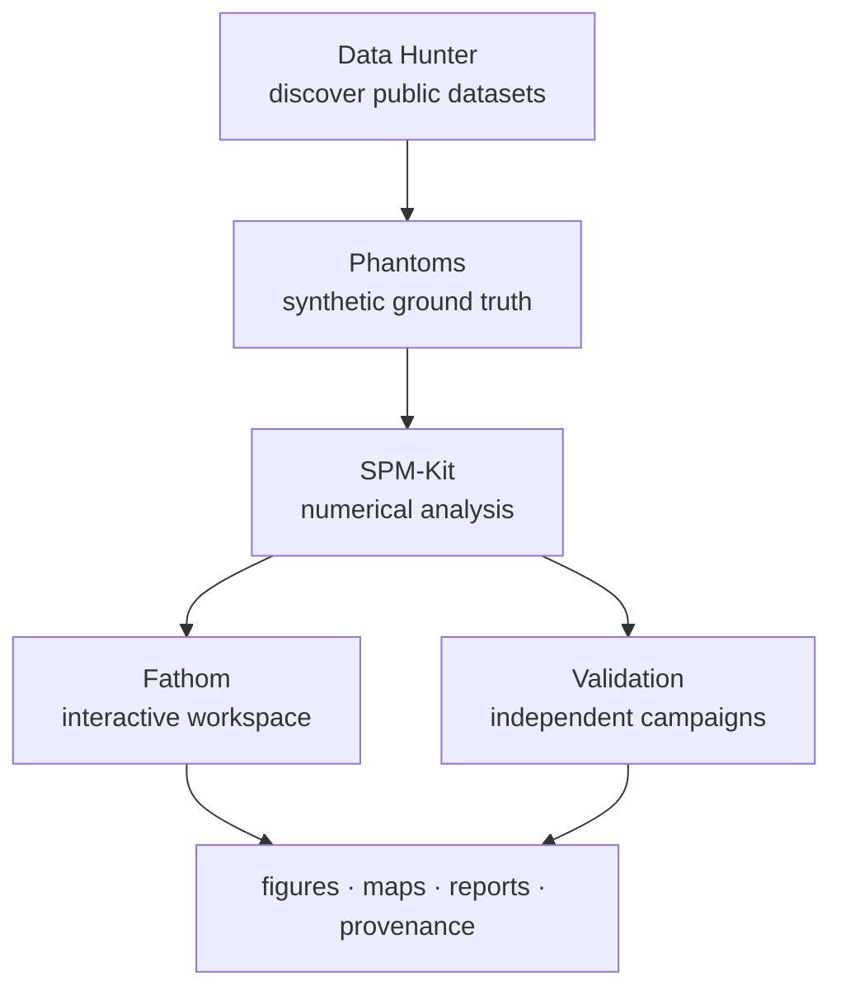

# SPM-Kit ecosystem

SPM-Kit is the central product of a scientific infrastructure ecosystem. The
components work together but are designed to be useful independently.

## The chain

> **Find the evidence → define the truth → test the system externally → preserve the result.**

## Components

Core engine

<h3><a href="spmkit.md">SPM-Kit</a></h3>

Numerical engine, Python API, CLI. <code>pip install spmkit</code>.

Workspace

<h3><a href="fathom.md">Fathom</a></h3>

PyQt6 desktop workspace for visualization and analysis.

Synthetic truth

<h3><a href="phantoms.md">Phantoms</a></h3>

Deterministic synthetic surfaces with known ground truth.

Discovery

<h3><a href="data-hunter.md">Data Hunter</a></h3>

Discover and triage public AFM/SPM datasets.

Evidence

<h3><a href="validation.md">Validation</a></h3>

External black-box validation harness with frozen evidence.

Umbrella

<h3><a href="pharos.md">Pharos</a></h3>

A broader collection of open scientific tools.

