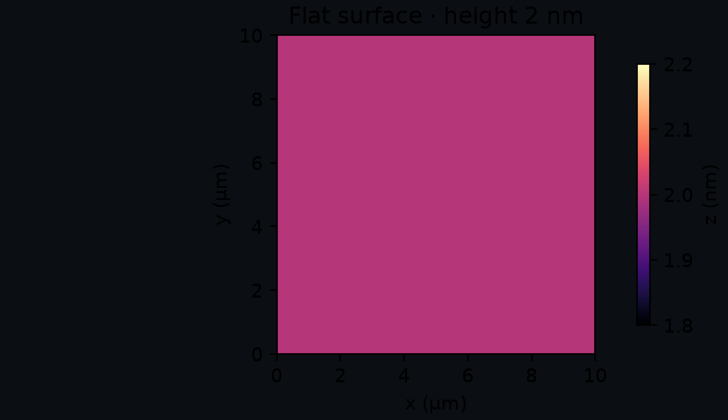
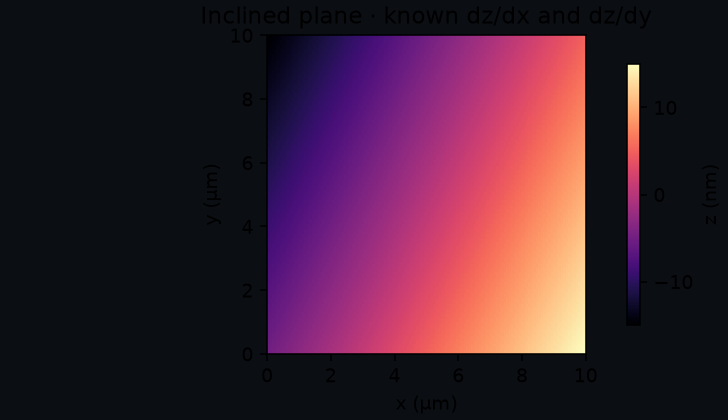
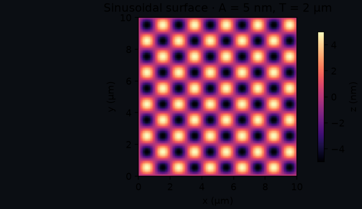
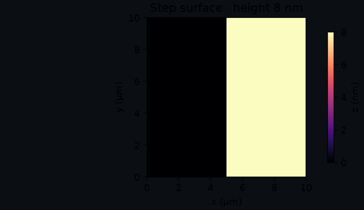
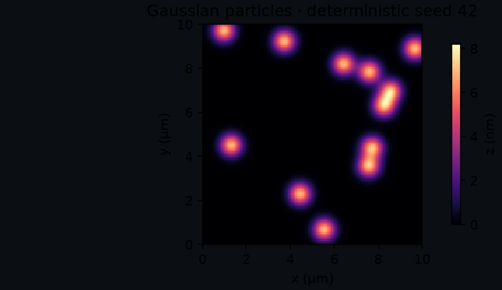

<section class="spm-component" data-component="phantoms">
  <picture><source type="image/webp" srcset="../../assets/ecosystem/phantoms/banner-640.webp 640w, ../../assets/ecosystem/phantoms/banner-1280.webp 1280w" sizes="(max-width: 1280px) 100vw, 1280px"></picture>
  <div class="spm-component__body">
    <div><p class="spm-component__role">SPM-Kit Phantoms · Synthetic truth</p><h1>Truth → corruption → observation → evidence</h1><p>Phantoms creates analytical surfaces with known parameters, applies explicit corruption sequences and exports the clean truth and observed data as separate scientific objects.</p></div>
    <div><span class="spm-status">Alpha · source 0.1.0</span><div class="spm-io"><span><b>Input</b>model, field of view, seed</span><span aria-hidden="true">→</span><span><b>Output</b>arrays, masks, hashes, manifests</span></div></div>
  </div>
</section>

## Role in one sentence

**Phantoms defines numerical truth before an algorithm sees the data.** It does
not replace physical validation and does not simulate every microscope effect.

## Problem it solves

An experimental image contains realism but the underlying exact surface is
usually unknown. A deterministic phantom supplies the missing counterpart: a
clean numerical object whose slope, amplitude, wavelength, step or particle
parameters are known before leveling, filtering, segmentation or metrology.

Simple phantoms are diagnostic instruments, not toy data.

## What it does

- generates five current surface families with physical X/Y size and Z units;
- uses `numpy.random.Generator` for stochastic cases;
- applies five declared corruptions without silently replacing clean truth;
- records ordered corruption names and requested parameters;
- preserves masks for spikes and missing lines;
- exports clean and observed arrays in separate NPZ files;
- computes canonical array SHA-256 from normalized dtype, shape, byte order and C-order bytes;
- computes normalized manifest SHA-256 and separate compressed-artifact hashes;
- records the CLI corruption seed in observed-bundle manifests.

## What it deliberately does not do

- analyze its own outputs or import SPM-Kit Core;
- claim that a generated surface is a certified reference material;
- simulate tip convolution, feedback dynamics, detector electronics or every instrument artifact;
- make an arbitrary corruption physically representative merely because it looks familiar;
- promote synthetic recovery into universal experimental validity.

## Installation and first command

The package is not on PyPI.

```bash
git clone https://github.com/kegouro/spmkit-phantoms.git
cd spmkit-phantoms
python -m venv .venv
source .venv/bin/activate
python -m pip install -e ".[dev]"
spmkit-phantoms --help
spmkit-phantoms --outdir cases --seed 42
```

The current CLI generates `flat_0nm/` and `inclined_noisy/`. The latter applies
Gaussian noise followed by isolated spikes with the declared seed.

## Ground-truth contract

| Field | Meaning |
|---|---|
| clean surface | immutable reference object containing analytical array, field of view, unit, model and original parameters |
| observed surface | new array after one or more ordered corruptions, linked back to clean truth |
| analytical parameters | values supplied to the generator; the basis for expected quantities |
| field of view | `x_size_m` and `y_size_m`, independent from pixel count |
| Z unit | current generators use metres and preserve the unit in exports |
| seed | clean stochastic model seed or exported corruption RNG seed when supplied |
| masks | boolean arrays identifying localized spikes or missing lines |
| canonical hash | scientific-array identity independent from NPZ filename/compression metadata |
| artifact hash | SHA-256 of the actual compressed file |
| normalized manifest hash | deterministic hash of sorted compact JSON before the hash field is added |

An array hash identifies the numeric array together with dtype and shape. It
does not prove authorship, authenticity, physical calibration or suitability.

## Surface catalog

The plots below were regenerated by `scripts/gen_phantom_catalog.py` against the
current Phantoms source. They are labeled numerical examples, not microscope images.

<div class="spm-surface-grid">
  <article class="spm-panel spm-panel--figure"><h3>Flat surface</h3><p><strong>Definition:</strong> $z(x,y)=h$.</p><p><strong>Question:</strong> does preprocessing introduce texture or remove a constant offset as intended?</p><p><strong>Known:</strong> height, zero range, Sa/Sq after declared centering.</p><p><strong>Limit:</strong> no morphology or instrument response.</p></article>
  <article class="spm-panel spm-panel--figure"><h3>Inclined plane</h3><p><strong>Definition:</strong> $z=s_xx+s_yy+z_0$.</p><p><strong>Question:</strong> can leveling recover/remove a known plane without residual structure?</p><p><strong>Known:</strong> both slopes, offset and full height range.</p><p><strong>Limit:</strong> ideal linear tilt only.</p></article>
  <article class="spm-panel spm-panel--figure"><h3>Sinusoidal surface</h3><p><strong>Definition:</strong> $z=A\sin(2\pi x/T_x)\sin(2\pi y/T_y)$.</p><p><strong>Question:</strong> are amplitude, roughness and spatial-frequency peaks recovered?</p><p><strong>Known:</strong> amplitude, periods and sampled phase grid.</p><p><strong>Limit:</strong> periodic ideal field and finite-grid sampling.</p></article>
  <article class="spm-panel spm-panel--figure"><h3>Step surface</h3><p><strong>Definition:</strong> left field 0, right field $h_s$ at a declared split ratio.</p><p><strong>Question:</strong> is step height preserved through filtering, leveling or export?</p><p><strong>Known:</strong> height and split position.</p><p><strong>Limit:</strong> infinitely sharp ideal edge with no tip convolution.</p></article>
  <article class="spm-panel spm-panel--figure"><h3>Gaussian particles</h3><p><strong>Definition:</strong> seeded sum of Gaussian peaks with declared count, width and amplitude.</p><p><strong>Question:</strong> does segmentation recover particle count/size under controlled overlap?</p><p><strong>Known:</strong> generator parameters and deterministic realization.</p><p><strong>Limit:</strong> mathematical peaks, not tip-convolved physical particles.</p></article>
</div>

## Corruption catalog

| Corruption | Approximates | Parameters | Stochastic | Mask | May disturb | Does not model |
|---|---|---|---:|---:|---|---|
| `AdditiveGaussianNoise` | additive measurement noise | `sigma` in Z units | yes | no | all amplitude metrics and spectra | colored noise, electronics or feedback physics |
| `LineOffsets` | independent slow-axis line offsets | per-line `sigma` | yes | no | row alignment, roughness, low-frequency PSD | line curvature or controller history |
| `SlowLinearDrift` | linear drift along row index | `slope_y` per line | no | no | plane/row leveling and large-scale slope | nonlinear thermal drift or creep |
| `IsolatedSpikes` | sparse impulsive artifacts | `fraction`, `amplitude` | yes | `spikes_mask` | Sz, tails, segmentation and filters | realistic tip contamination or feedback transient shape |
| `MissingLines` | line freeze/repeat | `fraction` | yes | `missing_lines_mask` | texture, PSD and continuity | data-loss recovery or arbitrary scan dropout |

Corruption order is part of the case. Noise then spikes is not assumed equivalent
to spikes then filtering/noise.

## Verified end-to-end example

### 1. Generate clean and observed bundles

```bash
spmkit-phantoms --outdir cases --seed 42
```

```text
cases/
├── flat_0nm/
│   ├── clean.npz
│   └── manifest.json
└── inclined_noisy/
    ├── clean.npz
    ├── observed.npz
    ├── masks.npz
    └── corruption_manifest.json
```

### 2. Inspect identity and provenance

```bash
python -m json.tool cases/inclined_noisy/corruption_manifest.json
```

Check `rng_seed`, ordered `applied_corruptions`, clean/observed canonical array
hashes, artifact hashes, mask hashes, dimensions, dtype, physical scales and units.

### 3. Analyze the observed array with Core

```bash
spmkit info cases/inclined_noisy/observed.npz
spmkit analyze cases/inclined_noisy/observed.npz --level plane --output results/
```

The NPZ reader exposes the height channel as `Z-Axis` and retains the original
model name as metadata.

### 4. Evaluate recovery through Validation

From an environment containing all three source checkouts:

```bash
spmkit-validation campaign campaigns/smoke_v0.1.yaml validation-runs/ \
  --spmkit /absolute/path/to/spmkit
spmkit-validation report validation-runs/smoke_v0.1/cases.csv validation-runs/report/
```

The smoke campaign writes numerical differences with
`TODO-SCIENTIFIC-DECISION`; it deliberately does not manufacture a PASS before
a tolerance and claim are frozen. Use a retained campaign for published evidence.

## Architecture and integration

```text
surface parameters → SurfacePhantom (clean)
                            ↓
                corruption.apply(clean, rng)
                            ↓
                 ObservedPhantom + masks
                            ↓
        NPZ artifacts + normalized JSON manifest
                            ↓ manual/declared handoff
                   Validation campaign input
```

- **Phantoms → Validation:** implemented in current campaign code and documented manual bundles.
- **Phantoms → SPM-Kit Core:** implemented NPZ handoff.
- **Phantoms → Fathom:** the NPZ can be opened through Core routing; this is inspection, not validation.
- **Phantoms → Data Hunter:** no dependency or automatic link.

## Scientific status and limitations

Surface equations, deterministic seeds, corruption identity paths and bundle
export have automated tests. Synthetic recovery can support `LEVEL 2` for a
named algorithm and case. A campaign comparing a declared independent reference
may support a narrow `LEVEL 3` claim. Phantoms alone grants neither.

- Corruptions are controlled approximations, not a complete acquisition simulator.
- No current model includes full tip/sample convolution or feedback-loop physics.
- Canonical hashing normalizes array identity, not semantic equivalence between different grids.
- Before 1.0, pin the exact Phantoms commit and manifest schema in campaigns.
- Physical validation still requires calibrated experimental references.

## Contribute

Add a surface or corruption only with explicit parameters, units, deterministic
behavior, clean/observed separation, an export round-trip and a validation
question. Visual realism without a known quantity is not enough.

[Repository](https://github.com/kegouro/spmkit-phantoms) ·
[Workflow: roughness recovery](workflows/index.md#workflow-b-test-roughness-recovery-on-known-truth) ·
[Next: Validation](validation.md)
