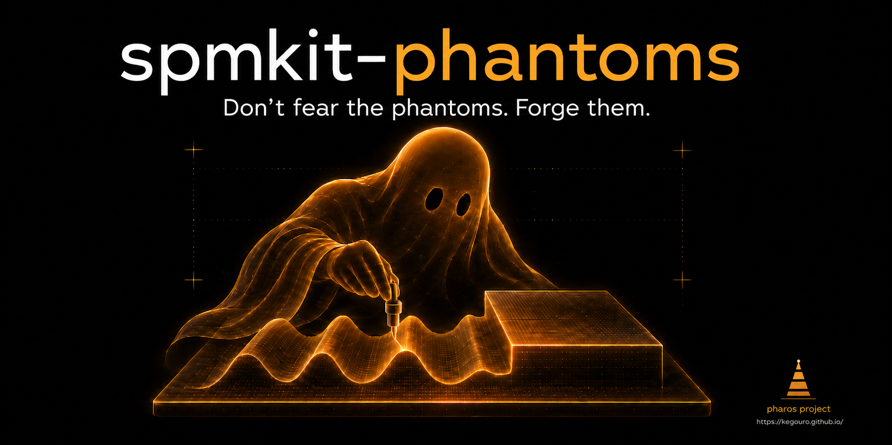

# SPM-Kit Phantoms

  

**Deterministic synthetic surfaces with known ground truth.**

spmkit-phantoms generates analytical 2D surfaces with known parameters, applies
controlled SPM-like corruptions, and exports reproducible validation cases. It
is the truth generator that feeds SPM-Kit Validation campaigns.

## What it does

- 6 analytical surface families (plane, tilted, sinusoidal, step, grid, particles)
- 4 corruption models (Gaussian noise, line offsets, linear drift, spikes)
- Clean-vs-observed separation with canonical hashes
- Deterministic seeds, reproducible export bundles

## Evidence

| Capability | Level |
|---|---|
| Surface determinism | LEVEL 1 SOFTWARE_VERIFIED |
| Corruption reproducibility | LEVEL 1 SOFTWARE_VERIFIED |
| Export round-trip | LEVEL 1 SOFTWARE_VERIFIED |

**13 automated tests.** The synthetic roughness v0.1 cross-validation campaign
used 6 surfaces from this package to verify Sa, Sq, Sz against Gwyddion 2.71.

## What it does not do

- Not a microscope simulator
- Not a certified reference material
- Not a physics-based acquisition model

## Links

- **Repository:** [github.com/kegouro/spmkit-phantoms](https://github.com/kegouro/spmkit-phantoms)
- **Citation:** [CITATION.cff](https://github.com/kegouro/spmkit-phantoms/blob/main/CITATION.cff)

---

[:material-arrow-left: Fathom](fathom.md) · [:material-arrow-right: Data Hunter](data-hunter.md)
