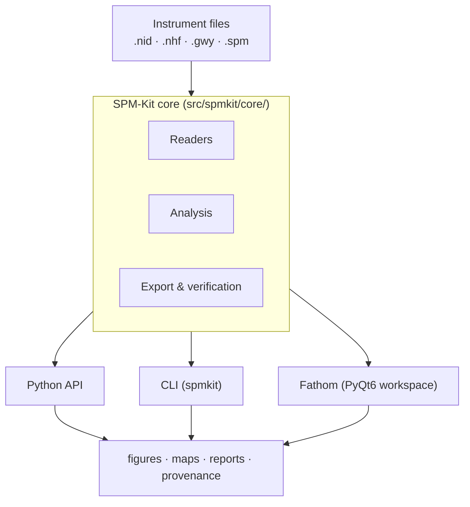

# SPM-Kit · Fathom

Fathom is the scientific workspace. SPM-Kit is the open numerical engine beneath it.

Alpha · 0.1.5.dev0

<a class="primary" href="getting-started.md">Get started</a>
<a class="secondary" href="manual/index.md">Manual</a>
<a class="secondary" href="theory/index.md">Theory</a>
<a class="secondary" href="ecosystem/validation.md">Validation</a>
<a class="secondary" href="https://github.com/kegouro/spmkit">GitHub</a>

---

## The problem

AFM/SPM data analysis is fragmented across proprietary tools, opaque processing
pipelines, and format-specific software that makes it hard to inspect what
transformations were applied to your data. Researchers need to separate
**computation**, **interface**, and **evidence** — and to trace every result
back to its source.

SPM-Kit solves this by providing an open numerical engine with a transparent
pipeline: every step is inspectable, every format reader is traceable, and every
physical model is validated against known ground truth.

---

## What it can do

| Domain | Capabilities |
|---|---|
| **Imaging & surface metrology** | ISO 25178 roughness (Sa, Sq, Sz, Ssk, Sku), leveling, profiles, PSD, Hurst exponent |
| **Force spectroscopy & nanomechanics** | Hertz, DMT, JKR, WLC, FJC, SLS relaxation, force-volume maps |
| **Single-molecule force spectroscopy** | Event detection, contour extraction, baseline correction, multi-peak analysis |
| **Resonance & mass sensing** | Thermal tune (SHO fit), Q factor, resonance frequency, mass sensing (d² law) |
| **Reproducible workflows & reporting** | Recipe (YAML pipeline), HTML/PDF reports, provenance, byte-level traceability |

---

## Architecture

All numerical analysis lives in `core/`. The CLI and Fathom only orchestrate it — they never implement analysis or touch parsers directly.

---

## Scientific evidence

| Capability | Evidence | Level |
|---|---|---|
| Physical models (Hertz, WLC, FJC, JKR, SLS, SHO) | Synthetic recovery tests — parameters recovered within tolerance | LEVEL 2 NUMERICALLY_VERIFIED |
| Sa, Sq, Sz (synthetic surfaces) | 18/18 cross-comparisons vs Gwyddion 2.71 | LEVEL 3 CROSS_VALIDATED |
| Nanoscope III `.spm` reader | 18/18 within tolerance, 6 experimental files | LEVEL 2 NUMERICALLY_VERIFIED |
| `.nid` format round-trip | Machine-precision correlation vs Gwyddion | LEVEL 1 SOFTWARE_VERIFIED |
| JPK TIFF, `.ibw`, NT-MDT | Readers implemented, not cross-validated | experimental |

**Verification coverage:** 741 unique automated tests, plus 18 external cross-comparisons of Sa, Sq and Sz against Gwyddion 2.71.

---

## Ecosystem

Core engine

<h3><a href="ecosystem/spmkit.md">SPM-Kit</a></h3>

Numerical engine, Python API, CLI. The package you install with <code>pip install spmkit</code>.

Workspace

<h3><a href="ecosystem/fathom.md">Fathom</a></h3>

Interactive PyQt6 desktop workspace for visualization, analysis, and reporting.

Synthetic truth

<h3><a href="ecosystem/phantoms.md">Phantoms</a></h3>

Deterministic synthetic surfaces with known ground truth, controlled corruptions, canonical hashes.

Discovery

<h3><a href="ecosystem/data-hunter.md">Data Hunter</a></h3>

Discover, catalog, and triage public AFM/SPM datasets for validation campaigns.

Evidence

<h3><a href="ecosystem/validation.md">Validation</a></h3>

External black-box validation harness. Runs SPM-Kit via subprocess, preserves reproducible evidence.

Umbrella

<h3><a href="ecosystem/pharos.md">Pharos</a></h3>

A broader collection of open scientific tools built around reproducibility and transparent computation.

> **Find the evidence → define the truth → test the system externally → preserve the result.**

---

## Learn & explore

<h3><a href="theory/index.md">Theory guide</a></h3>

AFM principles, operating modes, force spectroscopy, KPFM, roughness, resonance — connected to SPM-Kit implementations.

<h3><a href="manual/index.md">User manual</a></h3>

Full GUI guide, CLI reference, PDF reader, keyboard shortcuts, and workflows.

<h3><a href="getting-started.md">Getting started</a></h3>

Install, open your first file, run your first analysis in 5 minutes.

<h3><a href="api.md">Python API</a></h3>

Direct access to readers, models, analysis functions, and export utilities.

<h3><a href="ecosystem/validation.md">Validation evidence</a></h3>

Campaign records, tolerance budgets, receipts, and cross-validation results.

<h3><a href="extending.md">Extending</a></h3>

Add file formats, analysis methods, and Fathom perspectives through the plugin system.

---

## What SPM-Kit does not claim

!!! warning "Honest scope"

    - **Alpha software.** APIs may change before 1.0.
    - **No certified metrological traceability.** Results are not certified reference values.
    - **Cross-validation is limited.** Sa, Sq, Sz validated on 6 synthetic surfaces against Gwyddion 2.71 — not on all formats, all metrics, or all instruments.
    - **No blind holdout.** The Nanoscope campaign had `ACCIDENTAL_PRE_FREEZE_UNBLINDING`.
    - **No physical validation (LEVEL 4) or interlaboratory reproducibility (LEVEL 5).**
    - **Experimental formats** (JPK TIFF, `.ibw`, NT-MDT) are implemented but not cross-validated.
    - **Not a Gwyddion replacement.** The reference uses Gwyddion libraries through a frozen wrapper; this is not universal equivalence.

---

## Citation

If you use SPM-Kit or Fathom in a publication, cite it per [`CITATION.cff`](https://github.com/kegouro/spmkit/blob/main/CITATION.cff).

Independently designed and developed by José Labarca Baeza · SPM Lab, UTFSM · MIT License © 2026

