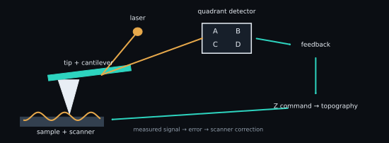

# AFM principles

An atomic force microscope converts tip–sample interaction into a calibrated
height or force signal. The image is not a direct photograph: it is the output
of a sensor, feedback controller, scanner and reconstruction convention.

<figure class="science-figure">
  
  <figcaption>The optical lever amplifies cantilever angle. Feedback turns the detector error into a scanner Z command that is recorded as topography in constant-interaction modes.</figcaption>
</figure>

## Tip, cantilever and interaction

A sharp tip sits at the end of a compliant cantilever. When the interaction
force $F$ is small enough for a linear cantilever model,

$$
F=-k\,d,
$$

where $k$ is spring constant in N m$^{-1}$ and $d$ is cantilever deflection in
metres. The sign depends on the detector and coordinate convention. Van der
Waals, capillary, electrostatic, chemical and repulsive contact forces can all
contribute; “height” is therefore inferred through an operating-mode-specific
control law, not read by a camera.

## Optical lever and detector

A laser reflected from the back of the cantilever moves across a quadrant
photodiode. A vertical difference signal such as $(A+B)-(C+D)$ is converted
from volts to deflection with a deflection-sensitivity calibration. Multiplying
by $k$ converts deflection to force. Detector saturation, laser drift, cross-talk
and an incorrect sensitivity propagate into force results.

## Feedback and scanner

The controller compares the measured interaction signal with a setpoint and
commands the Z piezo. The reported topography can correspond to this correction,
the residual/error signal, or another vendor-defined channel. Feedback gains,
line speed and bandwidth determine whether steep features are tracked or
distorted.

## Coordinates and physical scale

SPM arrays have at least four coordinate choices:

- array row/column indexing;
- physical X/Y coordinates derived from field of view and pixel count;
- fast/slow scan axes and forward/backward direction;
- Z/force sign and unit conventions.

A transpose or vertical flip can preserve roughness statistics while changing
spatial interpretation. A unit error can change a modulus by orders of
magnitude. SPM-Kit domain objects therefore keep array shape, X/Y range, unit,
direction and source metadata where the reader can recover them.

## Raw signal versus calibrated quantity

| Raw/near-raw signal | Required context | Calibrated/derived quantity |
|---|---|---|
| detector voltage | deflection sensitivity | cantilever deflection (m) |
| cantilever deflection | spring constant | force (N) |
| scanner command/counts | scanner calibration and axis convention | topography (m) |
| force and ramp coordinate | tip/sample geometry, contact point, Poisson ratio | indentation and modulus |
| electrostatic null voltage | sign convention and calibrated tip work function | CPD/work function |

Calibration metadata are inputs to a result, not decorative labels.

## SPM-Kit implementation and evidence

| Concept | Current path | Evidence | Limitation |
|---|---|---|---|
| image/force inspection | `spmkit.core.io.load_any`, reader contracts | format-specific Level 1/2 | not every variant is demonstrated |
| image domain model | `spmkit.core.models.SPMData` / `SPMChannel` | Level 1 | metadata depend on source availability |
| force calibration functions | `spmkit.core.analysis.calibration` | Level 1/2 paths | calibration constants must be externally defensible |
| file inspection CLI | `spmkit info` | Level 1 | inspection does not validate an analysis |

Fathom routes image data to **Imagen** and force data to **Curva de fuerza** or
**Mapa**. It uses the same Core reader/domain objects.

[:material-arrow-left: Theory overview](index.md) ·
[:material-arrow-right: Operating modes](operating-modes.md)
