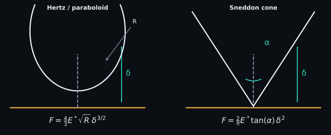

# Contact mechanics

Contact models turn a calibrated force-indentation segment into parameters such
as reduced or sample modulus. They are conditional physical models, not generic
curve shapes: geometry, elasticity, adhesion, substrate effects, contact-point
choice, and fit depth all determine whether a fitted number is meaningful.

<figure class="spm-science-figure">
  
  <figcaption>SPM-Kit implements spherical/paraboloidal and conical elastic laws. The geometry parameters are measured inputs, not fit decorations.</figcaption>
</figure>

## Reduced modulus

For sample modulus $E_s$ (Pa), sample Poisson ratio $\nu_s$, tip modulus $E_t$
(Pa), and tip Poisson ratio $\nu_t$,

$$
\frac{1}{E^*}=\frac{1-\nu_s^2}{E_s}+\frac{1-\nu_t^2}{E_t}.
$$

$E^*$ is the reduced modulus (Pa). SPM-Kit's main elastic fitter assumes a rigid
tip, so $E_s=E^*(1-\nu_s^2)$. This approximation fails when tip compliance is
not negligible.

## Hertz sphere and paraboloid

$$
F=\frac{4}{3}E^*\sqrt{R}\,\delta^{3/2}.
$$

$F$ is normal load (N), $R$ tip radius (m), and $\delta$ indentation (m).
Assumptions include small-strain elastic, frictionless, non-adhesive contact
between smooth bodies; an isotropic homogeneous half-space; and contact radius
small relative to sample thickness and relevant curvature. In
`spmkit.core.analysis.mechanics.fit_hertz`, `sphere` and `paraboloid` use this
same local law. Current evidence is `LEVEL 2 — NUMERICALLY_VERIFIED` for the
declared synthetic-recovery cases, not physical validation.

## Sneddon cone

$$
F=\frac{2}{\pi}E^*\tan(\alpha)\,\delta^2.
$$

$\alpha$ is cone half-angle (rad). The other symbols and units are as above.
The ideal cone is singular at its apex, so a real rounded tip may behave
spherically at shallow indentation and conically only over a later interval.
`mechanics.fit_hertz(..., model="cone", half_angle=...)` implements this law.
It has synthetic recovery evidence at `LEVEL 2` within the tested interval.

## DMT offset path

The implemented DMT path uses a spherical elastic term plus a constant adhesive
offset:

$$
F=\frac{4}{3}E^*\sqrt{R}\,\delta^{3/2}-F_{\mathrm{adh}}.
$$

$F_{\mathrm{adh}}$ is the measured pull-off magnitude (N). This is a specific
operational approximation in `mechanics.fit_hertz(..., model="dmt")`, suitable
for testing the declared offset model. It is not a complete material-selection
rule for the DMT adhesion regime. Synthetic modulus/adhesion recovery supports
`LEVEL 2`; no physical-reference campaign promotes it further.

## Experimental JKR

SPM-Kit's experimental JKR route uses contact radius $a$ (m), work of adhesion
$w$ (J m$^{-2}$), radius $R$ (m), and reduced modulus $E^*$ (Pa):

$$
\delta(a)=\frac{a^2}{R}-\sqrt{\frac{2\pi w a}{E^*}},
\qquad
F(a)=\frac{4E^*a^3}{3R}-\sqrt{8\pi wE^*a^3}.
$$

`spmkit.core.analysis.experimental.fit_jkr` performs a bounded grid search and
is explicitly marked experimental. Analytical construction and synthetic
recovery support a narrow `LEVEL 2` numerical claim, including the $w\to0$
Hertz limit. They do not validate JKR for a particular material or tip.

## Fit-window discipline

- Exclude non-contact points and pull-off unless the selected model includes them.
- Keep indentation small enough for the assumed geometry, but large enough to
  exceed contact-point and noise uncertainty.
- Repeat fits across plausible contact points and windows.
- Inspect residual structure, $R^2$, RMSE, point count, and parameter stability.
- Treat substrate, viscoelasticity, plasticity, poroelasticity, roughness, and
  adhesion regime as model-selection questions, not nuisance noise.

In automation, use `spmkit forcecurve`; for maps use `spmkit forcemap`. Fathom's
**Curva de fuerza** and **Mapa** perspectives expose these paths. A modulus map
inherits every calibration and model assumption of every pixel fit.

[:material-arrow-left: Force-distance curves](force-distance.md) ·
[:material-arrow-right: KPFM](kpfm.md)
