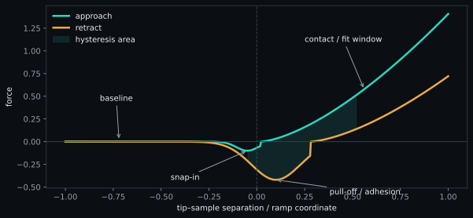

# Force-distance curves

A force-distance experiment parks the lateral position and drives the sample or
tip along the vertical axis. The measured deflection signal becomes a force only
after sensitivity and cantilever-stiffness calibration; the commanded scanner
position becomes indentation only after contact and cantilever bending are
accounted for.

<figure class="spm-science-figure">
  
  <figcaption>Idealized force-distance regions. Real sign and axis directions depend on the instrument export, so SPM-Kit normalizes them before display and fitting.</figcaption>
</figure>

## From detector signal to force

For a detector signal $V$ in volts, a deflection sensitivity $S$ in metres per
volt, and cantilever stiffness $k$ in newtons per metre,

$$
d = S(V-V_0), \qquad F = k d.
$$

$d$ is cantilever deflection (m), $V_0$ is the non-contact baseline (V), and
$F$ is normal force (N). This linear conversion assumes the detector response
and cantilever remain in their calibrated regimes. A wrong sensitivity or $k$
scales every subsequent force and modulus result.

If $z$ is the imposed vertical displacement and $z_c$ the contact position, a
common indentation convention is

$$
\delta=(z-z_c)-d,
$$

where indentation $\delta$ is in metres. Axis orientation can reverse the first
term; the implemented reader/curve convention governs, not the visual direction
of a vendor plot.

## Approach and retract

1. **Baseline:** far from the surface, fit and subtract offset or drift without
   including interaction points.
2. **Snap-in:** an attractive force gradient can exceed the cantilever restoring
   gradient, producing a sudden transition to contact.
3. **Contact and loading:** force rises as the tip indents the sample and bends
   the cantilever. This is the candidate fit region for a contact model.
4. **Retract:** adhesion can hold the tip after the drive reverses.
5. **Pull-off:** the most negative corrected force is an operational adhesion
   magnitude under the declared sign convention.
6. **Hysteresis:** the area between compatible approach and retract paths has
   units of joules and can represent dissipated work, but only after sampling,
   speed, baseline, and branch alignment are controlled.

## Segmentation is part of the measurement

Contact-point error changes both the origin and the fitted indentation range.
SPM-Kit provides threshold and ratio-of-variances paths, and the force pipeline
can use a joint contact fit. None removes the need to inspect the result.

Common failure modes include baseline curvature, hydrodynamic drag, optical
interference, detector saturation, piezo creep, a double contact, plasticity,
tip contamination, insufficient non-contact data, and fitting through pull-off.
Flat residuals and a high $R^2$ do not prove the physical model is appropriate.

## SPM-Kit path

`spmkit.core.analysis.forcecurve` handles display-axis normalization and the
public curve fit. `spmkit.core.pipeline.force_ops` applies calibration, contact
detection, and model fitting to typed `ForceCurve` objects. The direct command is:

```bash
spmkit forcecurve measurement.jpk-force --curve 0 --model sphere --tip-radius 1e-8
```

Fathom exposes a single curve in **Curva de fuerza** (`force`) and force-volume
property maps in **Mapa** (`map`). The calibration source, contact method, model,
tip geometry, Poisson ratio, and retained fit interval belong in provenance.

## Evidence boundary

| Claim | Current support | Boundary |
|---|---|---|
| calibrated signal conversion and curve orchestration | software tests | does not certify an instrument calibration |
| contact detection and elastic fits | synthetic numerical recovery | does not establish a universal contact point on experimental curves |
| force-volume property maps | scalar/vectorized consistency and synthetic recovery | the two internal routes are not independent external references |
| adhesion and hysteresis interpretation | implemented observables | no broad public physical-reference campaign |

[:material-arrow-left: Operating modes](operating-modes.md) ·
[:material-arrow-right: Contact mechanics](contact-mechanics.md)
