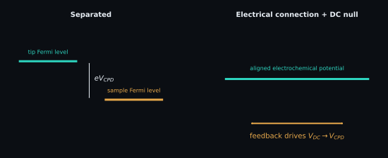

# KPFM: contact potential and work function

Kelvin probe force microscopy adds an electrical feedback observable to the
topographic experiment. The instrument adjusts a DC bias until a selected
electrostatic-force component is nulled, producing a spatial map associated
with the tip-sample contact-potential difference (CPD).

<figure class="science-figure">
  
  <figcaption>Idealized work-function relation. Surface dipoles, adsorbates, geometry, environment, and transfer function can all alter the measured contrast.</figcaption>
</figure>

## Electrostatic null

With an applied voltage

$$
V(t)=V_{\mathrm{DC}}+V_{\mathrm{AC}}\sin(\omega t),
$$

an idealized capacitive interaction has energy

$$
U=\tfrac12 C(z)\,[V(t)-V_{\mathrm{CPD}}]^2,
$$

and force $F_{\mathrm{el}}=-\partial U/\partial z$. $C$ is capacitance (F),
$z$ separation (m), voltages are in V, $\omega$ is angular frequency (rad s$^{-1}$),
and force is in N. The component at $\omega$ is proportional to
$V_{\mathrm{AC}}(V_{\mathrm{DC}}-V_{\mathrm{CPD}})\,\partial C/\partial z$.
The feedback nulls that term by driving $V_{\mathrm{DC}}$ toward the instrument's
CPD convention.

## Work-function relation and sign

A commonly used convention is

$$
V_{\mathrm{CPD}}=\frac{\phi_{\mathrm{tip}}-\phi_{\mathrm{sample}}}{e},
\qquad
\phi_{\mathrm{sample}}=\phi_{\mathrm{tip}}-V_{\mathrm{CPD}},
$$

when work functions $\phi$ are expressed in electronvolts and voltage in volts;
numerically, one electronvolt per elementary charge corresponds to one volt.
If energies are expressed in joules, retain the elementary charge $e$ (C)
explicitly. Some instruments export the opposite CPD sign. Confirm the vendor
definition with a reference sample before comparing absolute work functions.

## What the map can and cannot mean

Relative CPD contrast can track work-function, doping, charge, surface dipoles,
adsorbates, or illumination state. It is also affected by tip contamination,
humidity, topographic cross-talk, stray capacitance, lift height, feedback
bandwidth, grounding, and whether amplitude- or frequency-modulation KPFM is
used. A calibrated tip work function can drift during the same session.

Therefore, a histogram is not chemical identification, and an absolute sample
work function requires a calibrated tip, a documented sign convention,
environmental context, and a defensible uncertainty budget.

## SPM-Kit path and evidence

`spmkit.core.analysis.kpfm.statistics` reports mean, standard deviation, minimum,
and maximum CPD from an already calibrated voltage channel. With a supplied tip
work function, it applies the algebraic sample-work-function conversion. It does
not demodulate raw detector signals or calibrate the tip.

Use `spmkit analyze` for a file containing a recognized CPD channel; in Fathom,
inspect the channel under **Imagen**. These calculations are
`LEVEL 1 — SOFTWARE_VERIFIED`. No current public physical-reference campaign
supports a general absolute-work-function claim.

[:material-arrow-left: Contact mechanics](contact-mechanics.md) ·
[:material-arrow-right: Roughness](roughness.md)
