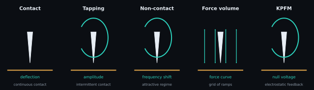

# AFM operating modes

An operating mode is defined by how the tip is driven, what signal is measured
and what the feedback loop holds constant. The same array shape can therefore
represent different physical observables.

<figure class="science-figure">
  
  <figcaption>Each mode changes the interaction regime and measured signal. SPM-Kit analyzes resulting files; it does not control these acquisition loops.</figcaption>
</figure>

## Mode comparison

| Mode | Physical interaction | Measured/control signal | Advantage | Common limitation/artifact | SPM-Kit scope |
|---|---|---|---|---|---|
| contact | repulsive contact, tip remains on surface | deflection or force setpoint | direct, fast, strong signal | lateral drag, wear, sample deformation | reads/analyzes resulting topography and force channels |
| tapping / intermittent contact | driven oscillation briefly interacts each cycle | amplitude/phase setpoint | lower lateral force; common in air | setpoint/gain artifacts, phase ambiguity, tip convolution | image metrology on resulting channels; no acquisition controller |
| non-contact / frequency modulation | attractive force gradient shifts resonance | frequency shift or amplitude | gentle; high sensitivity in controlled environments | water layer/environment, long-range-force mixing | reads compatible exported channels; no FM controller |
| force volume | approach/retract curve at each grid point | force curve per pixel | spatial mechanics/adhesion maps | slow, drift, calibration and fit failures | `ForceVolume`, force fitting and property maps |
| quantitative imaging / fast force mapping | rapid force curves at each pixel | peak force/indentation/adhesion route | image + mechanical observables | vendor-specific timing and calibration | limited to demonstrated containers/readers; not universal QI support |
| KPFM | electrostatic force/force-gradient nulling | DC compensation voltage | surface-potential contrast | sign, capacitive averaging, tip calibration | CPD statistics and work-function calculation from a supplied channel |

## Contact mode

The controller keeps cantilever deflection near a setpoint. Because the tip is
dragged laterally, friction and tip/sample damage can dominate soft materials.
Reported height combines scanner response with any residual feedback error.

## Tapping and non-contact modes

For a driven damped oscillator, tip–sample forces change amplitude, phase and
resonance frequency. Tapping typically uses amplitude feedback and intermittent
contact; frequency-modulation non-contact uses a frequency-shift observable.
They share oscillator physics but do not produce interchangeable channels.

## Force volume and quantitative maps

A force-volume acquisition records approach/retract segments at each grid
location. SPM-Kit preserves curve segments and grid shape, then derives maps
from per-curve fits. Failed fits, missing lines and calibration uncertainty
should remain visible rather than being interpolated into apparent material
contrast without disclosure.

## Implementation boundary

SPM-Kit is an analyzer, not an instrument controller. The current readers
interpret demonstrated exported files. The Core path cannot reconstruct missing
feedback settings or decide whether acquisition was physically appropriate.

| Route | Core | Fathom | CLI |
|---|---|---|---|
| image/topography | `SPMData` / image readers | Imagen | `info`, `roughness`, `analyze` |
| force curve | `ForceCurve` / force readers | Curva de fuerza | `forcecurve`, `nanomech` |
| force volume | `ForceVolume` | Mapa | `forcemap`, `forceexport` |
| KPFM channel | `kpfm.statistics` | Imagen | `analyze --tip-wf` |

Evidence follows the reader and analysis path, not the acquisition-mode label.

[:material-arrow-left: AFM principles](afm-principles.md) ·
[:material-arrow-right: Force-distance curves](force-distance.md)
