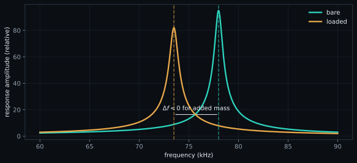

# Resonance and mass sensing

A cantilever mode can be approximated as a damped harmonic oscillator. That
model connects resonance frequency to stiffness and modal mass, but quantitative
mass sensing also depends on mode shape, load position, added-mass distribution,
fluid damping, temperature, detector calibration, and the definition of the
bare state.

<figure class="science-figure">
  
  <figcaption>Added mass lowers the idealized resonance. Peak shape and width carry damping information; a real spectrum can contain backgrounds and multiple modes.</figcaption>
</figure>

## Oscillator and quality factor

For stiffness $k$ (N m$^{-1}$) and effective modal mass $m_{\mathrm{eff}}$ (kg),

$$
f_0=\frac{1}{2\pi}\sqrt{\frac{k}{m_{\mathrm{eff}}}},
\qquad
m_{\mathrm{eff}}=\frac{k}{(2\pi f_0)^2}.
$$

$f_0$ is in hertz. For a narrow single resonance, the operational bandwidth
relation is

$$
Q=\frac{f_0}{\Delta f_{\mathrm{FWHM}}},
$$

where $Q$ is dimensionless and $\Delta f_{\mathrm{FWHM}}$ is the full width at
half maximum (Hz) under the selected amplitude/power convention.

`resonance.find_resonance` uses the peak and half-height width.
`resonance.fit_sho` fits an amplitude-spectral-density SHO model with a noise
floor when SciPy is available and otherwise returns the peak-based estimate.

## Thermal noise and stiffness

Ideal equipartition gives

$$
\tfrac12 k\langle x^2\rangle=\tfrac12 k_B T.
$$

$x$ is calibrated deflection (m), $\langle x^2\rangle$ its variance (m$^2$),
$k_B$ the Boltzmann constant (J K$^{-1}$), and $T$ temperature (K).
SPM-Kit implements

$$
k=\chi\frac{k_BT}{\langle x^2\rangle},
$$

with a configurable mode/detection correction $\chi$ and default `0.817` in
`core.analysis.calibration.spring_constant_thermal`. This requires a calibrated
deflection spectrum with noise-background treatment. The Sader method is
explicitly not implemented.

## Effective and added mass

For a load treated at position $x/L$ along a cantilever, the implemented
position correction is

$$
k(x)=\frac{k(L)}{(x/L)^3}.
$$

With bare frequency $f_b$ and loaded frequency $f$,

$$
\Delta m=\frac{k(x)}{4\pi^2}
\left(\frac{1}{f^2}-\frac{1}{f_b^2}\right).
$$

$\Delta m$ is in kilograms. The relation assumes the one-mode lumped model and
the declared load-position correction. Distributed loads, shape changes,
stiffness changes, or fluid-property changes can shift frequency without
representing only added mass.

## Evaporation and the d² diagnostic

For a spherical droplet of density $\rho$ (kg m$^{-3}$), SPM-Kit converts
positive added mass to radius $r$ (m) with

$$
r=\left(\frac{3\Delta m}{4\pi\rho}\right)^{1/3}.
$$

It then fits the diffusion-limited diagnostic

$$
d^2(t)=d_0^2-Kt,\qquad d=2r,
$$

where $K$ has units m$^2$ s$^{-1}$. `fit_d2_law` labels a fit
`is_diffusion_limited` when $R^2>0.95`; that boolean is an implementation
criterion, not proof that all physical assumptions hold.

## Measurement path versus educational simulation

`extract_thermal` and `load_evaporation_series` read NanoSurf thermal-tuning
metadata and spectra; `spmkit evaporation FOLDER` builds the time series;
Fathom uses **Sintonía térmica** (`resonance`) and **Evaporación**
(`evaporation`). `core.analysis.simulation` separately generates idealized
thermal spectra and mass-loaded shifts for **Simulador**. Simulation demonstrates
equations; it is not a calibration reference.

The current scientific-status classification is `LEVEL 1 — SOFTWARE_VERIFIED`
for SHO, thermal-calibration, and mass-sensing utilities. Unit tests and
controlled numerical cases exercise these paths, while selected experimental
files provide development context. There is no frozen public calibrated
physical-reference campaign, no general nanogram-resolution claim, and no basis
for the legacy statement that a particular real instrument was recovered to a
universal percentage.

[:material-arrow-left: Spectral analysis](spectral-analysis.md) ·
[:material-arrow-right: Implementation map](spmkit-workflows.md)
