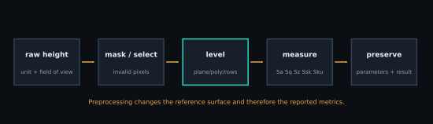

# Roughness and surface metrology

Roughness parameters summarize deviations from a chosen reference surface.
They do not discover that surface automatically, and they do not preserve where
features occur. Two physically different surfaces can share the same Sa or Sq.

<figure class="science-figure">
  
  <figcaption>Every preprocessing decision changes the field over which the statistics are defined. Preserve the raw channel and report the transformation.</figcaption>
</figure>

## Reference field

Let $z_i$ be the $N$ finite sampled heights after declared masking and
preprocessing, and let

$$
\bar z=\frac{1}{N}\sum_{i=1}^{N}z_i,\qquad \eta_i=z_i-\bar z.
$$

$z_i$, $\bar z$, and $\eta_i$ share the channel's length unit (usually m or
nm). SPM-Kit removes non-finite samples, subtracts the arithmetic mean, and
computes the following discrete quantities.

## Implemented areal parameters

$$
S_a=\frac{1}{N}\sum_{i=1}^{N}|\eta_i|,
\qquad
S_q=\sqrt{\frac{1}{N}\sum_{i=1}^{N}\eta_i^2}.
$$

$S_a$ and $S_q$ are heights. $S_q$ gives greater weight to large deviations;
that does not make it more or less correct than $S_a$.

$$
S_p=\max_i\eta_i,\qquad S_v=\min_i\eta_i,
\qquad S_z=S_p-S_v.
$$

In the result object, `Sv` is the signed minimum and `Sz = Sp - Sv`; all have
height units. A single spike or dropout can dominate $S_z$.

$$
S_{sk}=\frac{N^{-1}\sum_i\eta_i^3}{S_q^3},
\qquad
S_{ku}=\frac{N^{-1}\sum_i\eta_i^4}{S_q^4}.
$$

$S_{sk}$ and $S_{ku}$ are dimensionless. This is kurtosis, not excess
kurtosis, so a Gaussian distribution tends toward 3. For an exactly flat field,
the implementation returns zero for both normalized moments to avoid division
by zero; mathematically those ratios are undefined.

## Leveling and filtering

`spmkit.core.analysis.leveling` provides plane, polynomial, and per-row paths.
Plane subtraction can remove sample tilt; it can also remove a real long-scale
slope. Per-row alignment can suppress scanner offsets; it can also erase real
line-to-line structure. Filtering and masks similarly redefine the measured
surface. Report method, order, mask, and processing sequence.

```bash
spmkit roughness scan.nid --channel Z-Axis --level plane
```

`spmkit.core.analysis.roughness.statistics` expects the chosen channel already
leveled. The CLI applies `plane`, `poly`, or `none`; Fathom's **Imagen**
perspective applies user-selected preprocessing before displaying statistics.

## Sampling and scale

- Pixel pitch is lateral range divided by sample count under the stored grid
  convention. Incorrect range metadata corrupts physical spatial scales.
- Field of view controls which long-wavelength form and rare extrema enter the
  statistics.
- Pixel spacing, tip radius, feedback bandwidth, and filtering limit the
  smallest observable structure.
- Resampling changes $N$ and correlation, but does not add instrument bandwidth.
- Compare results only when channel, area, mask, leveling, filtering, and units
  are compatible.

## ISO terminology and implementation scope

SPM-Kit uses ISO 25178 areal names and discrete formulas for the parameters
above. It does not claim a complete ISO 25178 filtering, nesting-index,
uncertainty, or metrological-traceability implementation. Standards terminology
must not be read as certification.

## Evidence boundary

The strongest current evidence is restricted to Sa, Sq, and Sz:

- 48 frozen synthetic shared matrices, 144/144 SPM-Kit/Gwyddion 2.71
  comparisons within `1e-6 nm + 1e-6 relative`;
- 12 public experimental GWY records, 36/36 shared-matrix comparisons within
  the same declared tolerance;
- the real-data parser track separately retained ten equivalences and two
  channel-count differences.

This supports `LEVEL 3 — CROSS_VALIDATED` for those metrics and campaign
conditions. It does not transfer to Ssk, Sku, preprocessing equivalence,
universal parser behavior, or physical validation.

[:material-arrow-left: KPFM](kpfm.md) ·
[:material-arrow-right: Spectral analysis](spectral-analysis.md)
