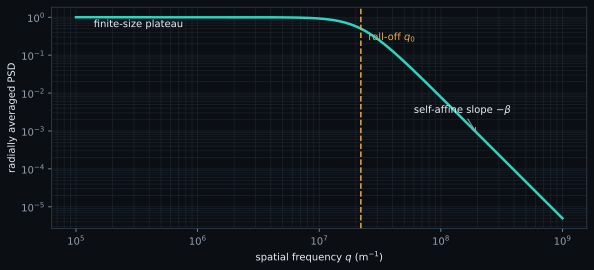

# Spectral and self-affine analysis

Spatial statistics ask how much a surface varies. Spectral analysis asks **at
which lateral scales** that variation occurs.

## Two-dimensional Fourier transform

For a sampled height field $z(x,y)$, the discrete Fourier transform maps
position to spatial frequency:

$$
Z(q_x,q_y)=\sum_{m=0}^{N_y-1}\sum_{n=0}^{N_x-1}
z_{m,n}\exp\left[-2\pi i\left(\frac{nk}{N_x}+\frac{m\ell}{N_y}\right)\right].
$$

$q_x$ and $q_y$ are spatial frequencies in m$^{-1}$ when pixel spacing is in
metres. A wavelength is $\lambda=1/q$ under the cycles-per-length convention.
The power spectral density is proportional to $|Z|^2$ with normalization that
depends on the discrete convention; comparisons require the same convention.

## Radial PSD

For an approximately isotropic surface, bins of equal
$q=\sqrt{q_x^2+q_y^2}$ are averaged to obtain a one-dimensional radial PSD.

<figure class="spm-science-figure">
  
  <figcaption>A roll-off separates a long-wavelength plateau from the fitted self-affine band. Only the declared frequency interval contributes to the slope.</figcaption>
</figure>

## Hurst exponent and fractal dimension

For a two-dimensional self-affine height field, a common convention is

$$
\operatorname{PSD}(q)\propto q^{-\beta},\qquad \beta=2H+2,
\qquad D=3-H.
$$

Here $H$ is dimensionless and, under the model, typically lies between 0 and 1;
$D$ is the corresponding surface fractal dimension between 2 and 3. These
relations apply only when a stable power-law band exists. Reporting a slope
from a visually selected narrow band is not a universal material property.

## Correlation length

The correlation length $\xi$ (m) is a characteristic lateral scale at which
height correlations decay or the PSD changes regime. Its exact estimator and
threshold convention matter. It is not automatically the grain diameter or a
tip radius.

## Sampling and bandwidth limits

- Field width $L$ limits the smallest resolved spatial frequency to order $1/L$.
- Pixel spacing $\Delta x$ limits the highest frequency to the Nyquist value $1/(2\Delta x)$.
- Leveling suppresses low-frequency content and can move the apparent roll-off.
- Line artifacts create directional spectral power that radial averaging can hide.
- Tip convolution suppresses high-frequency structure; the measured PSD is not the unconvolved surface PSD.
- Windowing trades leakage for spectral resolution and must be reported.

## SPM-Kit implementation

`spmkit.core.analysis.spectral.radial_psd` computes the radial representation;
`fractal_dimension` fits a declared log-log region and returns PSD slope, Hurst
exponent, fractal dimension and R²; `correlation_length` estimates the lateral
scale. The CLI path is:

```bash
spmkit psd scan.nid --channel Z-Axis
```

The command applies plane leveling before the spectral calculation. In Fathom,
use **Espectral** (`spectral`).

## Evidence and limitation

The spectral functions have software and synthetic tests (`LEVEL 1`/path-specific
numerical recovery). They have not been promoted by the current external
Gwyddion campaigns, which cover Sa, Sq and Sz only. Finite-size, window and tip
effects remain interpretation limits even when a synthetic slope is recovered.

[:material-arrow-left: Roughness](roughness.md) ·
[:material-arrow-right: Resonance](resonance.md)
