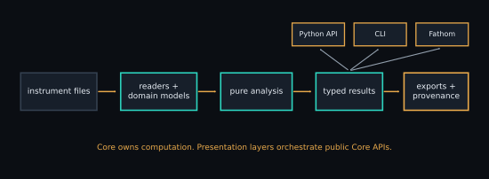

# SPM-Kit implementation map

<figure class="spm-science-figure">
  
  <figcaption>Core owns computation. Python, the CLI and Fathom orchestrate the same public numerical paths.</figcaption>
</figure>

## Concept-to-code map

| Concept | Current implementation | Fathom | CLI/public route | Strongest retained evidence | Known limitation |
|---|---|---|---|---|---|
| file inspection/routing | `core.io.load_any`, `core.plugins`, built-in readers | automatic open route | `spmkit info` | format-specific Level 1/2 | support is variant-specific |
| leveling | `core.analysis.leveling` | Imagen (`image`) | `roughness --level`, `analyze --level` | Level 1 + synthetic cases | changes the reference surface |
| Sa/Sq/Sz/Ssk/Sku | `core.analysis.roughness.statistics` | Imagen (`image`) | `spmkit roughness`, `analyze` | scoped Level 3 for Sa/Sq/Sz | external campaigns do not cover Ssk/Sku or every preprocessing route |
| line profile | `core.analysis.profiles.line` | Imagen (`image`) | Python API | Level 1 | interpolation and coordinate choice matter |
| grain segmentation | `core.analysis.grains.detect` | Granos (`grains`) | `spmkit grains` | Level 1 + synthetic tests | threshold/overlap/tip effects |
| radial PSD/fractal fit | `core.analysis.spectral` | Espectral (`spectral`) | `spmkit psd` | Level 1/path-specific numerical tests | bandwidth and fit-band dependence |
| KPFM statistics/work function | `core.analysis.kpfm.statistics` | Imagen (`image`) | `analyze --tip-wf`, Python | Level 1 | sign convention and tip calibration |
| baseline/contact/elastic fit | `core.analysis.forcecurve`, `mechanics` | Curva de fuerza (`force`) | `forcecurve`, `nanomech` | model-specific Level 2 | contact, geometry and material assumptions |
| JKR | `core.analysis.experimental` | Curva de fuerza (`force`) where exposed | `spmkit jkr` | experimental synthetic recovery | adhesive-contact assumptions; CLI marks experimental |
| SMFS WLC/FJC/events | `core.analysis.chain` | SMFS (`smfs`) | Python API | Level 2 synthetic recovery | polymer model and event-window dependence |
| force-volume maps | `core.analysis.forcevolume`, `forcevolume_fast` | Mapa (`map`) | `spmkit forcemap` | Level 2 synthetic recovery | invalid curves/calibration propagate spatially |
| batch analysis | `core.batch`, `core.forcebatch` | Batch (`batch`) | `batch`, `fbatch` | Level 1 | homogeneous channel/parameter assumptions |
| SHO and thermal spectrum | `core.analysis.resonance` | Sintonía térmica (`resonance`) | Python API | Level 1 software tests and controlled numerical cases | no frozen calibrated physical-reference campaign |
| frequency-shift mass model | `core.analysis.resonance` | Evaporación (`evaporation`) | `spmkit evaporation` | Level 1 software tests and controlled numerical cases | point-mass/effective-mode assumptions |
| publication figure | `core.viz` | Figura (`figure`) | `spmkit figure` | Level 1 | figure quality is not scientific validation |
| 3D rendering | GUI panel over image domain | Vista 3D (`view3d`) | none | GUI/software tested | display transform is not analysis |
| educational simulation | `core.analysis.simulation` | Simulador (`simulator`) | Python API | software-tested analytical construction | not a calibrated instrument simulator or physical evidence |

## Public boundary

```text
core/  ← numerical truth and domain objects
  ↑
  ├── cli/  arguments, files and terminal output
  └── gui/  Fathom routing, parameters, views and reports
```

Validation invokes the installed public package from another process. Phantoms
does not import Core. Those two separations are necessary for useful evidence,
but reference independence is still assessed per campaign.

## How maturity advances

1. Define units, assumptions and failure behavior in Core.
2. Add deterministic software tests.
3. Recover a known numerical case, preferably from independent Phantoms logic.
4. Freeze an external comparison/reference and tolerance in Validation.
5. Add calibrated physical and interlaboratory evidence when it exists.
6. Expose the stable result in Fathom without changing the equation.

[Scientific status](../SCIENTIFIC_STATUS.md) ·
[Architecture](../ARCHITECTURE.md) ·
[Ecosystem workflow E](../ecosystem/workflows/index.md#workflow-e-add-an-ecosystem-capability)
